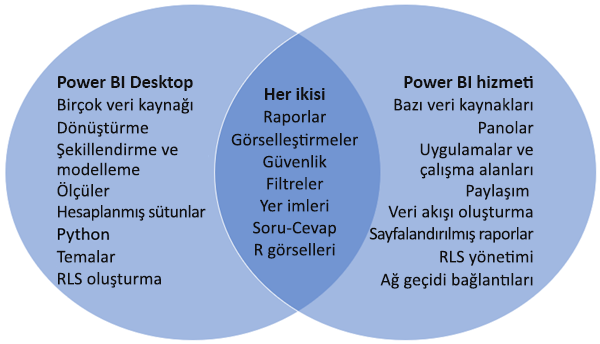

# Power BI Desktop ile Power BI hizmetini karşılaştırma

Power BI Desktop ile Power BI hizmetinin karşılaştırıldığı Venn diyagramında, ortadaki alan bu ikisinin nasıl kesiştiğini gösterir. Bazı görevleri hem Power BI Desktop'ta hem de hizmette gerçekleştirebilirsiniz. Venn diyagramının iki yanında, uygulamanın ve hizmetin benzersiz özellikleri gösterilir.  

**Power BI Desktop**, yerel bilgisayarınıza ücretsiz olarak yüklediğiniz eksiksiz bir veri analizi ve rapor oluşturma aracıdır. Çok sayıda farklı veri kaynağına bağlanıp bu kaynakları bir veri modelinde (çoğunlukla modelleme olarak adlandırılır) birleştirebileceğiniz Sorgu Düzenleyicisi’ni içerir. Daha sonra bu veri modelini temel alan bir rapor tasarlayacaksınız. [Power BI Desktop ile çalışmaya başlama kılavuzu](desktop-getting-started.md) bu işlemde size yol gösterir.

**Power BI hizmeti**, bulut tabanlı bir hizmettir. Takımlar ve kuruluşlar için hafif rapor düzenleme işlemini ve işbirliğini destekler. Power BI hizmetinde de veri kaynaklarına bağlanabilirsiniz ama modelleme sınırlıdır.

İş zekası projelerinde çalışan Power BI rapor tasarımcılarının çoğu, Power BI raporları oluşturmak için **Power BI Desktop** uygulamasını ve sonra işbirliği yapmak ve raporlarını dağıtmak için **Power BI hizmetini** kullanır.

Power BI hizmeti ayrıca, Power BI Premium kapasitesi tarafından desteklenen çalışma alanlarında *sayfalandırılmış raporları* barındırır. Sayfalandırılmış raporları Power BI Rapor Oluşturucusu ile oluşturursunuz. “Power BI Premium’da sayfalandırılmış raporlar nelerdir?” başlıklı makalede [Power BI raporlarını ve sayfalandırılmış raporları karşılaştırma](../paginated-reports/paginated-reports-report-builder-power-bi.md#compare-power-bi-reports-and-paginated-reports) bölümüne bakın. bölümüne bakın.

## Power BI raporlarını düzenleme

Hem uygulamada hem de hizmette Power BI *raporları* oluşturabilir ve düzenleyebilirsiniz. Bir rapor, görseller ve görsel koleksiyonları içeren bir veya birden çok sayfadan oluşabilir. Gezintiyi geliştirmek için raporlarınıza yer işaretleri, düğmeler, filtreler ve detaylandırma ekleyin.

Power BI Desktop'taki ve hizmetteki rapor düzenleyicileri birbirine benzer. Bunlar üç bölümden oluşur:  

1. Üst gezinti bölmeleri (Power BI Desktop ile hizmette farklıdır)    
2. Rapor tuvali     
3. **Alanlar**, **Görsel Öğeler** ve **Filtreler** bölmeleri

Bu videoda, Power BI Desktop'taki rapor düzenleyicisi gösterilir. 

<iframe width="560" height="315" src="https://www.youtube.com/embed/IkJda4O7oGs" frameborder="0" allowfullscreen></iframe>

## Power BI hizmetinde çalışma

### İşbirliği

Raporlarınızı oluşturduktan sonra, bunları *Power BI hizmetinde* iş arkadaşlarınızla işbirliği yapabileceğiniz bir **çalışma alanına** kaydedebilirsiniz. Bu raporların üstünde *panolar* oluşturursunuz. Sonra bu panoları ve raporları kuruluşunuz içindeki ve dışındaki rapor kullanıcılarıyla paylaşırsınız. Raporunuzun kullanıcıları bunları Power BI hizmetinde, Düzenleme görünümünde değil *Okuma görünümünde* görüntüler. Rapor oluşturucularına sağlanan özelliklerin tümüne erişemezler.  Veri kümelerinizi başkalarıyla da paylaşabilir ve başkalarının bunlardan kendi raporlarını oluşturmasına izin verebilirsiniz. [Power BI hizmetinde işbirliği](../collaborate-share/service-new-workspaces.md) hakkında daha fazla bilgi edinin.

### Veri akışları ile self servis veri hazırlığı

Veri akışları, kuruluşların dağınık kaynaklardan gelen verileri birleştirmesine ve modellemeye hazırlamasına yardımcı olmak için kullanıma sunmuştur. Analistler tanıdık, self servis araçları kullanarak veri akışlarını kolayca oluşturabilir. Analistler, veri kaynağı bağlantılarını, ETL mantığını, yenileme zamanlamalarını ve daha birçok öğeyi tanımlayarak büyük verileri almak, dönüştürmek, tümleştirmek ve zenginleştirmek için veri akışlarını kullanılır. [Veri akışları ile self servis veri hazırlığı](../transform-model/service-dataflows-overview.md) hakkında daha fazla bilgi edinin.

## Sonraki adımlar

[Power BI Desktop nedir?](desktop-what-is-desktop.md)

Power BI hizmetinde [rapor oluşturma](../create-reports/service-report-create-new.md)

[Rapor tasarımcıları için temel kavramlar](service-basic-concepts.md)

Başka bir sorunuz mu var? [Power BI Topluluğu'na başvurun](https://community.powerbi.com/)
