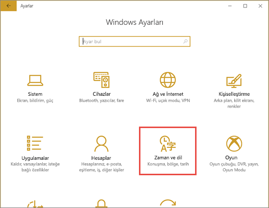
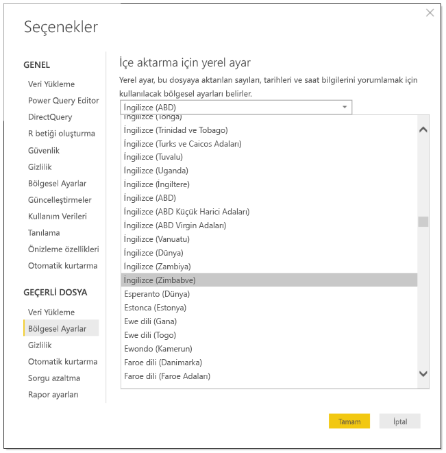
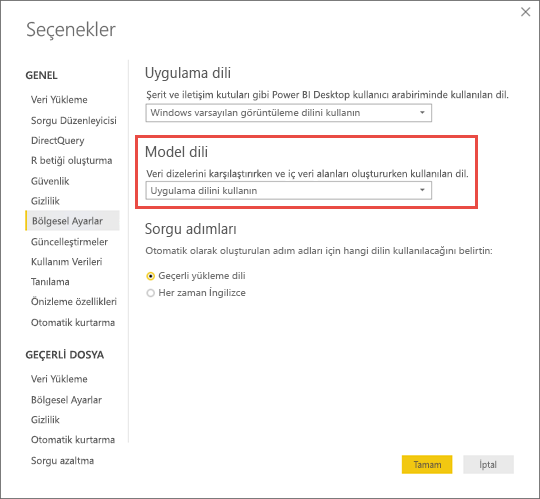

# Power BI için desteklenen diller ve ülkeler/bölgeler

Bu makale Power BI hizmeti, Power BI Desktop ve Power BI belgeleri için desteklenen dilleri ve ülkeleri/bölgeleri kapsar.

## Power BI'ın kullanılabildiği ülkeler ve bölgeler
Power BI'ın kullanılabildiği ülkelerin ve bölgelerin bir listesi için [uluslararası kullanılabilirlik listesine](https://products.office.com/business/international-availability) göz atın. 

## Power BI hizmetinin kullanıma sunulduğu diller
Power BI hizmeti (tarayıcıdaki) şu 44 dilde kullanılabilir:

* Arapça
* Baskça - Basque
* Bulgarca - Български
* Katalanca - català
* Çince (Basitleştirilmiş) - 中文(简体)
* Çince (Geleneksel) - 中文(繁體)
* Hırvatça - hrvatski
* Çekçe - čeština
* Danca - dansk
* Felemenkçe - Nederlands
* İngilizce - English
* Estonca - eesti
* Fince - suomi
* Fransızca - français
* Galiçya dili - galego
* Almanca - Deutsch
* Yunanca - Ελληνικά
* İbranice
* Hintçe - हिंदी
* Macarca - magyar
* Endonezce - Bahasa Indonesia
* İtalyanca - italiano
* Japonca - 日本語
* Kazakça - Қазақ
* Korece - 한국어
* Letonca - latviešu
* Litvanca - lietuvių
* Malayca - Bahasa Melayu
* Norveççe (Bokmål) - norsk (bokmål)
* Lehçe - Polski
* Portekizce (Brezilya) - Português
* Portekizce (Portekiz) - português
* Rumence - română
* Rusça - Русский
* Sırpça (Kiril) - српски
* Sırpça (Latin) - srpski
* Slovakça - slovenčina
* Slovence - slovenski
* İspanyolca - español
* İsveççe - svenska
* Tayca - ไทย
* Türkçe
* Ukraynaca - українська
* Vietnamca - Tiếng Việt

## Power BI Desktop diller
Power BI Desktop, Ibranice ve Arapça dışında Power BI hizmeti aynı dillerde kullanılabilir. Masaüstü, sağdan sola dilleri desteklemez.

### Neler çevrilir?
Power BI, menüleri, düğmeleri, iletileri ve deneyimin diğer öğelerini dilinize çevirir. Örneğin Power BI otomatik olarak oluşturulan başlıklar, filtreler ve araç ipuçları gibi rapor içeriğini çevirir. Öte yandan verileriniz otomatik olarak çevrilmez. İbranice gibi sağdan sola düzende yazılan bir dili kullanıyorsanız raporların içindeki görsellerin yerleşimi değişmez.

Şu anda birkaç özellik yalnızca İngilizce dilinde kullanıma sunulmaktadır:

* Microsoft Dynamics CRM, Google Analytics ve Salesforce gibi hizmetlere bağlandığınızda Power BI tarafından oluşturulan panolar ve raporlar. Yine de kendi dilinizde pano ve rapor oluşturabilirsiniz.
* Soru-Cevap ile verilerinizi araştırma.

Diğer diller için yeni özellikler sunmaya devam edeceğiz, bizimle kalın. 

### Power BI hizmetinde dilinizi seçme
1. Power BI hizmeti, ayarlar simgesinin gösterildiği Power BI hizmeti **Ayarlar** simgesi  > **Ayarlar**.
2. **Genel** sekmesinde **dil**' i seçin.
3. Tarayıcınız için zaten ayarlanmış olan dili kullanın veya Power BI hizmeti için ayrı bir dil seçin.  

### Tarayıcınızda dilinizi değiştirme
Power BI, bilgisayarınızdaki dil tercihlerine göre dilinizi algılar. Bu tercihlere erişmek ve tercihleri değiştirmek için izleyeceğiniz yol işletim sisteminize ve tarayıcınıza göre değişiklik gösterebilir. Bu tercihlerinize Microsoft Edge ve Google Chrome 'dan erişme hakkında daha fazla bilgiyi burada bulabilirsiniz.

#### Microsoft Edge
1. Tarayıcı pencerenizin sağ üst köşesindeki **ayarları ve daha fazla** üç nokta (...) simgesini seçin ve **Ayarlar**' ı seçin.    
    

1. Tarayıcı pencerenizin sol üst köşesindeki **Ayarlar** simgesini seçin ve **Diller**' i seçin.
   
   

1. Tercih ettiğiniz dili seçin.

#### Google Chrome (sürüm 87)
1. Tarayıcı pencerenizin sağ üst köşesindeki menü düğmesini seçin ve **Ayarlar**' ı seçin.
   
   
 
3. **Gelişmiş**' i genişletin ve **Diller**' i seçin.

    

4. Yeni bir dil eklemek için dil **Ekle**' yi seçin.
   
   Değişikliğin uygulanması için tarayıcınızı kapatıp yeniden açmanız gerekebilir.

## Power BI Desktop'ta dili veya yerel ayarı seçme
Power BI Desktop'ı almanızın iki yolu vardır: Tek başına yükleyici olarak indirebilir veya Microsoft Store’dan yükleyebilirsiniz. 

* Windows Mağazası 'ndan Power BI Desktop yüklediğinizde, tüm diller (Şu anda, 42 dili) yüklenir ve varsayılan olarak Windows varsayılan diline karşılık gelen dili gösterir.
* Power BI Desktop’ı tek başına yükleyici olarak indirdiğinizde, yükleyiciyi çalıştırırken varsayılan dili seçerseniz. Sonraki bir tarihte bu dili değiştirebilirsiniz.
* Belirli bir rapor için [veriler içeri aktarılırken kullanılacak bir yerel ayar](#choose-the-locale-for-importing-data-into-power-bi-desktop) da seçebilirsiniz.

> [!NOTE]
> Power BI Desktop'ın Power BI Rapor Sunucusu için iyileştirilmiş sürümünü yüklüyorsanız, indirirken dili seçersiniz. Ayrıntılar için bkz. [Power BI Rapor Sunucusu için iyileştirilmiş Power BI Desktop'ı yükleme](../report-server/install-powerbi-desktop.md).

### Power BI Desktop için dil seçme 
1. Power BI Desktop’ı [Microsoft Store](https://aka.ms/pbidesktopstore)’dan veya [tek başına yükleyici](https://aka.ms/pbiSingleInstaller) olarak yükleyin.
2. Dili değiştirmek için Masaüstünü açın ve sol üst köşede **Dosya**  >  **seçenekleri ve ayarlar**  >  **Seçenekler**' i seçin.    

       

1. **Bölgesel ayarları** seçin ve dil tercihlerinizi ayarlayın veya değiştirin.

Power BI Desktop’ın dil desteği Uygulama Dili açılan listesinde gösterilen dillerle sınırlıdır.

### Power BI Desktop varsayılan sayı ve tarih biçimini doğrulama

Power BI Desktop varsayılan sayı ve tarih biçimlendirmesini Windows Bölge ayarlarından alır. Gerekirse bu ayarları denetleyebilir veya değiştirebilirsiniz.

1. Windows menüsünde **Ayarlar**’ı seçin

2. **Windows Ayarları**’nda **Zaman ve dil**’i seçin.
   
     

3. **Bölge** > **Ek tarih, saat ve bölgesel ayarlar**’ı seçin. Bu seçeneği görmüyorsanız, **veri biçimlerini Değiştir**' i ve ardından **ilgili ayarları** seçin.

    :::image type="content" source="media/supported-languages-countries-regions/power-bi-service-region-settings.png" alt-text="Ek tarih, saat ve bölgesel ayarlar":::

4. **Saat ve Bölge** bölümünde **Tarih, saat veya sayı biçimlerini değiştir**’i seçin.

    :::image type="content" source="media/supported-languages-countries-regions/power-bi-service-check-region-settings.png" alt-text="Saat ve bölge ayarları":::

5. **Windows görüntüleme dilini eşleştir**’in seçili olduğundan emin olun veya gerekirse bunu değiştirin.

    :::image type="content" source="media/supported-languages-countries-regions/power-bi-service-match-windows.png" alt-text="Windows görüntüleme dilini eşleştir":::

### Power BI Desktop'a veri aktarılırken kullanılacak yerel ayarı seçme
Power BI Desktop'ı indirerek veya Windows Mağazası'ndan yükleyerek edinmiş olmanız fark etmeksizin belirli bir rapor için Power BI Desktop sürümünüzdekinden farklı bir yerel ayar seçebilirsiniz. Yerel ayar Power BI’ın veri kaynağınızdan içeri aktarılan verileri yorumlama şeklini değiştirir. Örneğin "3/4/2017" tarihi 3 Nisan olarak mı yoksa 4 Mart olarak mı yorumlanacak?

1. Power BI Desktop'ta **Dosya** > **Seçenekler ve ayarlar** > **Seçenekler** bölümüne gidin.
2. **Geçerli dosya** bölümünde **Bölgesel Ayarlar**'ı seçin.
3. **İçeri aktarma için yerel ayar** kutusunda farklı bir yerel ayar seçin. 
   
   
4. **Tamam**’ı seçin.

### Power BI Desktop'ta model dilini seçme

Power BI Desktop uygulamasının dilini ayarlamanın yanı sıra model dilini de ayarlayabilirsiniz. Model dili temelde iki öğeyi etkiler:

- Dizeleri karşılaştırma ve sıralama yöntemi. Örneğin, Türkçe iki farklı i harfine sahip olduğu için veritabanınızın harmanlama özelliğine göre sıralama sırasında bu iki harf farklı sıralarda yer alabilir. 
- Power BI Desktop uygulamasının tarih alanlarından gizli tarih tablosu oluştururken kullandığı dil. Örneğin alanların adı Month/Monat/Mois/Ay gibi olabilir.

> [!NOTE]
> Power BI modeli şu anda büyük/küçük harfe duyarlı (veya kana duyarlı) olmayan bir yerel ayar kullandığı için “ABC” ile “abc” eşdeğer kabul edilir. Veri kümesine ilk olarak “ABC” yüklenirse, yalnızca büyük harf bakımından farklılık gösteren “Abc” gibi diğer dizeler ayrı bir değer olarak yüklenmez.
> 
>

Model dilini ayarlamak için aşağıdaki yönergeleri izleyin.

1. Power BI Desktop'ta **Dosya** > **Seçenekler ve ayarlar** > **Seçenekler** bölümüne gidin.
2. **Genel**'in altında **Bölgesel Ayarlar**'ı seçin.
3. **Model dili** kutusundan farklı bir dil seçin. 

    

> [!NOTE]
> Bir Power BI modeli oluşturulduktan sonra dili değiştirilemez.
> 
>

## Yardım belgelerinin kullanıma sunulduğu diller
Yardım belgeleri şu 10 dilde kullanıma sunulmuştur: 

* Çince (Basitleştirilmiş) - 中文(简体)
* Çince (Geleneksel) - 中文(繁體)
* Fransızca - français
* Almanca - Deutsch
* İtalyanca - italiano
* Japonca - 日本語
* Korece - 한국어
* Portekizce (Brezilya) - Português
* Rusça - Русский
* İspanyolca - español

## Sonraki adımlar
* Power BI mobil uygulamalarından birini kullanıyor musunuz? Ayrıntılı bilgi için bkz. [Power BI mobil uygulamalarında desteklenen diller](../consumer/mobile/mobile-apps-supported-languages.md).
* Sorularınız mı var? [Power BI Topluluğu](https://community.powerbi.com/)'na sorun.
* Sorununuz hâlâ çözülmedi mi? [Power BI destek sayfasını](https://powerbi.microsoft.com/support/) ziyaret edin.
