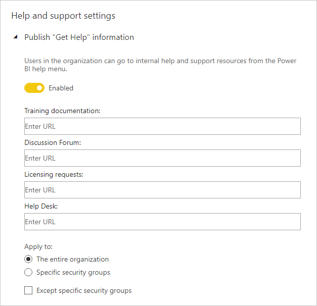

# Kiracı yöneticisi ayarları rehberi

Bu makalenin hedef kitlesi, kuruluşlarındaki Power BI ortamını ayarlamadan ve yapılandırmadan sorumlu Power BI yöneticileridir.

Makalede, Power BI deneyimini geliştirmeye yardımcı olan veya kuruluşunuzu risk altında bırakabilecek belirli kiracı ayarlarına yönelik rehberlik sunulur. Kiracınızı kuruluşunuzun ilke ve süreçleriyle uyumlu olacak şekilde yapılandırmanızı öneririz.

[Kiracı ayarları](../service-admin-portal.md#tenant-settings) [Yönetici portalından](https://app.powerbi.com/admin-portal/tenantSettings) yönetilir ve bir [Power BI hizmet yöneticisi](../service-admin-administering-power-bi-in-your-organization.md#administrator-roles-related-to-power-bi) tarafından yapılandırılabilir. Çoğu kiracı ayarı, özellikleri sınırlı sayıda kullanıcıyla kısıtlayabilir. Bu nedenle, ihtiyaç duyacağınız güvenlik gruplarını planlamak için ilk olarak ayarları öğrenmeniz önerilir. Aynı güvenlik grubunu birden fazla ayara uygulayabileceğinizi fark edebilirsiniz.

## Power BI deneyimini geliştirme

### “Yardım alın” bilgilerini yayımlama

[Microsoft Teams](/microsoftteams) veya farklı bir işbirliği platformunu kullanarak Power BI ile ilgili iç siteler oluşturmanızı öneririz. Bu siteler, eğitim belgelerini depolamak, tartışma düzenlemek, lisans isteğinde bulunmak veya yardım isteklerine yanıt vermek için kullanılabilir.

Bunu yapacaksanız, _tüm kuruluş için_ **“Yardım Alın” bilgilerini yayımla** ayarını etkinleştirmenizi öneririz. Bu ayar, **Yardım ve destek ayarları** grubunda bulunur. Şunlar için URL ayarlayabilirsiniz:

- Eğitim belgeleriniz
- Tartışma forumunuz
- Lisans istekleriniz
- Yardım masanız

Bu URL’ler, Power BI yardım menüsünde bağlantı olarak kullanıma sunulur.

> [!NOTE]
> **Lisanslama istekleri** URL’sinin sağlanması, bireysel kullanıcıların 60 günlük ücretsiz Power BI Pro deneme sürümüne kaydolmasını engeller. Bunun yerine, kullanıcılar Power BI Ücretsiz veya Pro için lisans alma bilgilerini içeren iç sitenize yönlendirilir.

## Riski yönetin

### Hizmet kesintileri veya olaylar için e-posta bildirimleri gönder

Kiracınız hizmet kesintisinden veya olaydan etkileniyorsa e-posta yoluyla bildirim alabilirsiniz. Böylece, olaylara proaktif olarak yanıt verebilirsiniz.

**Hizmet kesintileri veya olaylar için e-posta bildirimleri gönder** ayarını etkinleştirmenizi öneririz. Bu ayar **Yardım ve destek ayarları** grubunda bulunur. Bir veya daha fazla _Posta etkin_ güvenlik grubu atayın.

### Bilgi koruması

Bilgi koruması, veriler Power BI hizmetinden dışarı aktarılırken şifreleme veya eşik değerler gibi koruma ayarlarının uygulanmasına olanak tanır.

Bilgi korumasına ilişkin iki kiracı ayarı bulunur. Varsayılan olarak, ikisi de tüm kuruluş için devre dışıdır.

Hassas verilerle çalışmanız veya bunları korumanız gerekiyorsa bu ayarları etkinleştirmenizi öneririz. Daha fazla bilgi için bkz. [Power BI’da veri koruması](../admin/service-security-data-protection-overview.md).

### Çalışma alanı oluşturma

Kullanıcıların çalışma alanı oluşturmasını kısıtlayabilirsiniz. Böylece, kuruluşunuzda nelerin oluşturulabileceğini belirleyebilirsiniz.

> [!NOTE]
> Şu anda, eski çalışma alanı deneyiminden yenisine geçiş süreci devam ediyor. Bu kiracı ayarı yalnızca yeni deneyim için geçerlidir.

**Çalışma alanları oluştur** ayarı tüm kuruluş için varsayılan olarak etkindir. Bu ayar, **Çalışma alanı ayarları** grubunda bulunur.

Bir veya daha fazla güvenlik grubu atamanızı öneririz. Bu gruplara çalışma alanı oluşturma izni verilebilir _veya izin reddedilebilir_.

Çalışma alanı oluşturma hakları olmayan kullanıcılara yeni bir çalışma alanı istemeyi öğreten yönergeleri belgelerinize eklemeyi unutmayın.

### Dış kullanıcılarla içerik paylaşma

Kullanıcılar, raporları ve panoları kuruluşunuzun dışındaki kişilerle paylaşabilir.

**Dış kullanıcılarla içerik paylaş** ayarı tüm kuruluş için varsayılan olarak etkindir. Bu ayar, **Dışarı aktarma ve paylaşım ayarları** grubunda bulunur.

Bir veya daha fazla güvenlik grubu atamanızı öneririz. Bu gruplara dış kullanıcılarla içerik paylaşma izni atanabilir veya _izin reddedilebilir_.

### Web'de yayımla

[Web’de yayımla](../service-publish-to-web.md) özelliği, genel raporların Web’de yayımlanmasına olanak tanır. Uygun şekilde kullanılmazsa, gizli bilgilerin Web’de canlı olarak kullanılabilir hale gelme riski vardır.

**Web’de yayımla** ayarı, tüm kuruluş için varsayılan olarak etkindir. Ancak, yönetici olmayan kullanıcıların ekleme kodu oluşturma özellikleri kısıtlanır. **Dışarı aktarma ve paylaşım ayarları** grubunda bulunur.

Bu özellik etkinse, bir veya daha fazla güvenlik grubu atamanızı öneririz. Bu gruplara rapor yayımlama izni verilebilir _veya izin reddedilebilir_.

Ayrıca, ekleme kodlarınızın nasıl çalışacağını belirleme seçeneği de bulunur. Varsayılan olarak, **Yalnızca mevcut kodlara izin ver** olarak ayarlanır. Bu ayar, kullanıcılardan ekleme kodu oluşturmak için Power BI yöneticisine ulaşmalarının isteneceğini belirtir.

[Web’de yayımla ekleme kodlarını](https://app.powerbi.com/admin-portal/embedCodes) düzenli olarak gözden geçirmenizi de öneririz. Özel veya gizli bilgilerin yayımlanması durumunda, buna sebep olan kodları kaldırın.

### Verileri dışarı aktar

Kullanıcıların pano kutucuklarından veya rapor görsellerinden verileri dışarı aktarmalarını kısıtlayabilirsiniz.

**Verileri dışarı aktar** ayarı tüm kuruluş için varsayılan olarak etkindir. **Dışarı aktarma ve paylaşım ayarları** grubunda bulunur.

Bir veya daha fazla güvenlik grubu atamanızı öneririz. Bu gruplara rapor yayımlama izni verilebilir _veya izin reddedilebilir_.

> [!IMPORTANT]
> Bu ayarın devre dışı bırakılması, [Excel’de Çözümle](../service-analyze-in-excel.md) ve Power BI hizmeti [canlı bağlantı](../desktop-report-lifecycle-datasets.md#using-a-power-bi-service-live-connection-for-report-lifecycle-management) özelliklerinin kullanımını da kısıtlar.

> [!NOTE]
> Kullanıcılar, diğer kullanıcıların verileri dışarı aktarmasına izin verirse, [veri koruması](../admin/service-security-data-protection-overview.md) uygulayarak koruma katmanı ekleyebilirsiniz. Bu yapılandırıldığında, duyarlılık etiketleri ile yetkisiz kullanıcıların içeriği dışarı aktarması engellenir.

### Harici konuk kullanıcıların kuruluş içeriklerini düzenlemelerine ve yönetmelerine izin ver

Dış kullanıcılar Power BI içeriğini düzenleyebilir ve yönetebilir. Daha fazla bilgi için bkz. [Azure AD B2B ile Power BI içeriğini dış konuk kullanıcılara dağıtma](../service-admin-azure-ad-b2b.md).

**Dış konuk kullanıcıların kuruluş içeriklerini düzenlemelerine ve yönetmelerine izin ver** ayarı tüm kuruluş için varsayılan olarak devre dışıdır. **Dışarı aktarma ve paylaşım ayarları** grubunda bulunur.

Dış kullanıcılara içerik düzenleme ve yönetme yetkisi vermeniz gerekiyorsa, bir veya daha fazla güvenlik grubu atamanızı öneririz. Bu gruplara rapor yayımlama izni verilebilir _veya izin reddedilebilir_.

### Geliştirici ayarları

[Power BI içeriğini eklemeye](../developer/embedded/embedding.md) ilişkin iki kiracı ayarı bulunur. Bunlar:

- Uygulamalara içerik ekle (varsayılan olarak etkindir)
- Hizmet sorumlularının Power BI API’lerini kullanmasına izin ver (varsayılan olarak devre dışıdır)

İçerik eklemek için geliştirici API’lerini kullanma amacınız yoksa, bunları devre dışı bırakmanızı öneririz. Ya da bu işlemi gerçekleştirecek belirli güvenlik grupları yapılandırabilirsiniz.

## Sonraki adımlar

Bu makaleyle ilgili daha fazla bilgi için aşağıdaki kaynaklara bakın:

- [Power BI yönetimi nedir?](../service-admin-administering-power-bi-in-your-organization.md)
- [Yönetim portalında Power BI’ı yönetme](../service-admin-portal.md)
- Sorularınız mı var? [Power BI Topluluğu'na sorun](https://community.powerbi.com/)
- Önerileriniz mi var? [Power BI'ı geliştirmek için fikirlerinizi paylaşın](https://ideas.powerbi.com)
