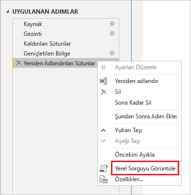
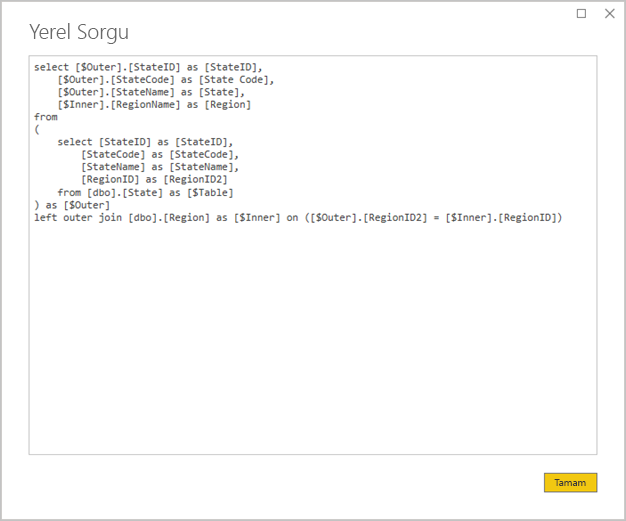
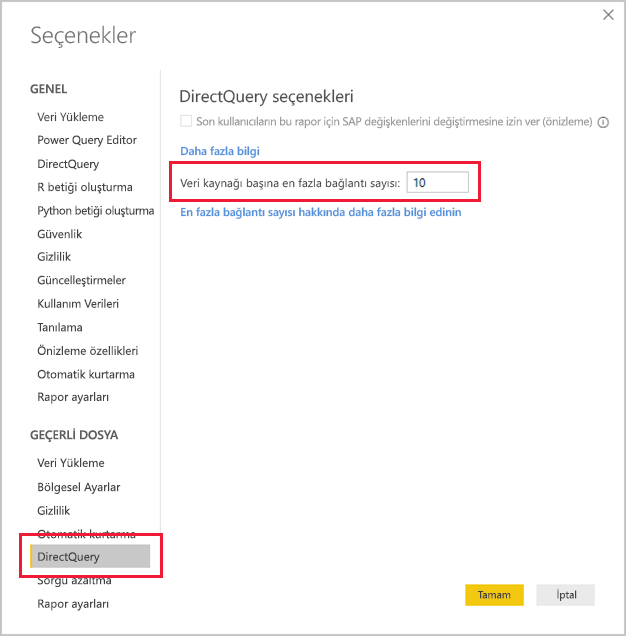
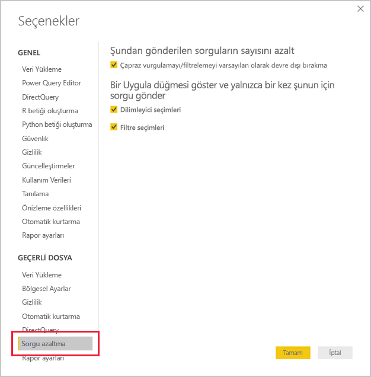
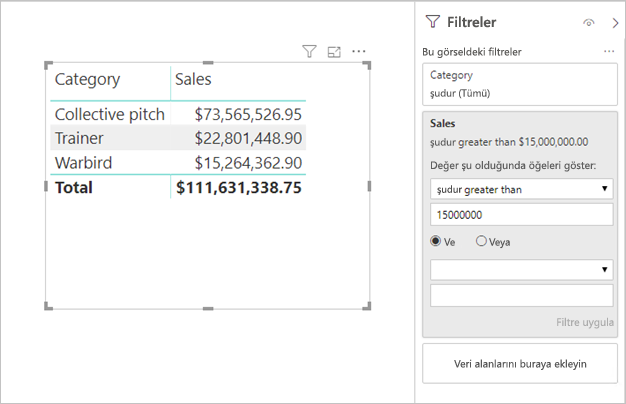

# <a name="directquery-model-guidance-in-power-bi-desktop"></a>Power BI Desktop’ta DirectQuery modeli kılavuzu

Bu makale, Power BI Desktop veya Power BI hizmeti kullanılarak geliştirilen Power BI DirectQuery modellerini geliştiren veri modelleyicilerini hedeflemektedir. DirectQuery kulanım örneklerini, sınırlamalarını ve yönergelerini açıklar. Bu kılavuz özellikle DirectQuery’nin modelinize uygun olup olmadığını belirlemenize yardımcı olmak ve DirectQuery modellerine göre raporlarınızın performansını iyileştirmek için tasarlanmıştır. Bu makale Power BI hizmetinde veya Power BI Rapor Sunucusu’nda barındırılan DirectQuery modelleri için geçerlidir.

Bu makalede DirectQuery tasarımıyla ilgili eksiksiz bir açıklama sağlamak amaçlanmamıştır. Tanıtım bilgisi için [Power BI Desktop’taki DirectQuery modelleri](../connect-data/desktop-directquery-about.md) makalesine bakın. Daha ayrıntılı bir tartışma için doğrudan [SQL Server 2016 Analysis Services’te DirectQuery](https://download.microsoft.com/download/F/6/F/F6FBC1FC-F956-49A1-80CD-2941C3B6E417/DirectQuery%20in%20Analysis%20Services%20-%20Whitepaper.pdf) teknik incelemesine başvurun. Teknik incelemenin SQL Server Analysis Services'te DirectQuery kullanımını açıkladığını unutmayın. Ancak içeriğin çoğu, Power BI DirectQuery modelleri için de geçerlidir.

Bu makale Bileşik modelleri doğrudan kapsamaz. Bir Bileşik model en az bir ve muhtemelen daha fazla DirectQuery kaynağından oluşur. Bu makalede açıklanan yönergeler, kısmen de olsa Bileşik model tasarımı için de geçerlidir. Ancak, İçeri Aktarma tablolarını DirectQuery tablolarıyla birleştirmenin sonuçları bu makalenin kapsamında değildir. Daha fazla bilgi için bkz. [Power BI Desktop’ta bileşik modelleri kullanma](../transform-model/desktop-composite-models.md).

DirectQuery modellerinin Power BI ortamında (Power BI hizmeti veya Power BI Rapor Sunucusu) ve ayrıca temel alınan veri kaynaklarında farklı bir iş yükü oluşturduğunu anlamak önemlidir. DirectQuery'nin uygun tasarım yaklaşımı olduğunu belirlerseniz, projede doğru kişileri kullanmanızı öneririz. Genellikle, başarılı bir DirectQuery modeli dağıtımının bir grup BT uzmanından oluşan bir ekibin birlikte çalışmasının sonucu olduğunu görüyoruz. Ekip genellikle model geliştiricilerden ve kaynak veritabanı yöneticilerinden oluşur. Ayrıca veri mimarlarını, veri ambarı ve ETL geliştiricilerini de içerebilir. Genellikle, iyi performans sonuçları elde etmek için iyileştirmelerin doğrudan veri kaynağına uygulanması gerekir.

## <a name="design-in-power-bi-desktop"></a>Power BI Desktop'ta tasarım

Hem Azure SQL Veri Ambarı hem de Azure HDInsight Spark veri kaynakları, Power BI Desktop kullanılmasına gerek kalmadan doğrudan bağlanabilir. Bu bağlantı, Power BI hizmetinde "Veri Alarak" ve Veritabanları kutucuğu seçilerek yapılır. Daha fazla bilgi bkz. [DirectQuery ile Azure SQL Veri Ambarı](../connect-data/service-azure-sql-data-warehouse-with-direct-connect.md).

Doğrudan bağlantı kullanışlı olsa da bu yaklaşımı kullanmanızı önermiyoruz. Bunun başlıca nedeni, temel alınan veri kaynağı şemasının değişmesi durumunda model yapısını yenilemenin mümkün olmamasıdır.

Tüm DirectQuery modellerinizi oluşturmak ve yönetmek için Power BI Desktop kullanmanızı öneririz. Bu yaklaşım hiyerarşiler, hesaplanan sütunlar, ölçümleri ve daha birçok destek özelliğin kullanımı dahil olmak üzere ihtiyacınız olan modeli tanımlamaya yönelik kapsamlı bir denetim sağlar. Ayrıca, temel alınan veri kaynağı şemasının değişmesi durumunda model tasarımını gözden geçirmenize olanak tanır.

## <a name="optimize-data-source-performance"></a>Veri kaynağı performansını iyileştirme

İlişkisel veritabanı kaynağı, aşağıdaki madde işaretli listede açıklandığı gibi çeşitli yollarla iyileştirilebilir.

> [!NOTE]
> Tüm modelleyicilerin bir ilişkisel veritabanını iyileştirme izinlerine veya becerilerine sahip olmadığını biliyoruz. Bir DirectQuery modeline yönelik verileri hazırlamak için tercih edilen katman olsa da, kaynak veritabanını değiştirmeden model tasarımında da bazı iyileştirmeler yapılabilir. Ancak, en iyi iyileştirme sonuçları genellikle kaynak veritabanına iyileştirmeler uygulanarak elde edilir.

- **Veri bütünlüğünün tamamlandığından emin olun:** Boyut türü tablolarının, olgu türü tabloları ile eşleşen bir benzersiz değerler (boyut anahtarı) sütununu içermesi özellikle önemlidir. Olgu türü boyut sütunlarının geçerli boyut anahtarı değerlerini içermesi de önemlidir. Bu durum, ilişkilerin her iki tarafında eşleşen değerler olmasını bekleyen daha verimli model ilişkileri yapılandırmaya olanak tanır. Kaynak verilerde bütünlük olmadığında, verileri etkin bir şekilde onarmak için bir "bilinmeyen" boyut kaydının eklenmesi önerilir. Örneğin, bilinmeyen bir ürünü temsil etmek için **Product** tablosuna bir satır ekleyebilir ve sonra -1 gibi bir aralık dışı anahtar atayabilirsiniz. **Sales** tablosundaki satırlar eksik bir ürün anahtarı değeri içeriyorsa bunları -1 ile değiştirin. Bunun yapılması, her **Sales** ürün anahtarı değerinin **Product** tablosunda karşılık gelen bir satıra sahip olmasını sağlar.
- **Dizin ekleme:** Beklenen rapor görseli filtrelemesi ve gruplandırması için verilerin verimli bir şekilde alınmasını desteklemek üzere tablo veya görünümlerde uygun dizinleri tanımlayın. SQL Server, Azure SQL Veritabanı veya Azure SQL Veri Ambarı kaynakları için, dizin tasarımı kılavuzuna ilişkin yararlı bilgiler almak üzere [SQL Server Dizin Mimarisi ve Tasarım Kılavuzu](/sql/relational-databases/sql-server-index-design-guide)’na göz atın. SQL Server veya Azure SQL Veritabanı geçici kaynakları için bkz. [Gerçek zamanlı işletimsel analizler için Columnstore ile çalışmaya başlama](/sql/relational-databases/indexes/get-started-with-columnstore-for-real-time-operational-analytics).
- **Dağıtılmış tablolar tasarlama:** Çok Büyük Ölçekte Paralel İşleme (MPP) mimarisinden yararlanan Azure SQL Veri Ambarı kaynakları için, büyük olgu türü tabloları karma dağıtılmış olarak yapılandırmayı ve boyut türü tabloları tüm işlem düğümlerinde çoğaltılacak şekilde yapılandırmayı düşünün. Daha fazla bilgi için bkz. [Azure SQL Veri Ambarı’nda dağıtılmış tablolar tasarlama yönergeleri](/azure/sql-data-warehouse/sql-data-warehouse-tables-distribute#what-is-a-distributed-table).
- **Gerekli veri dönüştürme işlemlerinin gerçekleştirildiğinden emin olun:** SQL Server ilişkisel veritabanı kaynakları (ve diğer ilişkisel veritabanı kaynakları) için, hesaplanan sütunlar tablolara eklenebilir. Bu sütunlar **UnitPrice** ile çarpılmış **Quantity** gibi bir ifadeyi temel alır. Hesaplanan sütunlar kalıcı (gerçekleştirilmiş) olabilir ve normal sütunlar gibi bazı durumlarda dizinlenebilir. Daha fazla bilgi için bkz. [Hesaplanan Sütunlarda Dizinler](/sql/relational-databases/indexes/indexes-on-computed-columns).

    Aynı zamanda olgu tablosu verilerini daha yüksek bir dokuda önceden toplayabilen dizinlenmiş görünümleri göz önünde bulundurun. Örneğin, **Sales** tablosu verileri sipariş satırı düzeyinde depoluyorsa, bu verileri özetlemek için bir görünüm oluşturabilirsiniz. Görünüm, **Sales** tablosu verilerini tarih (ay düzeyinde), müşteri, ürüne göre gruplandıran ve satış, miktar vb. ölçüm değerlerini özetleyen bir SELECT ifadesine dayandırılabilir. Daha sonra görünüm dizinlenebilir. SQL Server veya Azure SQL Veritabanı kaynakları için bkz. [Dizinlenmiş Görünümler Oluşturma](/sql/relational-databases/views/create-indexed-views).
- **Veri tablosu gerçekleştirme:** Genel bir modelleme gereksinimi, zamana dayalı filtrelemeyi desteklemek için bir veri tablosu eklemeyi içerir. Kuruluşunuzda bilinen zamana dayalı filtreleri desteklemek için, kaynak veritabanında bir tablo oluşturun ve tabloya olgu tablosu tarihlerini kapsayan bir tarih aralığının yüklendiğinden emin olun. Ayrıca, tablonun yıl, üç ay, ay, hafta gibi faydalı süreleri içerdiğinden emin olun.

## <a name="optimize-model-design"></a>Model tasarımını iyileştirme

Bir DirectQuery modeli, aşağıdaki madde işaretli listede açıklandığı gibi birçok şekilde iyileştirilebilir.

- **Karmaşık Power Query sorgularından kaçının:** Power Query sorgularının herhangi bir dönüştürme uygulaması gereksinimi ortadan kaldırılarak verimli bir model tasarımı elde edilebilir. Diğer bir deyişle, her sorgu tek bir ilişkisel veritabanı kaynak tablosu veya görünümüne eşlenir. **Yerel Sorguyu Görüntüle** seçeneğini belirleyerek, Power Query uygulanmış bir adım için gerçek SQL sorgu bildiriminin bir temsiline ait önizlemeyi görebilirsiniz.

    
    
    

- **Hesaplanmış sütun ve veri türü değişikliklerinin kullanımını inceleyin:** DirectQuery modelleri, veri türlerini dönüştürmek için hesaplamalar ve Power Query adımları eklemeyi destekler. Ancak, mümkün olduğunda, ilişkisel veritabanı kaynağında dönüştürme sonuçları gerçekleştirilerek genellikle daha iyi performans elde edilir.
- **Power Query göreli tarih filtrelemesi kullanmayın:** Bir Power Query sorgusunda göreli tarih filtrelemesi tanımlanabilir. Örneğin, son bir yılda (bugünün tarihine göre) oluşturulan satış siparişlerini getirmek için. Bu filtre türü aşağıdaki gibi verimsiz bir sorguya dönüşür:

    ```SQL
    …
    from [dbo].[Sales] as [_]
    where [_].[OrderDate] >= convert(datetime2, '2018-01-01 00:00:00') and [_].[OrderDate] < convert(datetime2, '2019-01-01 00:00:00'))  
    ```
    
    Veri tablosuna göreli saat sütunlarını dahil etmek daha iyi bir tasarım yaklaşımıdır. Bu sütunlar, geçerli tarihe göre uzaklık değerlerini depolar. Örneğin, bir **RelativeYear** sütununda sıfır değeri geçerli yılı temsil eder, -1 önceki yılı temsil eder vb. Tercihen, **RelativeYear** sütunu tarih tablosunda gerçekleştirilir. Daha az verimli olsa da, [TODAY](/dax/today-function-dax) ve [DATE](/dax/date-function-dax) DAX işlevleri kullanılarak ifadeye göre modelde hesaplanmış bir sütun olarak da eklenebilir.

- **Ölçüleri basit tutun:** Ölçülerin en azından başlangıçta basit toplamalarla sınırlanması önerilir. Toplama işlevleri SUM, COUNT, MIN, MAX ve AVERAGE şeklindedir. Daha sonra, ölçüler yeterince yanıt veriyorsa daha karmaşık ölçüleri deneyebilirsiniz, ancak her birinin performansına dikkat edin. [CALCULATE](/dax/calculate-function-dax) DAX işlevi, filtre bağlamını denetleyen karmaşık ölçü ifadeleri üretmek için kullanılabilse de, iyi performans göstermeyen pahalı yerel sorgular oluşturabilir.
- **Hesaplanmış sütunlarda ilişki kullanmayın:** Model ilişkileri yalnızca bir tablodaki tek bir sütunu, farklı bir tablodaki tek bir sütunla ilişkilendirebilir. Ancak bazen birden çok sütun kullanarak tabloları ilişkilendirmek gerekir. Örneğin, **Sales** ve **Geography** tabloları iki sütun ile ilişkilendirilir: **Country** ve **City**. Tablolar arasında ilişki oluşturmak için tek bir sütun gereklidir ve **Geography** tablosunda sütunun benzersiz değerler içermesi gerekir. Ülke ve şehri bir tire ayırıcısıyla birleştirerek bu sonucu elde edebilirsiniz.

    Birleşik sütun, bir Power Query özel sütunuyla ya da modelde hesaplanmış bir sütun olarak oluşturulabilir. Ancak, hesaplama ifadesi kaynak sorgulara katıştırılabildiğinden bundan kaçınılması gerekir. Bu sadece verimsiz bir yöntem olmakla kalmayıp, genellikle dizinlerin kullanımını engeller. Bunun yerine, ilişkisel veritabanı kaynağına gerçekleştirilmiş sütunlar ekleyin ve bunları dizinlemeyi deneyin. Ayrıca, ilişkisel veri ambarı tasarımlarında yaygın bir uygulama olarak, boyut türü tablolarına vekil anahtar sütunları eklemeyi de düşünebilirsiniz.
    
    Bu yönergenin bir istisnası vardır ve [COMBINEVALUES](/dax/combinevalues-function-dax) DAX işlevinin kullanımıyla ilgilidir. Bu işlevin amacı, çok sütunlu model ilişkilerini desteklemektir. İlişkinin kullandığı bir ifade oluşturmak yerine, çok sütunlu bir SQL birleşim koşulu oluşturur.
- **"Benzersiz Tanıtıcı" sütunlarında ilişkiler kullanmayın:** Power BI, benzersiz tanıtıcı (GUID) veri türünü yerel olarak desteklemez. Bu türdeki sütunlar arasında bir ilişki tanımlarken Power BI, tür dönüştürme içeren bir birleşim ile kaynak sorgu oluşturur. Bu sorgu zamanı veri dönüştürme işlemi genellikle düşük performansa neden olur. Bu durum iyileştirilene kadar tek geçici çözüm, temel alınan veritabanında alternatif bir veri türündeki sütunların gerçekleştirilmesidir.
- **İlişkilerin tek taraflı sütununu gizleyin:** Bir ilişkinin tek taraflı sütununun gizlenmesi gerekir. (Bu, genellikle boyut türü tablolarının birincil anahtar sütunudur.) Gizlendiğinde, **Alanlar** bölmesinde gösterilmez ve bu nedenle bir görseli yapılandırmak için kullanılamaz. Çok taraflı sütun ise raporları sütun değerlerine göre gruplamak veya filtrelemek için yararlıysa görünebilir. Örneğin, **Sales** ve **Product** tabloları arasında ilişki bulunan bir modeli düşünün. İlişki sütunları ürün SKU'su (Stok Tutma Birimi) değerlerini içerir. Ürün SKU'sunun görsellere eklenmesi gerekiyorsa yalnızca **Sales** tablosunda görünür olması gerekir. Bu sütun bir görselde filtrelemek veya gruplandırmak için kullanıldığında Power BI, **Sales** ve **Product** tablolarını birleştirmesi gerekmeyen bir sorgu oluşturur.
- **Bütünlüğü sağlamak için ilişkileri ayarlayın:** DirectQuery ilişkilerinin **Bilgi Tutarlılığı Varsay** özelliği, Power BI’ın dış birleşim yerine iç birleşim kullanarak kaynak sorgular oluşturup oluşturmayacağını belirler. Bu genellikle sorgu performansını iyileştirse de ilişkisel veritabanı kaynağının ayrıntılarına bağlıdır. Daha fazla bilgi için bkz. [Power BI Desktop'ta Bilgi tutarlılığı varsay ayarları](../connect-data/desktop-assume-referential-integrity.md).
- **İki yönlü ilişki filtrelemesi kullanmaktan kaçının:** İki yönlü ilişki filtrelemesinin kullanılması iyi performans göstermeyen sorgu deyimlerine yol açabilir. Bu ilişki özelliğini yalnızca gerektiğinde kullanın. Genellikle bir köprü oluşturma tablosunda çoka çok ilişkiler uygularken bu durum geçerlidir. Daha fazla bilgi için bkz. [Power BI Desktop’ta çoğa çok kardinalitesine sahip ilişkiler](../transform-model/desktop-many-to-many-relationships.md).
- **Paralel sorguları sınırlama:** Her temel veri kaynağı için DirectQuery'nin açtığı en fazla bağlantı sayısını ayarlayabilirsiniz. Bu ayar, eşzamanlı olarak veri kaynağına gönderilen sorguların sayısını denetler.

    
    
    Ayar yalnızca modelde en az bir DirectQuery kaynağı olduğunda etkinleştirilir. Değer tüm DirectQuery sorgularına ve aynı modele eklenen tüm yeni DirectQuery kaynaklarına uygulanır.

    **Veri Kaynağı Başına En Fazla Bağlantı Sayısı** değerini yükseltmek temel veri kaynağına daha fazla sorgu (belirtilen en yüksek sayıya kadar) gönderilebilmesini sağlar ve tek sayfada çok sayıda görsel bulunduğunda veya rapora aynı anda çok sayıda kullanıcı eriştiğinde yararlı olur. En fazla bağlantı sayısına ulaşıldığında, bağlantı kullanılabilir duruma gelene kadar diğer sorgular kuyruğa alınır. Bu sınırın yükseltilmesi temel veri kaynağında daha fazla yüke yol açtığından bu ayar genel performansın artırılmasını garanti etmez.
    
    Model Power BI’da yayımlandığında, temel alınan veri kaynağına gönderilen en fazla eşzamanlı sorgu sayısı da ortama bağlı olarak değişir. Farklı ortamların (Power BI, Power BI Premium veya Power BI Rapor Sunucusu gibi) her biri farklı aktarım hızı kısıtlamaları uygulayabilir. Power BI Premium kapasite kaynak sınırlamaları hakkında daha fazla bilgi için bkz. [Power BI Premium Kapasitelerini Dağıtma ve Yönetme](./whitepaper-powerbi-premium-deployment.md).

## <a name="optimize-report-designs"></a>Rapor tasarımlarını iyileştirme

Bir DirectQuery veri kümesini temel alan raporlar, aşağıdaki madde işaretli listede açıklandığı gibi birçok şekilde iyileştirilebilir.

- **Sorgu azaltma tekniklerini etkinleştirin:** Power BI Desktop _Seçenekleri ve Ayarları_, bir Sorgu Azaltma sayfası içerir. Bu sayfada üç yardımcı seçenek bulunur. Çapraz vurgulamayı ve çapraz filtrelemeyi varsayılan olarak devre dışı bırakmak mümkündür, ancak etkileşimler düzenlenerek bu ayar geçersiz kılınabilir. Ayrıca, dilimleyiciler ve filtreler üzerinde bir Uygula düğmesi göstermek de mümkündür. Rapor kullanıcısı düğmeye tıklamadığı sürece dilimleyici veya filtre seçenekleri uygulanmaz. Bu seçenekleri etkinleştirirseniz, raporu ilk kez oluştururken bunu yapmanızı öneririz.

    
    
- **Önce filtreleri uygulayın:** Raporları ilk kez tasarlarken, alanları görsel alanlarla eşlemeye başlamadan önce rapor, sayfa veya görsel düzeyinde uygulanabilir tüm filtreleri uygulamanızı öneririz. Örneğin, **Country** ve **Sales** ölçümlerini sürükleyip belirli bir yıla göre filtrelemek yerine, filtreyi öncelikle **Year** alanına uygulayın. Bunun nedeni, görsel oluşturma işleminin her adımında sorgu gönderilecek olmasıdır. İlk sorgu tamamlanmadan başka bir değişiklik yapılabilse de, temel alınan veri kaynağında yine de gereksiz yük oluşur. Filtreler erken uygulandığında, bu ara sorgular genellikle daha az maliyetli ve daha hızlı olur. Ayrıca, filtrelerin erken uygulanmaması yukarıda açıklandığı gibi 1 milyon satır sınırının aşılmasına neden olabilir.
- **Sayfadaki görsel sayısını sınırlayın:** Bir rapor sayfası açıldığında (ve sayfa filtreleri uygulandığında), sayfadaki tüm görseller yenilenir. Ancak, yukarıda açıklandığı gibi, paralel olarak gönderilebilecek sorgu sayısı Power BI ortamı ve **Veri Kaynağı Başına En Fazla Bağlantı** ayarı ile sınırlandırılır. Bu nedenle, sayfa görsellerinin sayısı arttıkça, sayfa görsellerinin seri bir şekilde yenilenme olasılığı artar. Sonuç olarak tüm sayfayı yenileme süresi uzar ve aynı zamanda görsellerin tutarsız sonuçlar (geçici veri kaynakları için) gösterme olasılığı artar. Bu nedenle, herhangi bir sayfadaki görsel sayısının sınırlanması ve bunun yerine sade içeriklere sahip daha fazla sayıda sayfa oluşturulması önerilir. Birden fazla kart görseli tek bir çok satırlı kart görseli ile değiştirilerek benzer bir sayfa düzeni elde edilebilir.
- **Görseller arasındaki etkileşimi kapatın:** Çapraz vurgulama ve çapraz filtreleme etkileşimleri, temel alınan kaynağa sorgu gönderilmesini gerektirir. Kullanıcı seçimlerine yanıt verme süresi makul olmayan bir uzunluktaysa, bu etkileşimlerin gerekli olmadığı sürece kapatılması önerilir. Bu etkileşimler raporun tamamı için (yukarıda Sorgu Azaltma seçenekleri için açıklandığı gibi) veya tek tek olay temelinde kapatılabilir. Daha fazla bilgi için bkz. [Görseller bir Power BI raporunda birbirini nasıl çapraz filtreler?](../consumer/end-user-interactions.md).

Yukarıdaki iyileştirme teknikleri listesine ek olarak, aşağıdaki raporlama özelliklerinin her biri performans sorunlarını artırabilir:

- **Ölçü filtreleri:** Ölçü (veya sütun toplamları) içeren görsellerde bu ölçülere uygulanmış filtreler olabilir. Örneğin, aşağıdaki görselde **Kategori** filtresine göre **Satış** değeri gösterilmektedir ancak yalnızca 15 milyon ABD dolarından yüksek satışa sahip kategoriler dahil edilmiştir.

    
    
    
    Bunun sonucunda, temel alınan kaynağa iki sorgu gönderilebilir:
    
    - İlk sorgu, koşulu karşılayan (Satış > 15 milyon ABD doları) kategorileri alır
    - İkinci sorgu, koşulu karşılayan kategorileri WHERE yan tümcesine ekleyerek görsel için gereken verileri alır
    
    Bu örnekte olduğu gibi, yüzlerce veya binlerce kategori olduğunda genellikle düzgün bir performans sergilenir. Bununla birlikte, kategori sayısı çok daha fazla olduğunda performans düşebilir ve yukarıda bahsedilen 1 milyon satır sınırı nedeniyle, koşulu karşılayan kategoriler 1 milyondan fazlaysa sorgu başarısız olur.
- **Üst N filtreleri:** Bir ölçüye göre derecelendirilen ilk (veya son) N değeri filtrelemek için gelişmiş filtreler tanımlanabilir. Örneğin, yukarıdaki görselde yalnızca en üstteki beş kategoriyi göstermek için. Ölçü filtrelerinde olduğu gibi bu da temel alınan veri kaynağına iki sorgunun gönderilmesine neden olur. Ancak, ilk sorgu temel alınan kaynaktan tüm kategorileri döndürür ve döndürülen sonuçlara dayalı olarak İlk N belirlenir. Söz konusu sütunun kardinalitesine bağlı olarak performans sorunları oluşabilir veya 1 milyon satır sınırı nedeniyle sorgu başarısız olabilir.
- **Ortanca Değer:** Genellikle tüm toplamalar (Toplam, Ayrı Sayım vb.) temel alınan kaynağa gönderilir. Ancak, bu toplama işlemi, temel alınan kaynak tarafından desteklenmediğinden bu durum Ortanca için geçerli değildir. Böyle durumlarda ayrıntı verileri, temel alınan kaynaktan alınır ve döndürülen sonuçlardan Power BI ortancayı değerlendirir. Bu, ortancanın az sayıda sonuç üzerinden hesaplandığında durumlarda makul bir işlemdir ancak kardinalite yüksek olduğunda performans sorunları oluşur veya 1 milyon satır sınırı nedeniyle sorgu başarısız olur. Örneğin, ortanca ülke nüfusu makul olabilirken ortanca satış fiyatı olmayabilir.
- **Dilimleyicileri çoklu seçme:** Dilimleyicilerde ve filtrelerde çoklu seçime izin vermek performans sorunlarına neden olabilir. Bunun nedeni, kullanıcı ek dilimleyici öğeleri seçtiğinde (örneğin, en çok ilgilendiği 10 ürüne kadar) her yeni seçimin temel alınan kaynağa yeni bir sorgu gönderilmesine neden olmasıdır. Kullanıcı, sorgu tamamlanmadan önce bir sonraki öğeyi seçebilse de bu durum temel alınan kaynakta ek yüke neden olur. Bu durum, yukarıdaki sorgu azaltma teknikleri bölümünde açıklandığı gibi Uygula düğmesi gösterilerek engellenebilir.
- **Görsel toplamları:** Varsayılan olarak, tablolar ve matrisler toplamları ve alt toplamları görüntüler. Çoğu durumda, toplam değerlerinin alınması için temel kaynağa ek sorgular gönderilmelidir. Bu durum, Ayrı Sayım veya Ortanca toplamlarının kullanıldığı her durumda ve SAP HANA veya SAP Business Warehouse üzerinde DirectQuery kullanılan tüm örneklerde geçerlidir. Bu tür toplamlar gerekli değilse kapatılmalıdır (Biçimlendir bölmesi kullanılarak).

## <a name="convert-to-a-composite-model"></a>Kompozit Modele dönüştürme

İçeri Aktarma ve DirectQuery modellerinin avantajları, model tablolarının depolama modu yapılandırılarak tek bir modelde birleştirilebilir. Tablo depolama modu İçeri Aktarma, DirectQuery veya İkili olarak bilinen her iki seçeneğin karması olabilir. Model farklı depolama modları içerdiğinde Bileşik model olarak adlandırılır. Daha fazla bilgi için bkz. [Power BI Desktop’ta bileşik modelleri kullanma](../transform-model/desktop-composite-models.md).

Bir DirectQuery modelini Bileşik modele dönüştürerek elde edilebilen birçok işlev ve performans geliştirmesi vardır. Bileşik bir model birden fazla DirectQuery kaynağını tümleştirebilir ve ayrıca toplamaları içerebilir. Toplama tabloları, tablonun özetlenen bir gösterimini içeri aktarmak için DirectQuery tablolarına eklenebilir. Görseller daha yüksek düzeyde toplamaları sorguladığında çarpıcı performans geliştirmeleri elde edilebilir. Daha fazla bilgi için bkz. [Power BI Desktop'taki Toplamalar](../transform-model/desktop-aggregations.md).

## <a name="educate-users"></a>Kullanıcıları eğitme

DirectQuery veri kümelerini temel alan raporlarla verimli bir şekilde çalışmak için kullanıcılarınızı eğitmeniz önemlidir. Rapor yazarlarınız, [Rapor tasarımlarını iyileştirme](#optimize-report-designs) bölümünde açıklanan içerik konusunda eğitim almış olmalıdır.

Rapor tüketicilerinizi, DirectQuery veri kümelerini temel alan raporlarınız hakkında eğitmenizi öneririz. Bu makalede açıklanan ilgili sınırlamalar da dahil olmak üzere genel veri mimarisini öğrenmeleri yararlı olabilir. Yenileme yanıtlarının ve etkileşimli filtrelemenin zaman zaman yavaş olabileceğini bildirin. Rapor kullanıcıları performans düşüşünün nedenlerini anladıklarında raporlara ve verilere yönelik güven kaybı yaşama olasılığı düşüktür.

Geçici veri kaynaklarıyla ilgili rapor sunarken, rapor kullanıcılarını Yenile düğmesinin kullanımıyla ilgili eğittiğinizden emin olun. Ayrıca, tutarsız sonuçlar görebileceklerini ve raporu yenilemenin rapor sayfasındaki tutarsızlıkları çözebileceğini bildirin.

## <a name="next-steps"></a>Sonraki adımlar

DirectQuery hakkında daha fazla bilgi için aşağıdaki kaynaklara bakın:

- [Power BI Desktop’ta DirectQuery modelleri](../connect-data/desktop-directquery-about.md)
- [Power BI Desktop'ta DirectQuery'yi kullanma](../connect-data/desktop-use-directquery.md)
- [Power BI Desktop’ta DirectQuery modeli sorunlarını giderme](../connect-data/desktop-directquery-troubleshoot.md)
- Sorularınız mı var? [Power BI Topluluğu'na sorun](https://community.powerbi.com/)
