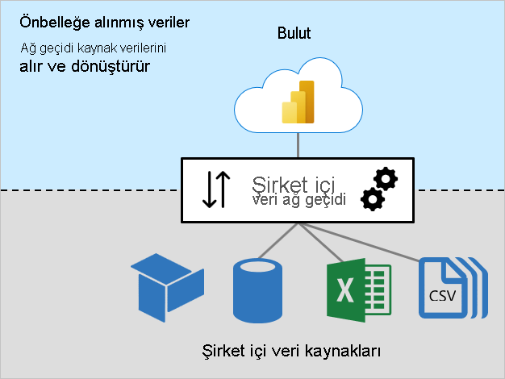
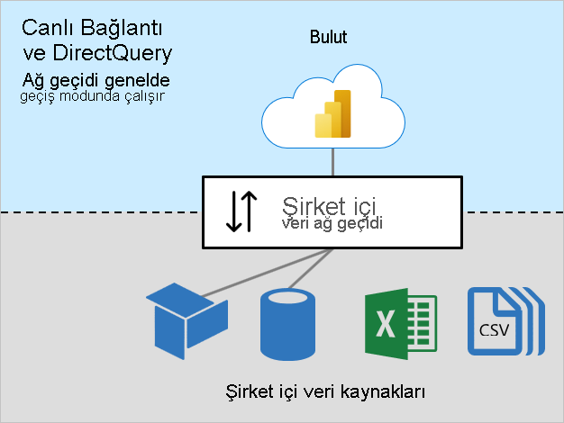

# Şirket içi veri ağ geçidi boyutlandırması

Bu makale [şirket içi veri ağ geçidini](../connect-data/service-gateway-onprem.md) yüklemesi ve yönetmesi gereken Power BI yöneticilerine yöneliktir.

Power BI’ın doğrudan İnternet üzerinden erişilemeyen verilere erişmesi gereken her durumda ağ geçidi gereklidir. Şirket içinde bir sunucuya veya VM’de barındırılan Hizmet Olarak Altyapıya (IaaS) yüklenebilir.

## Ağ geçidi iş yükleri

Şirket içi veri ağ geçidi iki iş yükünü destekler. Ağ geçidi boyutlandırmasını ve önerileri anlatmadan önce bu iş yüklerini anlamanız önemlidir.

### Önbelleğe alınan veriler iş yükü

_Önbelleğe alınan veriler_ iş yükü kaynak verileri Power BI veri kümelerine yüklemek üzere alır ve dönüştürür. Bu işlemi üç adımda yapar:

1. **Bağlantı**: Ağ geçidi veri kaynağına bağlanır
1. **Verileri alma ve dönüştürme**: Veriler alınır ve gerektiğinde dönüştürülür. Mümkünse, Power Query mashup altyapısı dönüştürme adımlarını veri kaynağına gönderir; bu işlem _[sorguyu kaynağa iletme](power-query-folding.md)_ olarak bilinir. Mümkün değilse, dönüştürmelerin ağ geçidi tarafından yapılması gerekir. Bu durumda ağ geçidi daha fazla CPU ve bellek kaynağı tüketir.
1. **Aktarma**: Veriler Power BI hizmetine aktarılır; özellikle büyük hacimli veriler söz konusu olduğunda güvenilir ve hızlı bir İnternet bağlantısı önemlidir

### Canlı Bağlantı ve DirectQuery iş yükleri

_Canlı Bağlantı ve DirectQuery_ iş yükü çoğunlukla geçiş modunda çalışır. Power BI hizmeti sorguları gönderir ve ağ geçidi de sorgu sonuçlarıyla yanıt verir. Genel olarak sorgu sonuçları küçük boyutludur.

- Canlı Bağlantı hakkında daha fazla bilgi için bkz. [Power BI hizmetinde veri kümeleri (Harici olarak barındırılan modeller)](../connect-data/service-datasets-understand.md#external-hosted-models).
- DirectQuery hakkında daha fazla bilgi için bkz. [Power BI hizmetindeki veri kümesi modları (DirectQuery modu)](../connect-data/service-dataset-modes-understand.md#directquery-mode).

Bu iş yüküne, sorguları ve sorgu sonuçlarını yönlendirmek için CPU kaynakları gerekir. Çoğu durumda Önbellek verileri iş yüküne gerekenden (özellikle de verileri önbelleğe almak için dönüştürmek gerekli olduğunda) çok daha az CPU talebi söz konusudur.

Rapor kullanıcılarının hızlı yanıt alabildiği deneyimler sağlamak için güvenilir, hızlı ve tutarlı bir bağlantı önemlidir.

## Boyutlandırma işleminde dikkat edilmesi gerekenler

Ağ geçidi makinenizin doğru boyutu aşağıdaki değişkenlere bağlı olarak saptanabilir:

- Veri önbelleği iş yükleri için:
  - Eş zamanlı veri kümesi yenilemelerinin sayısı
  - Veri kaynaklarının türleri (ilişkisel veritabanı, analitik veritabanı, veri akışları veya dosyalar)
  - Veri kaynaklarından alınacak verilerin hacmi
  - Power Query mashup altyapısı tarafından yapılması gereken tüm dönüştürmeler
  - Power BI hizmetine aktarılacak verilerin hacmi
- Canlı Bağlantı ve DirectQuery iş yükleri için:
  - Eş zamanlı rapor kullanıcılarının sayısı
  - Rapor sayfalarındaki görsellerin sayısı (her görsel en az bir sorgu gönderir)
  - Power BI panosu sorgu önbelleği güncelleştirmelerinin sıklığı
  - [Otomatik sayfa yenileme](../create-reports/desktop-automatic-page-refresh.md) özelliği kullanan gerçek zamanlı raporların sayısı
  - Veri kümelerinin [Satır Düzeyi Güvenlik (RLS)](../create-reports/desktop-rls.md) zorunluluğu olup olmadığı

Genel olarak Canlı Bağlantı ve DirectQuery iş yüklerine yeterli bir miktarda CPU gerekirken, Önbellek verileri iş yüklerine daha fazla CPU ve bellek gerekir. Her iki iş yükü de Power BI hizmetiyle iyi bir bağlantıya ve veri kaynaklarına bağımlıdır.

> [!NOTE]
> Power BI kapasiteleri model yenileme paralelliğine, ayrıca Canlı Bağlantı ve DirectQuery aktarım hızına sınırlar getirir. Ağ geçitlerinizi Power BI hizmetinin desteklediğinden daha fazlasını sağlamak için boyutlandırmak anlamlı olmaz. Sınırlar Premium SKU’suna (ve eşdeğer boyutlu A SKU’suna) göre değişir. Daha fazla bilgi için bkz. [Power BI Premium nedir? (Kapasite düğümleri)](../admin/service-premium-what-is.md#capacity-nodes).

## Öneriler

Ağ geçidi boyutlandırma önerileri birçok değişkene dayanır. Bu bölümde size, göz önünde bulundurabileceğiniz genel öneriler sağlıyoruz.

### İlk boyutlandırma

Doğru boyutu tahmin etmek zor olabilir. En az 8 CPU çekirdeği, 8 GB RAM ve birden çok Gigabit ağ bağdaştırıcısı içeren bir makineyle başlamanızı öneririz. Daha sonra CPU ve bellek sistemi sayaçlarını günlüğe kaydederek tipik bir ağ geçidi yükünü ölçebilirsiniz. Daha fazla bilgi için bkz. [Şirket içi veri ağ geçidi performansını izleme ve en iyi duruma getirme](/data-integration/gateway/service-gateway-performance).

### Bağlantı

Power BI hizmetiyle ağ geçidiniz ve ağ geçidinizle veri kaynakları arasında mümkün olan en iyi bağlantıyı planlayın.

- Güvenilirlik, yüksek hızlar ve düşük, tutarlı gecikme süreleri sağlamaya çalışın
- Ağ geçidi ile veri kaynaklarınız arasındaki makine atlamalarını ortadan kaldırın veya azaltın
- Güvenlik duvarı ara sunucu katmanınız tarafından uygulanan tüm ağ azaltmalarını kaldırın. Power BI uç noktaları hakkında daha fazla bilgi için bkz. [Power BI URL’lerini izin verilenler listenize ekleme](../admin/power-bi-allow-list-urls.md).
- Power BI ile özel ve yönetilen bağlantılar kurmak için [Azure ExpressRoute](/azure/expressroute/expressroute-introduction)’u yapılandırın
- Azure VM’lerindeki veri kaynakları için, VM’lerin [Power BI hizmetiyle aynı konumda yer aldığından](../admin/service-admin-where-is-my-tenant-located.md) emin olun
- Dinamik RLS içeren SQL Server Analysis Services’e (SSAS) yönelik Canlı Bağlantı iş yükleri için, ağ geçidi makinesiyle şirket içi Active Directory arasında iyi bir bağlantı bulunduğundan emin olun

### Kümeleniyor

Büyük ölçekli dağıtımlarda, küme yüklemelerinin ağ geçidini oluşturabilirsiniz. Kümeler tek hata noktalarını önler ve ağ geçitleri arasında trafik yükünü dengeleyebilir. Seçenekleriniz şunlardır:

- Kümede bir veya birden çok ağ geçidi yükleme
- İş yüklerini tek başına ağ geçitlerinde veya ağ geçidi sunucusu kümelerinde yalıtma

Daha fazla bilgi için bkz. [Şirket içi veri ağ geçidi yüksek kullanılabilirlik kümelerini ve yük dengelemesini yönetme](/data-integration/gateway/service-gateway-high-availability-clusters).

### Veri kümesi tasarımı ve ayarları

Veri kümesi tasarımı ve bunun ayarları ağ geçidi iş yüklerini etkileyebilir. Ağ geçidi iş yükünü azaltmak için aşağıdaki eylemleri göz önüne alabilirsiniz.

İçeri Aktarma veri kümeleri için:

- Daha seyrek veri yenilemesi yapılandırma
- Aktarılacak veri miktarını en aza indirmek için [artımlı yenilemeyi](../admin/service-premium-incremental-refresh.md) yapılandırma
- Mümkün olduğunca [sorguyu kaynağa iletmenin](power-query-folding.md) gerçekleştirildiğinden emin olma
- Özellikle büyük hacimli olan veya düşük gecikme süreli yanıtlar için gereken veriler söz konusu olduğunda, tasarımı DirectQuery modeline veya [Bileşik](../connect-data/service-dataset-modes-understand.md#composite-mode) modele dönüştürme

DirectQuery veri kümeleri için:

- Veri kaynaklarını, modeli ve rapor tasarımlarını iyileştirin. Daha fazla bilgi için bkz. [Power BI Desktop’ta DirectQuery modeli kılavuzu](directquery-model-guidance.md)
- Üst düzey sonuçları yakalayıp DirectQuery isteklerinin sayısını azaltmak için [toplamalar](../transform-model/desktop-aggregations.md) oluşturun
- Rapor tasarımlarında ve kapasite ayarlarında [Otomatik sayfa yenileme](../create-reports/desktop-automatic-page-refresh.md) aralıklarını kısıtlayın
- Özellikle dinamik RLS zorunlu tutulduğunda pano önbelleği güncelleştirme sıklığını kısıtlayın
- Özellikle daha küçük hacimli verilerde veya geçici olmayan verilerde, tasarımı bir İçeri Aktarma modeline veya [Bileşik](../connect-data/service-dataset-modes-understand.md#composite-mode) modele dönüştürün

Canlı Bağlantı veri kümeleri için:

- Özellikle dinamik RLS zorunlu tutulduğunda pano önbelleği güncelleştirme sıklığını kısıtlayın

## Sonraki adımlar

Bu makaleyle ilgili daha fazla bilgi için aşağıdaki kaynaklara bakın:

- [Power BI için bir veri ağ geçidi dağıtmaya yönelik rehberlik](../connect-data/service-gateway-deployment-guidance.md)
- [Şirket içi veri ağ geçidi için ara sunucu ayarlarını yapılandırma](/data-integration/gateway/service-gateway-proxy)
- [Şirket içi veri ağ geçidi performansını izleme ve en iyi duruma getirme](/data-integration/gateway/service-gateway-performance)
- [Ağ geçidiyle ilgili sorunları giderme - Power BI](../connect-data/service-gateway-onprem-tshoot.md)
- [Şirket içi veri ağ geçidi sorunlarını giderme](/data-integration/gateway/service-gateway-tshoot)
- [Sorguyu kaynağa iletmenin önemi](power-query-folding.md)
- Sorularınız mı var? [Power BI Topluluğu'na sorun](https://community.powerbi.com/)
- Önerileriniz mi var? [Power BI'ı geliştirmek için fikirlerinizi paylaşın](https://ideas.powerbi.com)
