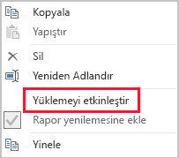

# İçeri Aktarma modellemesi için veri azaltma teknikleri

Bu makale İçeri Aktarma modelleri geliştiren Power BI Desktop veri modelleyicilerine yöneliktir. İçeri Aktarma modellerine yüklenen verileri azaltmaya yardımcı olacak farklı teknikler açıklanır.

İçeri Aktarma modelleri sıkıştırılmış ve iyileştirilmiş verilerle yüklenir, sonra da VertiPaq depolama motoru tarafından diskte depolanır. Kaynak veriler belleğe yüklendiğinde 10 kat sıkıştırma görmek mümkündür ve bundan dolayı 10 GB kaynak verinin boyutunun yaklaşık 1 GB'a kadar sıkıştırılması beklenebilir. Ayrıca diskte kalıcı hale getirildiğinde fazladan %20 daha azaltma elde edilebilir.

VertiPaq depolama motoruyla elde edilen verimliliklere karşın, modellerinize yüklenecek olan verileri en aza indirmek için çaba harcamanız önemlidir. Bu durum özellikle büyük modeller veya zamanla çok büyümesini beklediğiniz modeller için geçerlidir. Dört dikkat çekici nedeni vardır:

- Büyük model boyutları kapasiteniz tarafından desteklenmiyor olabilir. Paylaşılan kapasite boyutu en çok 1 GB olan modelleri barındırabilirken, Premium kapasiteler boyutu 13 GB'a kadar olan modelleri barındırabilir. Daha fazla bilgi için [Büyük veri kümeleri için Power BI Premium desteği](../service-premium-large-datasets.md) makalesini okuyun.
- Daha küçük model boyutları kapasite kaynakları, özellikle de bellek için çekişmeyi azaltır. Bu sayede daha fazla model daha uzun süreler için eşzamanlı olarak yüklenebildiğinden sonuçta daha düşük çıkarma ücretleri elde edilir. Daha fazla bilgi için bkz. [Premium kapasiteleri yönetme](../service-premium-capacity-manage.md).
- Daha küçük modeller daha hızlı veri yinelemesi sağladığından düşük gecikme süreli raporlama, daha yüksek veri kümesi yenileme işleme hızı ve kaynak sistemle kapasite kaynakları üzerinde daha az baskı sonucu verir.
- Tablo satır sayısının daha az olması daha hızlı hesaplama değerlendirmeleri sonucu verebildiğinden bir bütün olarak sorgu performansını artırabilir.

Bu makalede sekiz farklı veri azaltma tekniği ele alınmıştır. Bu teknikler şunları içerir:

- [Gereksiz sütunları kaldırma](#remove-unnecessary-columns)
- [Gereksiz satırları kaldırma](#remove-unnecessary-rows)
- [Gruplandırma ve özetleme](#group-by-and-summarize)
- [Sütun veri türlerini iyileştirme](#optimize-column-data-types)
- [Özel sütunlar tercihi](#preference-for-custom-columns)
- [Power Query sorgu yükünü devre dışı bırakma](#disable-power-query-query-load)
- [Otomatik tarih/saati devre dışı bırakma](#disable-auto-datetime)
- [Karma moda geçiş](#switch-to-mixed-mode)

## Gereksiz sütunları kaldırma

Model tablosu sütunları iki ana amaca hizmet eder:

- **Raporlama**, model verilerini uygun şekilde filtreleyen, gruplandıran ve özetleyen rapor tasarımları elde etmek için
- **Model yapısı**, model ilişkilerini, model hesaplamalarını, güvenlik rollerini, hatta veri rengi biçimlendirmesini destekleyerek

Bu amaçlara hizmet etmeyen sütunlar büyük olasılıkla kaldırılabilir. Raporların kaldırılması _dikey filtreleme_ olarak adlandırılır.

Modelleri, bilinen raporlama gereksinimleri temelinde tam olarak doğru sayıda sütunla tasarlamanızı öneririz. Gereksinimleriniz zaman içinde değişebilir ama daha sonra sütun eklemenin kaldırmaktan daha kolay olduğunu aklınızda bulundurun. Sütunların kaldırılması raporları veya veri modelini bozabilir.

## Gereksiz satırları kaldırma

Model tabloları mümkün olan en az sayıda satırla yüklenmelidir. İki farklı nedenle model tablolarına filtrelenmiş satır kümeleri yüklenerek bu başarılabilir: varlığa veya zamana göre filtreleme. Satırların kaldırılması _yatay filtreleme_ olarak adlandırılır.

**Varlığa göre filtreleme**, kaynak verilerin bir alt kümesini modele yüklemeyi içerir. Örneğin tüm satış bölgelerinin satış olgularını yüklemek yerine tek bir bölgenin olgularını yükleyin. Bu tasarım yaklaşımının sonucunda birçok küçük model elde edilir ve bu yaklaşım satır düzeyi güvenlik tanımlama gereğini de ortadan kaldırabilir (ama Power BI hizmetinde belirli veri kümesi izinleri verilmesini ve her veri kümesine bağlanan "yinelenen" raporlar oluşturulmasını gerektirecektir). Yönetimi ve yayını basitleştirmek için Power Query parametrelerinin ve Power BI Şablon dosyalarının kullanımından yararlanabilirsiniz. Daha fazla bilgi için [Sorgu Parametrelerine ve Power BI Şablonlarına Derinlemesine Bakış](https://powerbi.microsoft.com/blog/deep-dive-into-query-parameters-and-power-bi-templates/) blog girdisini okuyun.

**Zamana göre filtreleme**, olgu türündeki tablolara yüklenen _veri geçmişi_ miktarını sınırlamayı (ve model tarih tablolarına yüklenen tarih satırlarını sınırlamayı) içerir. Bilinen bir raporlama gereksinimi olmadıkça tüm kullanılabilir geçmişi otomatik olarak yüklememenizi öneririz. Zamana dayalı Power Query filtrelerini parametreleştirmenin, hatta göreli dönemleri kullanacak şekilde ayarlamanın (yenileme tarihine göre, örneğin son beş yıl) mümkün olduğunu anlamanız yararlı olabilir. Ayrıca zaman filtrelerinde yapılan geçmişe dönük değişikliklerin raporları bozmayacağını; yalnızca raporlarda daha az (veya daha çok) veri geçmişi bulunmasıyla sonuçlanacağını da aklınızda bulundurun.

## Gruplandırma ve özetleme

Model boyutunu küçültmek için belki de en etkili teknik önceden özetlenmiş verileri yüklemektir. Bu teknik olgu türündeki tabloların dilimini yükseltmek için kullanılabilir. Öte yandan bunun da ayrıntı kaybı gibi bir bedeli vardır.

Örneğin kaynak satışlar olgu tablosunda sipariş satırı başına bir satır depolanır. Tüm satış ölçümlerini özetleyerek, tarihe, müşteriye ve ürüne göre gruplandırarak önemli bir veri azaltması elde edilebilir. Ardından da tarihe göre, _ay düzeyinde_ gruplandırarak daha da önemli bir veri azaltması elde edilebileceğini göz önünde bulundurun. Bu şekilde modelde %99 azaltma elde etmek mümkün olabilir ancak gün düzeyinde raporlama veya tek tek sipariş düzeyinde raporlama artık mümkün olmayacaktır. Olgu türündeki verilerin özetlenmesiyle ilgili kararların her zaman bir bedeli vardır. Karma model tasarımı kullanılarak bu bedel hafifletilebilir ve bu seçenek [Karma moda geçiş](#switch-to-mixed-mode) tekniği altında açıklanır.

## Sütun veri türlerini iyileştirme

VertiPaq depolama motoru her sütun için ayrı veri yapıları kullanır. Tasarımı gereği bu veri yapıları değer kodlaması kullanan sayısal sütun verilerinde en yüksek iyileştirmeleri getirir. Öte yandan metin verileri ve diğer sayısal olmayan veriler karma kodlama kullanır. Bunun için depolama motorunun sütunda yer alan her benzersiz metin değerine bir sayısal tanımlayıcı ataması gerekir. Ardından veri yapısında depolanan işte bu sayısal tanımlayıcıdır; depolama ve sorgulama sırasında karma arama gerektirir.

Bazı belirli durumlarda kaynak metin verilerini sayısal değerlere dönüştürebilirsiniz. Örneğin satış siparişi numarasında tutarlı olarak bir metin değeri ön eki bulunabilir (örneğin "SO123456"). Ön ek kaldırılabilir ve sipariş numarası değeri tam sayıya dönüştürülebilir. Büyük tablolarla, özellikle de sütun benzersiz veya yüksek kardinaliteye sahip değerler içerdiğinde bu uygulama önemli bir veri azaltması sonucu verebilir.

Bu örnekte sütunun Varsayılan Özetleme özelliğini "Özetleme" olarak ayarlamanızı öneririz. Bu ayar sipariş numarası değerlerinin uygun olmayan şekilde özetlenmesini en aza indirmeye yardımcı olacaktır.

## Özel sütunlar tercihi

VertiPaq depolama motoru model hesaplanmış sütunlarını (DAX dilinde tanımlanır) aynı normal Power Query kaynaklı sütunlar gibi depolar. Öte yandan veri yapıları biraz farklı depolanır ve genellikle daha az verimli sıkıştırma yapılabilir. Ayrıca tüm Power Query tabloları yüklendikten sonra oluşturulur ve bunun sonucunda daha uzun veri yenileme sürelerine neden olabilir. Dolayısıyla tablo sütunlarını Power Query _hesaplanan_ sütunları (M dilinde tanımlanan) yerine _hesaplanan_ sütunlar olarak eklemek daha az verimlidir.

Power Query'de özel sütunlar oluşturmanın tercih edilmesi gerekir. Kaynak bir veritabanı olduğunda iki yönden daha fazla yük verimliliği elde edebilirsiniz. Hesaplama SQL deyiminde tanımlanabilir (sağlayıcının yerel sorgu dili kullanılarak) veya veri kaynağında bir sütun olarak gerçekleştirilebilir.

Öte yandan bazı durumlarda model hesaplanmış sütunları daha iyi bir seçenek olabilir. Formül ölçülerin değerlendirilmesini içerdiğinde veya yalnızca DAX işlevlerinde desteklenen özel modelleme işlevselliği gerektirdiğinde bu durum geçerli olabilir. Bu tür bir örnekle ilgili bilgi için [DAX'ta üst-alt hiyerarşileri için işlevleri anlama](/dax/understanding-functions-for-parent-child-hierarchies-in-dax) makalesine bakın.

## Power Query sorgu yükünü devre dışı bırakma

Diğer sorgularla veri tümleştirmesini desteklemesi hedeflenen Power Query sorguları modele yüklenmemelidir. Sorgunun modele yüklenmesini önlemek için bu örneklerde sorgu yüklemesinin devre dışı bırakıldığından emin olun.

## Otomatik tarih/saati devre dışı bırakma

Power BI Desktop'ta _Otomatik tarih/saat_ olarak adlandırılan bir seçenek mevcuttur. Bu seçenek etkinleştirildiğinde takvim süreleri için filtreleme, gruplama ve detaylandırma yapılandırma aşamalarında rapor yazarlarına destek olma amacıyla tarih sütunları için gizli bir otomatik tarih/saat tablosu oluşturur. Gizli tablolar gerçekte hesaplanmış tablolardır ve modelin boyutunu artıracaktır. Bu seçeneği kullanma hakkında bilgi edinmek için [Power BI Desktop'ta otomatik tarih/saat kılavuzu](../desktop-auto-date-time.md) makalesine bakın.

## Karma moda geçiş

Power BI Desktop'ta Karma mod tasarımı bir Bileşik bir model oluşturur. Temelde _her tablo için_ depolama modunu saptamanıza olanak tanır. Dolayısıyla her tablonun Import veya DirectQuery olarak ayarlanmış kendi Depolama Modu özelliği olabilir (bir diğer seçenek de Dual'dır).

Model boyutunu küçültmeye yönelik etkili bir teknik daha büyük olgu türündeki tabloların Depolama Modu özelliğini DirectQuery olarak ayarlamaktır. Bu tasarım yaklaşımının daha önce açıklanan [Gruplandırma ve özetleme](#group-by-and-summarize) tekniğiyle birlikte iyi çalışacağını göz önünde bulundurun. Örneğin, özetlenmiş satış verileri yüksek performanslı "özet" raporu elde etmek için kullanılabilir. Bir detaylandırma sayfasında belirli (ve dar) bir filtre bağlamı için ayrıntılı satışlar ve bağlam içi tüm satış siparişleri görüntülenebilir. Bu örnekte detaylandırma sayfasında satış siparişi verilerini almaya yönelik bir DirectQuery tablosuna dayalı görseller bulunabilir.

Bununla birlikte Bileşik modellerle ilgili birçok güvenlik ve performans etkisi söz konusudur. Daha fazla bilgi için [Power BI Desktop'ta bileşik modelleri kullanma](../desktop-composite-models.md) makalesini okuyun.

## Sonraki adımlar

Power BI İçeri Aktarma modeli tasarımı hakkında daha fazla bilgi için aşağıdaki makalelere bakın:

- [Power BI Desktop’ta bileşik modeller kullanma](../desktop-composite-models.md)
- [Power BI Desktop’ta depolama Modu](../desktop-storage-mode.md)
- Sorularınız mı var? [Power BI Topluluğu'na sorun](https://community.powerbi.com/)
