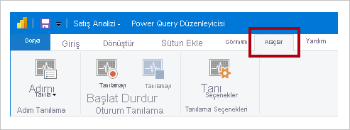

# <a name="monitor-report-performance-in-power-bi"></a>Power BI’da rapor performansını izleme

[Power BI Premium Ölçümler uygulamasını](../admin/service-premium-metrics-app.md) kullanarak Power BI Desktop’ta rapor performansını izleyin, nerede performans sorunlarını olduğunu ve rapor performansını nasıl geliştirebileceğinizi öğrenin.

Aşağıdaki durumlarda performansın izlenmesi yararlı olur:

- İçeri Aktarma veri modeliniz yavaş yenileniyor.
- DirectQuery veya Canlı Bağlantı raporlarınız yavaş çalışıyor.
- Model hesaplamalarınız yavaş çalışıyor.

Yavaş sorgular veya rapor görselleri, devam eden iyileştirme çalışmalarının odak noktası olmalıdır.

## <a name="use-query-diagnostics"></a>Sorgu Tanılamaları’nı Kullanma

Sorguları önizlerken veya uygularken Power Query’nin neler yaptığını saptamak için Power BI Desktop’ta [Sorgu Tanılamaları](/power-query/QueryDiagnostics)’nı kullanın. Ayrıca her sorgu adımında ayrıntılı değerlendirme bilgilerinin kaydını almak için _Tanılama Adımını_ kullanın. Sonuçlar Power Query’de kullanıma sunulur ve sorgu yürütmesini daha iyi anlamak için dönüştürmeler uygulayabilirsiniz.

> [!NOTE]
> Sorgu Tanılamaları şu anda bir önizleme özelliğidir ve bu nedenle özelliği _Seçenekler ve Ayarlar_’da etkinleştirmeniz gerekir. Etkinleştirildikten sonra komutları Power Query Düzenleyicisi penceresindeki **Araçlar** şerit sekmesinde kullanılabilir.



## <a name="use-performance-analyzer"></a>Performans Analizi'ni kullanma

Görsel öğelerinizden her birinin, örneğin görsellerin ve DAX formüllerinin nasıl performans gösterdiğini anlamak için Power BI Desktop'ta [Performans Analizi](../create-reports/desktop-performance-analyzer.md)’ni kullanın. Özellikle performans sorunlarına sorgunun mu yoksa görseli işleme işleminin mi yol açtığını belirleme açısından yararlıdır.

## <a name="use-sql-server-profiler"></a>SQL Server Profiler’ı kullanma

Yavaş çalışan sorguları belirlemek için [SQL Server Profiler](/sql/tools/sql-server-profiler/sql-server-profiler)’ı da kullanabilirsiniz.

> [!NOTE]
> SQL Server Profiler, [SQL Server Management Studio](/sql/ssms/download-sql-server-management-studio-ssms)’nun bir parçası olarak sağlanır.

Veri kaynağınız aşağıdakilerden biri olduğunda SQL Server Profiler’ı kullanın:

- SQL Server
- SQL Server Analysis Services
- Azure Analysis Services

> [!CAUTION]
> Power BI Desktop bir tanılama bağlantı noktasına bağlanmayı destekler. Tanılama bağlantı noktası, diğer araçların tanılama amacıyla izleme yapmak için bağlanmasına olanak tanır. Power Desktop veri modelinde herhangi bir değişiklik yapılması desteklenmez. Veri modelinde değişiklik yapılması bozulmaya veya veri kaybına yol açabilir.

SQL Server Profiler izlemesi oluşturmak için şu yönergeleri izleyin:

1. Power BI Desktop raporunuzu açın (böylelikle sonraki adımda bağlantı noktası kolayca bulunabilir). Açık olan diğer raporları kapatın.
1. Power BI Desktop tarafından kullanılan bağlantı noktasını belirlemek için, PowerShell’de (yönetici ayrıcalıklarıyla) veya Komut İsteminde aşağıdaki komutu girin:
    ```powershell
    netstat -b -n
    ```
    Çıkış, uygulamaların ve bunların açık bağlantı noktalarının listesi şeklinde olur. **Msmdsrv.exe** tarafından kullanılan bağlantı noktasını bulun ve daha sonra kullanmak üzere kaydedin. Bu sizin Power BI Desktop örneğinizdir.
1. SQL Server Profiler’ı Power BI Desktop raporunuza bağlamak için:
    1. SQL Server Profiler’ı açın.
    1. SQL Server Profiler’da _Dosya_ menüsünden _Yeni İzleme_’yi seçin.
    1. **Sunucu Türü** olarak _Analysis Services_’i seçin.
    1. **Sunucu Adı** olarak _localhost:[daha önce kaydedilen bağlantı noktası]_ girin.
    1. _Çalıştır_’a tıklayın; artık SQL Server Profiler izlemesi canlıdır ve etkin bir şekilde Power BI Desktop sorgularının profilini oluşturur.
1. Power BI Desktop sorguları yürütülürken bunların sürelerini ve CPU sürelerini görürsünüz. Veri kaynağı türüne bağlı olarak, sorgunun nasıl yürütüldüğünü gösteren başka olaylar da görebilirsiniz. Bu bilgileri kullanarak hangi sorgularda performans sorunları yaşandığını saptayabilirsiniz.

SQL Server Profiler’ı kullanmanın bir avantajı da, SQL Server (ilişkisel) veritabanı izlemesini kaydetmenin mümkün olmasıdır. İzleme, [Veritabanı Altyapısı Ayarlama Danışmanı](/sql/relational-databases/performance/start-and-use-the-database-engine-tuning-advisor)’nda giriş olarak kullanılabilir. Bu şekilde veri kaynağınızı nasıl ayarlayacağınız konusunda öneriler alabilirsiniz.

## <a name="monitor-premium-metrics"></a>Premium ölçümlerini izleme

Power BI Premium kapasitelerde, Power BI Premium aboneliğinizin durumunu ve kapasitesini izlemek için **Power BI Premium Ölçümler uygulamasını** kullanın. Daha fazla bilgi için bkz. [Power BI Premium Ölçümler uygulaması](../admin/service-premium-metrics-app.md).

## <a name="next-steps"></a>Sonraki adımlar

Bu makale hakkında daha fazla bilgi için aşağıdaki kaynaklara bakın:

- [Sorgu Tanılamaları](/power-query/QueryDiagnostics)
- [Performans Analizi](../create-reports/desktop-performance-analyzer.md)
- [Power BI’da rapor performansı sorunlarını giderme](report-performance-troubleshoot.md)
- [Power BI Premium Ölçümler uygulaması](../admin/service-premium-metrics-app.md)
- Sorularınız mı var? [Power BI Topluluğu'na sorun](https://community.powerbi.com/)
- Önerileriniz mi var? [Power BI'ı geliştirmek için fikirlerinizi paylaşın](https://ideas.powerbi.com/)
