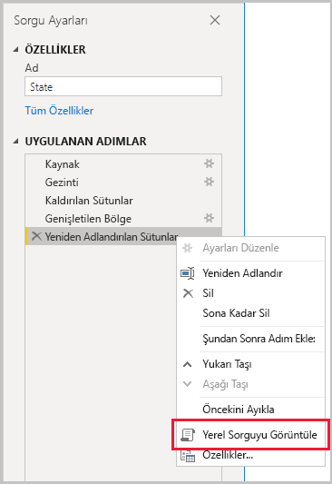
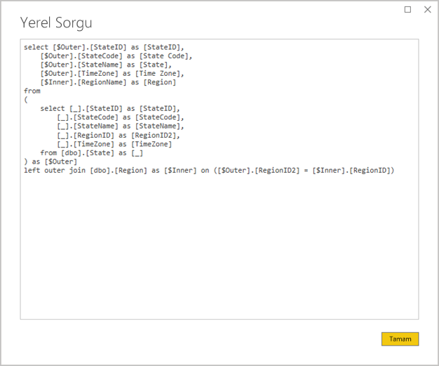
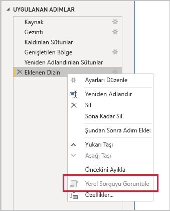

# <a name="the-importance-of-query-folding"></a>Sorguyu kaynağa döndürmenin önemi

Bu makale Power BI Desktop’ta model geliştiren veri modelleyicilerine yöneliktir. Sorguyu kaynağa döndürmenin ne olduğunu ve neden önemli olduğunu açıklar. Ayrıca, sorguyu kaynağa döndürmeyi sağlayabilecek veri kaynakları ile dönüşümleri ve Power Query sorgularınızın tamamen ya da kısmen kaynağa döndürülebileceğinin nasıl belirlendiğini açıklar. Son olarak, sorguyu kaynağa döndürmenin ne zaman ve nasıl gerçekleştirileceğine ilişkin en iyi uygulama yönergelerini sağlar.

## <a name="background"></a>Arka Plan

Sorguyu kaynağa döndürme, bir Power Query sorgusunun kaynak verileri almak ve dönüştürmek üzere tek bir sorgu deyimi oluşturma becerisidir. Power Query karma altyapısı, bir Power BI model tablosunu temel alınan veri kaynağına bağlayacak en verimli yolu verdiği için mümkün olan her durumda sorguyu kaynağa döndürmek için çabalar.

Sorguyu kaynağa döndürme birkaç nedenden dolayı veri modellemenin önemli bir konusudur:

- **İçeri aktarma model tabloları:** Veri yenileme işlemi kaynak kullanımı ve yenileme süresi bakımından İçeri aktarma model tabloları için verimli bir şekilde gerçekleşir
- **DirectQuery ve İkili depolama modu tabloları:** Her DirectQuery ve İkili depolama modu tablosu, kaynağa döndürülebilen bir Power Query sorgusunu temel almalıdır
- **Artımlı yenileme:** Artımlı veri yenileme, kaynak kullanımı ve yenileme süresi bakımından verimli olacaktır. Artımlı Yenileme yapılandırma penceresi tablo için sorguyu kaynağa döndürme işleminin gerçekleştirilemeyeceğini belirlemesi durumunda size bir uyarı gönderecektir. Gerçekleştirilemiyorsa artımlı yenilemenin hedefine ulaşılamamıştır. Bu durumda karma altyapının tüm kaynak satırları alması ve sonra artımlı değişiklikleri belirlemek için filtre uygulaması gerekir.

Sorguyu kaynağa döndürme, bir Power Query sorgusunun tamamı veya adımlarının bir alt kümesi için gerçekleşebilir. Sorguyu kaynağa döndürme kısmen veya tamamen gerçekleşemediğinde Power BI’daki Power Query karma altyapısı, veri dönüşümlerini kendisi işleyerek bu durumu telafi etmelidir. Buna, büyük veri kümeleri için oldukça kaynak yoğunluklu ve yavaş bir işlem olan kaynak sorgu sonuçlarını almak dahildir.

Veri modelleyicilerin mümkün olan her durumda sorguyu kaynağa döndürme işleminin gerçekleştiğinden emin olarak, İçeri aktarma modeli tasarımlarında verimliliği sağlamak için çalışmasını öneririz.

## <a name="sources-that-support-query-folding"></a>Sorguyu kaynağa döndürmeyi destekleyen kaynaklar

Sorgu dili kavramına sahip olan çoğu veri kaynağı, sorguyu kaynağa döndürmeyi destekler. Buna ilişkisel veritabanları, OData akışları (SharePoint listeleri dahil), Exchange ve Active Directory dahildir. Öte yandan düz dosyalar, bloblar ve web genellikle bu desteği vermez.

## <a name="transformations-that-can-achieve-query-folding"></a>Sorguyu kaynağa döndürmeyi gerçekleştirebilen dönüşümler

Sorguyu kaynağa döndürebilen ilişkisel veri kaynağı dönüşümleri tek bir SELECT deyimi olarak yazılabilir. SELECT deyimi uygun WHERE, GROUP BY ve JOIN yan tümceleri ile oluşturulabilir. Ayrıca, SQL veritabanları tarafından desteklenen yaygın yerleşik işlevleri kullanan sütun ifadeleri (hesaplamalar) içerebilir.

Genel olarak, aşağıdaki madde işaretli listede sorguyu kaynağına döndürebilen dönüşümler açıklanmaktadır.

- Sütunları kaldırma
- Sütunları yeniden adlandırma (SELECT sütun diğer adları)
- Satırları statik değerlerle veya Power Query parametreleriyle filtreleme (WHERE yan tümcesi koşulları)
- Gruplandırma ve özetleme (GROUP BY yan tümcesi)
- İki kaynak tablonun birleşimini gerçekleştirecek kayıt sütunlarını (kaynak yabancı anahtar sütunları) genişletme (JOIN yan tümcesi)
- Aynı kaynağı temel alan kaynağa döndürülebilir sorguların benzer olmayan öğelerle birleştirilmesi (JOIN yan tümcesi)
- Aynı kaynağı temel alan kaynağa döndürülebilir sorguları ekleme (UNION ALL işleci)
- _Basit mantık_ ile özel sütunlar ekleme (SELECT sütun ifadeleri). Basit mantık; matematik veya metin işleme işlevleri gibi SQL veri kaynağında eşdeğer işlevleri olan M işlevlerinin kullanılmasını da içerebilen, karmaşık olmayan işlemleri ifade eder. Örneğin, aşağıdaki ifadeler **OrderDate** sütun değerinin yıl bileşenini döndürür (sayısal bir değer döndürmek için).

    ```powerquery-m
    Date.Year([OrderDate])
    ```

- Özetleme ve özetlemeyi açma (PIVOT ve UNPIVOT işleçleri)

## <a name="transformations-that-prevent-query-folding"></a>Sorguyu kaynağa döndürmeyi engelleyen dönüşümler

Genel olarak, aşağıdaki madde işaretli listede sorguyu kaynağına döndürmeyi önleyen dönüşümler açıklanmaktadır. Bunun kapsamlı bir liste olması amaçlanmamıştır.

- Farklı kaynakları temel alan sorguları birleştirme
- Farklı kaynakları temel alan sorguları ekleme (birleştirme)
- _Karmaşık mantık_ ile özel sütunlar ekleme. Karmaşık mantık, veri kaynağında eşdeğer işlevlere sahip olmayan M işlevlerinin kullanıldığını ifade eder. Örneğin, aşağıdaki ifade biçimleri **OrderDate** sütun değerini biçimlendirir (sayısal bir değer döndürmek için).

    ```powerquery-m
    Date.ToText([OrderDate], "yyyy")
    ```

- Dizin sütunları ekleme
- Sütun veri türünü değiştirme

Bir Power Query sorgusu birden çok veri kaynağını kapsadığında, veri kaynağı gizlilik düzeylerinin uyumsuzluğu sorguyu kaynağa döndürmeyi önleyebilir. Daha fazla bilgi için [Power BI Desktop gizlilik düzeyleri](../desktop-privacy-levels.md) makalesini okuyun.

## <a name="determine-when-a-query-can-be-folded"></a>Sorgunun kaynağa döndürülebileceğini belirleme

Power Query Düzenleyicisi penceresinde, bir Power Query sorgusunun ne zaman kaynağa döndürülebileceğini belirlemek mümkündür. **Sorgu Ayarları** bölmesinde uygulanan son adıma sağ tıkladığınızda, **Yerel Sorguyu Görüntüle** seçeneği etkinse (gri değilse) sorgu kaynağına döndürülebilir.



Kaynağa döndürülmüş sorguyu görüntülemek için devam edin ve **Yerel Sorguyu Görüntüle** seçeneğini belirleyin. Daha sonra Power Query’nin kaynak verileri kullanacağı yerel sorgu gösterilir.



**Yerel Sorguyu Görüntüle** seçeneği etkin değilse (griyse), tüm sorgu adımlarının kaynağa döndürülemez olduğunu gösterir. Ancak, yine de bir adım alt kümesinin kaynağa döndürülebileceği anlamına gelebilir. Son adımdan geriye doğru giderek, **Yerel Sorguyu Görüntüle** seçeneğinin etkinleşip etkinleşmediğini görmek üzere her bir adımı kontrol edebilirsiniz. Etkinleşiyorsa, adım sırasına göre sorguyu kaynağa döndürmenin artık gerçekleşemediği yeri öğrenmiş olursunuz.



## <a name="best-practice-guidance"></a>En iyi yöntemler kılavuzu

Kısaca, bir DirectQuery veya İkili depolama modu tablosunda Power Query sorgusunun kaynağa döndürmeyi gerçekleştirmesi gerekir. İlişkisel bir kaynağı temel alan İçeri aktarma tablosu için ve tek bir SELECT deyiminin oluşturulabildiği durumlarda _en iyi veri yenileme performansı_, sorguyu kaynağa döndürmenin gerçekleştiğinden emin olunarak elde edilir. Karma altyapının dönüştürmeleri işlemesi hala gerekliyse, özellikle büyük veri kümeleri için yapması gereken işi en aza indirmeye çalışmanız gerekir.

Aşağıdaki madde işaretli listede en iyi yöntem yönergeleri verilmektedir.

- **Veri kaynağını mümkün olduğunca fazla işlemle görevlendirin:** Bir Power Query sorgusunun tüm adımları kaynağa döndürülemediğinde, sorguyu kaynağa döndürmeyi önleyen adımı bulma. Mümkün olduğunda, sorguyu kaynağa döndürme işleminde hesaba katılabilmesi için sonraki adımları sıranın başına taşıma. Power Query karma altyapısının, kaynak sorguyu oluşturduğunda sorgu adımlarınızı yeniden sıralamak için yeterince akıllı olabileceğini unutmayın.

İlişkisel bir veri kaynağı için, sorgu katlamayı engelleyen adım tek bir SELECT deyiminde veya saklı yordamın yordamsal mantığı dahilinde gerçekleştirilebiliyorsa, bir sonraki bölümde açıklandığı gibi yerel bir sorgu deyimi kullanmayı düşünün.

- **Yerel SQL sorgusu kullanma:** Bir Power Query sorgusu ilişkisel bir kaynaktan veri aldığında yerel bir SQL sorgusu kullanmak mümkündür. Sorgu aslında saklı yordam yürütmesi dahil olmak üzere herhangi bir geçerli deyim olabilir. Deyim birden çok sonuç kümesi üretirse yalnızca ilki döndürülür. Deyimde parametreler tanımlanabilir ve parametre değerlerini güvenli ve kolay bir şekilde geçirmek için [Value.NativeQuery](/powerquery-m/value-nativequery) M işlevini kullanmanız önerilir. Power Query karma altyapısının sonraki sorgu adımlarını kaynağa döndüremediğini anlamak önemlidir ve bu nedenle tüm (veya çoğu) dönüşüm mantığını yerel sorgu deyimine dahil etmek gerekir.

    Yerel SQL sorguları kullanırken göz önünde bulundurmanız gereken iki önemli konu vardır:

    - DirectQuery model tablosu için sorgunun bir SELECT deyimi olması gerekir ve Orta Tablo İfadeleri (CTE) veya saklı yordam kullanamaz
    - Artımlı yenileme bir yerel SQL sorgusundan yararlanamaz ve bu nedenle Power Query karma altyapısını tüm kaynak satırları almaya ve sonra artımlı değişiklikleri belirlemek üzere filtre uygulamaya zorlar

    > [!IMPORTANT]
    > Yerel bir sorgu, veri almaktan daha fazlasını yapma potansiyeline sahiptir. Verileri değiştiren veya silen deyimler de dahil olmak üzere herhangi bir geçerli deyim yürütülebilir (muhtemelen birden çok kez). Veritabanına erişmek için kullanılan hesabın gerekli veriler üzerinde yalnızca okuma iznine sahip olduğundan emin olmak için en düşük ayrıcalık ilkesini uygulamak gerekir.

- **Kaynaktaki dönüşüm verilerini hazırlama:** Belirli Power Query sorgu adımlarının kaynağa döndürülemediğini belirlerseniz, dönüşümleri veri kaynağına uygulamak mümkün olabilir. Power BI sorgulamadan önce kaynak verileri mantıksal olarak dönüştüren bir veritabanı yazarak veya verileri fiziksel olarak hazırlayıp somutlaştırarak bu işlem yapılabilir. İlişkisel veri ambarı, genellikle kuruluş verilerinin önceden tümleştirilmiş kaynaklarından oluşan hazırlanmış verilerin mükemmel bir örneğidir.

## <a name="next-steps"></a>Sonraki adımlar

Sorguyu Kaynağa Döndürme ve ilgili konu hakkında daha fazla bilgi için aşağıdaki kaynaklara göz atın:

- [Power BI Desktop’ta bileşik modeller kullanma](../desktop-composite-models.md)
- [Power BI Premium’da artımlı yenileme](../service-premium-incremental-refresh.md)
- [Sorguyu Kaynağa Döndürmeyi Uygulamak için Table.View Kullanma](/power-query/handlingqueryfolding)
- Sorularınız mı var? [Power BI Topluluğu'na sorun](https://community.powerbi.com/)
