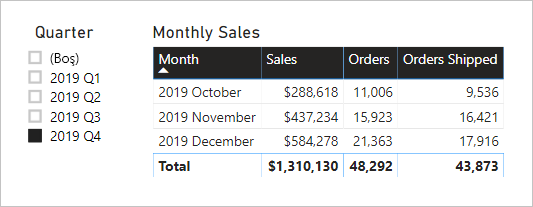

# <a name="active-vs-inactive-relationship-guidance"></a>Etkin ve etkin olmayan ilişki karşılaştırması kılavuzu

Bu makale, Power BI Desktop'la çalışan veri modelleyicilerine yöneliktir. Ne zaman etkin, ne zaman etkin olmayan model ilişkileri oluşturacağınız konusunda size yol gösterir. Varsayılan olarak etkin ilişkiler filtreleri diğer tablolara yayar. Öte yandan etkin olmayan ilişkiler yalnızca bir DAX ifadesi ilişkiyi etkinleştirdiğinde (kullandığında) filtreleri yayar.

[!INCLUDE [relationships-prerequisite-reading](includes/relationships-prerequisite-reading.md)]

## <a name="active-relationships"></a>Etkin ilişkiler

Genel olarak mümkün olduğunca etkin ilişkiler tanımlamanızı öneririz. Bunlar modelinizin rapor yazarları ve Soru-Cevap özelliğiyle çalışan kullanıcılar tarafından kullanılma kapsamını genişletir ve potansiyelini artırır.

Hava yolları uçuşlarının zamanlamaya uyma performansını (OTP) analiz etmek için tasarlanmış örnek bir İçeri Aktarma modeli düşünün. Modelin, uçuş başına bir satırın depolandığı olgu türünde bir tablo olan **Flight** tablosu vardır. Her satırda uçuş tarihi, uçuş numarası, kalkış ve variş havaalanları ve gecikme süresi (dakika cinsinden) kaydedilir. Ayrıca, havaalanı başına bir satırın depolandığı boyut türünde bir **Airport** tablosu da vardır. Her satırda havaalanı kodu, havaalanı adı ve ülke belirtilir.

Burada iki tablonun kısmi bir model diyagramı verilmiştir.


**Flight** ile **Airport** tabloları arasında iki model ilişkisi vardır. **Flight** tablosundaki **DepartureAirport** ve **ArrivalAirport** sütunları **Airport** tablosunun **Airport** sütunuyla ilişkilendirilir. Yıldız şema tasarımında **Airport** tablosu [rol yapan boyut](star-schema.md#role-playing-dimensions) olarak açıklanır. Bu modelde, iki rol _kalkış havaalanı_ ve _varış havaalanı_ rolleridir.

Bu tasarım ilişkili yıldız şeması tasarımlarında düzgün çalışsa da Power BI modellerinde çalışmaz. Çünkü model ilişkileri filtreyi yayma yollarıdır ve bu yolların kararlı olması gerekir. Bu nedenle modelde iki tablo arasında birden çok etkin ilişki olamaz. Dolayısıyla bu örnekte açıklandığı gibi bir ilişki etkin olduğunda diğer ilişki etkin değildir (kesikli çizgiyle gösterilir). Özel olarak belirtmek gerekirse, etkin olan ilişki **ArrivalAirport** sütunuyla arasındaki ilişkidir. Diğer bir deyişle **Airport** tablosuna uygulanan filtreler **Flight** tablosunun **ArrivalAirport** sütununa otomatik olarak yayılır.

Bu model tasarımı verilerin bildirilme şekline sıkı sınırlamalar getirir. Özel olarak belirtmek gerekirse, bir varış havaalanının uçuş ayrıntılarını otomatik olarak yalıtmak için **Airport** tablosunu filtrelemek mümkün değildir. Raporlama gereksinimleri arasında _aynı anda_ kalkış ve varış havaalanlarına göre filtreleme (veya gruplandırma) olduğundan, iki etkin ilişki gerekir. Bu gereksinim bir Power BI model tasarımına çevrildiğinde, modelin iki havaalanı tablosu olması gerektiği anlaşılır.

İşte geliştirilmiş bir model tasarımı.


Şimdi modelin iki havaalanı tablosu vardır: **Departure Airport** ve **Arrival Airport**. Bu tablolarla **Flight** tablosu arasındaki model ilişkileri etkin ilişkilerdir. Ayrıca **Departure Airport** ve **Arrival Airport** tablolarındaki sütun adlarının başına _Departure_ veya _Arrival_ sözcüğünün eklendiğine de dikkat edin.

Geliştirilmiş model tasarımı aşağıdaki rapor tasarımını destekler.


Rapor sayfası kalkış havaalanı olarak Melbourne’e göre filtrelenir ve tablo görseli varış havaalanlarına göre gruplandırılır.

> [!NOTE]
> İçeri Aktarma modellerinde, ek tablo model boyutunu artırmış ve yenileme sürelerini uzatmıştır. Dolayısıyla [İçeri Aktarma modellemesinde veri azaltma teknikleri](import-modeling-data-reduction.md) makalesinde açıklanan önerilerle çelişmektedir. Öte yandan, örnekte yalnızca etkin ilişkiler bulunması gereksinimi söz konusu önerileri geçersiz kılar.
>
> Üstelik boyut türünde tablolarda satır sayısının olgu türündeki tablolara göre daha az olması yaygın bir durumdur. Dolayısıyla model boyutundaki ve yenileme sürelerindeki artış büyük olasılıkla aşırı fazla olmayacaktır.

### <a name="refactoring-methodology"></a>Yeniden düzenleme yöntemi

Burada bir modeli, rol yapan boyut türünde tek tablodan _rol başına bir tablo_ içeren bir tasarıma göre yeniden düzenleme yöntemi gösterilir.

1. Etkin olmayan tüm ilişkileri kaldırın.
2. Rolünü daha iyi açıklamak için rol yapan boyut türünde tablonun adını değiştirmeyi göz önünde bulundurun. Örnekte **Airport** tablosu **Flight** tablosunun **ArrivalAirport** sütunuyla ilişkilidir, bu nedenle **Arrival Airport** olarak yeniden adlandırılır.
3. Rol yapan tablonun bir kopyasını oluşturun ve buna rolünü yansıtan bir ad verin. Bu bir İçeri Aktarma tablosuysa, hesaplanan tablo tanımlamanızı öneririz. Bu bir DirectQuery tablosuysa, Power Query sorgusunu çoğaltabilirsiniz.

    Örnekte **Departure Airport** tablosu aşağıdaki hesaplanan tablo tanımı kullanılarak oluşturulmuştur.

    ```dax
    Departure Airport = 'Arrival Airport'
    ```

4. Yeni tabloyu ilişkilendirmek için etkin ilişki oluşturun.
5. Rollerini doğru yansıtacak şekilde tablolardaki sütunları yeniden adlandırmayı göz önünde bulundurun. Örnekte tüm sütunların önüne _Departure_ veya _Arrival_ sözcüğü eklenmiştir. Bu adlar rapor görsellerinin varsayılan olarak açıklayıcı ve belirgin etiketlere sahip olmasını sağlar. Ayrıca Soru-Cevap deneyimini de geliştirerek kullanıcıların sorularını kolayca yazabilmesini sağlar.
6. Rol yapan tablolara açıklamalar eklemeyi göz önünde bulundurun. (**Alanlar** bölmesinde, rapor yazarı imlecini tablonun üzerine getirdiğinde bu açıklama bir araç ipucunda görüntülenir.) Bu yolla ek filtre yayma ayrıntılarını rapor yazarlarınıza iletebilirsiniz.

## <a name="inactive-relationships"></a>Etkin olmayan ilişkiler

Belirli durumlarda etkin olmayan ilişkiler özel raporlama gereksinimlerini karşılayabilir.

Şimdi farklı model ve raporlama gereksinimlerini düşünelim:

- Bir satış modelinin iki tarih sütunu içeren bir **Sales** tablosu vardır: **OrderDate** ve **ShipDate**
- **Sales** tablosundaki her satırda tek bir sipariş kaydedilir
- Her zaman geçerli bir tarihin depolandığı **OrderDate** sütununa neredeyse her zaman tarih filtreleri uygulanır
- Yalnızca bir ölçü, BOŞLUKLAR içerebilen **ShipDate** sütununa tarih filtresi yaymayı gerektirir (sipariş gönderilene kadar BOŞLUK içerir)
- Sipariş _ve_ gönderme tarihi dönemlerini eşzamanlı olarak filtreleme gereksinimi yoktur

Burada iki tablonun kısmi bir model diyagramı verilmiştir.


**Sales** ile **Date** tabloları arasında iki model ilişkisi vardır. **Sales** tablosundaki **OrderDate** ve **ShipDate** sütunları **Date** tablosunun **Date** sütunuyla ilişkilidir. Bu modelde **Date** tablosuna yönelik iki rol _sipariş tarihi_ ve _gönderme tarihi_ rolleridir. Bu, **OrderDate** sütunuyla etkin ilişkidir.

Alt ölçünün biri dışında tümü **OrderDate** sütununa göre filtreleme yapabilmelidir. Öte yandan **Orders Shipped** ölçüsünün **ShipDate** sütununa göre filtreleme yapması gerekir.

**Orders** ölçüsünün tanımı şöyledir. Basitçe **Sales** tablosunun filtre bağlamı içindeki satırlarını sayar. **Date** tablosuna uygulanan tüm filtreler **OrderDate** sütununa yayılır.

```dax
Orders = COUNTROWS(Sales)
```

**Orders Shipped** ölçüsünün tanımı şöyledir. [USERELATIONSHIP](/dax/userelationship-function-dax) DAX işlevini kullanır. Bu işlev yalnızca ifade hesaplandığı sırada belirli bir ilişki için filtre yayma işlemini etkinleştirir. Bu örnekte **ShipDate** sütunuyla ilişki kullanılmıştır.

```dax
Orders Shipped =
CALCULATE(
    COUNTROWS(Sales)
    ,USERELATIONSHIP('Date'[Date], Sales[ShipDate])
)
```

Model tasarımı aşağıdaki rapor tasarımını destekler.



Rapor sayfası 2019 Q4 çeyreğine göre filtrelenir. Tablo görseli aya göre gruplandırılır ve çeşitli satış istatistiklerini görüntüler. **Orders** ve **Orders Shipped** ölçüleri farklı sonuçlar üretir. Bunların ikisi de aynı özetleme mantığını (**Sales** tablosunun satırlarını sayma) ama farklı **Date** tablosu filtre yaymasını kullanır.

Çeyrek dilimleyicisinin BOŞ öğe içerdiğine dikkat edin. Bu dilimleyici öğesi, [tablo genişletme](../transform-model/desktop-relationships-understand.md#strong-relationships) işleminin sonucu olarak görüntülenir. **Sales** tablosundaki her satırın bir sipariş tarihi olmasına karşın bazı satırların gönderme tarihi BOŞTUR çünkü bu siparişler henüz gönderilmemiştir. Tablo genişletme işleminde etkin olmayan ilişkiler de dikkate alınır ve dolayısıyla ilişkinin çok tarafındaki BOŞLUKLAR veya veri bütünlüğü sorunları nedeniyle BOŞLUKLAR görülebilir.

## <a name="recommendations"></a>Öneriler

Özetle, mümkün olduğunca etkin ilişkiler tanımlamanızı öneririz. Bunlar modelinizin rapor yazarları ve Soru-Cevap özelliğiyle çalışan kullanıcılar tarafından kullanılma kapsamını genişletir ve potansiyelini artırır. Diğer bir deyişle rol yapan boyut türündeki tabloların modelinizde çoğaltılması gerekir.

Bununla birlikte belirli koşullarda rol yapan boyut türündeki bir tablo için bir veya birden fazla etkin olmayan ilişki tanımlayabilirsiniz. Aşağıdaki durumlarda bu tasarımı göz önünde bulundurun:

- Rapor görsellerinin farklı rollere göre eşzamanlı filtreleme gereksinimi yok
- Uygun model hesaplamalarında belirli bir ilişkiyi etkinleştirmek için USERELATIONSHIP DAX işlevini kullanıyorsunuz

## <a name="next-steps"></a>Sonraki adımlar

Bu makaleyle ilgili daha fazla bilgi için aşağıdaki kaynaklara bakın:

- [Power BI Desktop’ta model ilişkileri](../transform-model/desktop-relationships-understand.md)
- [Yıldız şemasını ve Power BI açısından önemini anlama](star-schema.md)
- [İlişki sorunlarını giderme kılavuzu](relationships-troubleshoot.md)
- Sorularınız mı var? [Power BI Topluluğu'na sorun](https://community.powerbi.com/)
- Önerileriniz mi var? [Power BI'ı geliştirmek için fikirlerinizi paylaşın](https://ideas.powerbi.com/)
