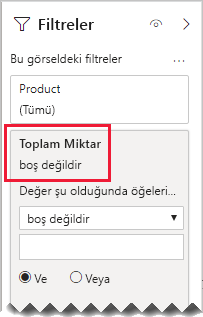

# <a name="bi-directional-relationship-guidance"></a>Çift yönlü ilişki kılavuzu

Bu makale, Power BI Desktop'la çalışan veri modelleyicilerine yöneliktir. Ne zaman çift yönlü ilişkiler oluşturacağınız konusunda size yol gösterir. Çift yönlü ilişki _her iki yönde_ de filtreleme yapan ilişkidir.

[!INCLUDE [relationships-prerequisite-reading](includes/relationships-prerequisite-reading.md)]

Genel olarak çift yönlü ilişki kullanımının en alt düzeyde tutulmasını öneririz. Bunlar model sorgu performansını olumsuz etkileyebilir ve bir olasılıkla rapor kullanıcılarınıza kafa karıştırıcı deneyimler getirebilir.

Çift yönlü filtrelemenin belirli gereksinimleri karşılayabileceği üç senaryo vardır:

- [Özel model ilişkileri](#special-model-relationships)
- [Dilimleyici öğeleri "verilerle birlikte"](#slicer-items-with-data)
- [Boyutlar arası analiz](#dimension-to-dimension-analysis)

## <a name="special-model-relationships"></a>Özel model ilişkileri

Aşağıdaki iki özel model ilişkisi türünün oluşturulmasında çift yönlü ilişkiler önemli bir rol oynar:

- **Birebir**: Tüm birebir ilişkilerin çift yönlü olması gerekir; bunları başka türlü yapılandırmak mümkün değildir. Genel olarak bu tür ilişkiler oluşturulmasını önermiyoruz. Eksiksiz bir açıklama ve alternatif tasarımlar için bkz. [Birebir ilişki kılavuzu](relationships-one-to-one.md).
- **Çoka çok ilişki**: Boyut türünde iki tabloyu ilişkilendirirken bir köprü oluşturma tablosu gerekir. Köprü oluşturma tablosu üzerinde filtrelerin yayıldığından emin olmak için çift yönlü filtre gereklidir. Daha fazla bilgi için bkz. [Çoka çok ilişki kılavuzu (Çoka çok boyutları ilişkilendirme)](relationships-many-to-many.md#relate-many-to-many-dimensions).

## <a name="slicer-items-with-data"></a>Dilimleyici öğeleri "verilerle birlikte"

Çift yönlü ilişkiler öğeleri verilerin bulunduğu yerle sınırlayan dilimleyiciler sağlayabilir. (Excel PivotTable’larını ve dilimleyicilerini biliyorsanız, verilerin kaynağı bir Power BI veri kümesi veya Analysis Services modeli olduğunda varsayılan davranış budur.) Bunun anlamını açıklarken yardımcı olması için önce aşağıdaki model diyagramını düşünün.


İlk tablo **Customer** adlı tablodur ve üç sütunu vardır: **Country-Region**, **Customer** ve **CustomerCode**. İkinci tablo **Product** adlı tablodur ve üç sütunu vardır: **Color**, **Product** ve **SKU**. Üçüncü tablo **Sales** adlı tablodur ve dört sütunu vardır: **CustomerCode**, **OrderDate**, **Quantity** ve **SKU**. **Customer** ve **Product** tabloları boyut türünde tablolardır ve ikisinin de **Sales** tablosuyla birebir ilişkisi vardır. Her ilişki tek yönde filtreler.

Çift yönlü filtreleme işleminin nasıl çalıştığını açıklamaya yardımcı olması için, model diyagramı tablo satırlarını ortaya koyacak şekilde değiştirilmiştir. Bu makaledeki tüm örneklerde bu veriler temel alınmıştır.

> [!NOTE]
> Power BI Desktop model diyagramında tablo satırlarını görüntülemek mümkün değildir. Bu makalede açıklamayı net örneklerle desteklemek için yapılmıştır.


Üç tablonun satır ayrıntıları aşağıdaki madde işaretli listede açıklanır:

- **Customer** tablosunun iki satırı vardır:
  - **CustomerCode** CUST-01, **Customer** Customer-1, **Country-Region** United States
  - **CustomerCode** CUST-02, **Customer** Customer-2, **Country-Region** Australia
- **Product** tablosunun üç satırı vardır:
  - **SKU** CL-01, **Product** T-shirt, **Color** Green
  - **SKU** CL-02, **Product** Jeans, **Color** Blue
  - **SKU** AC-01, **Product** Hat, **Color** Blue
- **Sales** tablosunun üç satırı vardır:
  - **OrderDate** January 1 2019, **CustomerCode** CUST-01, **SKU** CL-01, **Quantity** 10
  - **OrderDate** February 2 2019, **CustomerCode** CUST-01, **SKU** CL-02, **Quantity** 20
  - **OrderDate** March 3 2019, **CustomerCode** CUST-02, **SKU** CL-01, **Quantity** 30

Şimdi aşağıdaki rapor sayfasına bakın.


Sayfa iki dilimleyiciden ve bir kart görselinden oluşur. İlk dilimleyici **Country-Region** içindir ve iki öğesi vardır: Australia ve United States. Şu anda Australia’ya göre dilimlemektedir. İkinci dilimleyici **Product** içindir ve üç öğesi vardır: Hat, Jeans ve T-shirt. Hiçbir öğe seçili değildir (diğer bir deyişle _hiçbir ürün_ filtrelenmemiştir). Kart görselinde 30 miktarı görüntülenir.

Rapor kullanıcıları Australia’ya göre dilimlediğinde, **Product** dilimleyicisini verilerin Australia satışlarıyla _ilişkili_ olduğu öğeleri görüntüleyecek şekilde sınırlamak istersiniz. Dilimleyici öğelerini "verilerle birlikte" göstermenin anlamı budur. Bu davranışı elde etmek için **Product** ile **Sales** tabloları arasında her iki yönde filtreleme uygulayan ilişkiyi yapılandırabilirsiniz.


Şimdi **Product** dilimleyicisinde tek öğe listelenir: T-shirt. Bu öğe Avustralyalı (Australia) müşterilere satılan tek ürünü temsil eder.


Önce bu tasarımın rapor kullanıcılarınıza uygun olup olmadığını dikkatle irdelemenizi öneririz. Bazı rapor kullanıcıları bu deneyimi kafa karıştırıcı bulabilir. Diğer dilimleyicilerle etkileşim kurduklarında dilimleyici öğelerinin neden dinamik olarak göründüğünü veya kaybolduğunu anlamayabilirler.

Dilimleyici öğelerini "verilerle birlikte" göstermeye karar verirseniz, çift yönlü ilişki yapılandırmamanızı öneririz. Çift yönlü ilişkiler daha fazla işleme gerektirir ve bu nedenle, özellikle de modelinizdeki çift yönlü ilişkilerin sayısı arttıkça, sorgu performansını olumsuz etkileyebilir.

Ayrı sonucu elde etmenin daha iyi bir yolu vardır: Çift yönlü filtreleri kullanmak yerine **Product** dilimleyicisinin kendisine bir görsel düzeyi filtresi uygulayabilirsiniz.

Şimdi de **Product** ile **Sales** tabloları arasındaki ilişkinin artık her iki yönde filtrelemediğini düşünelim. Ayrıca **Sales** tablosuna şu ölçü tanımı eklenmiştir.

```dax
Total Quantity = SUM(Sales[Quantity])
```

**Product** dilimleyicisi öğelerini "verilerle birlikte" göstermek için yalnızca "boş değil" koşulu uygulanarak **Total Quantity** ölçüsüne göre filtrelenmesi gerekir.



## <a name="dimension-to-dimension-analysis"></a>Boyutlar arası analiz

Çift yönlü ilişkiler içeren farklı bir senaryoda, olgu türündeki tablo bir köprü oluşturma tablosu olarak değerlendirilir. Bu yolla boyut türündeki tablonun verilerini, başka bir boyut türündeki tablonun filtre bağlamında analiz etmeyi destekler.

Bu makaledeki örnek modeli kullanarak, aşağıdaki soruların nasıl yanıtlanabileceğini düşünün:

- Avustralyalı müşteriler kaç renkte ürün satıldı?
- Kaç ülke kot satın aldı?

Her iki soru da, olgu türündeki köprü oluşturma tablosunun verileri _özetlenmeden_ yanıtlanabilir. Öte yandan bu sorular filtrelerin boyut türündeki bir tablodan diğerine yayılmasını gerektirir. Filtreler olgu türündeki tablo yoluyla yayıldıktan sonra, [DISTINCTCOUNT](/dax/distinctcount-function-dax) DAX işlevi ve bir olasılıkla [MIN](/dax/min-function-dax) ile [MAX](/dax/max-function-dax) DAX işlevleri kullanılarak boyut türündeki tablo sütunları özetlenebilir.

Olgu türündeki tablo bir köprü oluşturma tablosu gibi davrandığından, boyut türündeki iki tabloyu ilişkilendirmek için çoka çok ilişki kılavuzunu izleyebilirsiniz. Her iki yönde de filtrelemek için en az bir ilişkinin yapılandırılmasını gerektirir. Daha fazla bilgi için bkz. [Çoka çok ilişki kılavuzu (Çoka çok boyutları ilişkilendirme)](relationships-many-to-many.md#relate-many-to-many-dimensions).

Bununla birlikte bu makalede daha önce açıklandığı gibi bu tasarım büyük olasılıkla [dilimleyici öğeleri "verilerle birlikte"](#slicer-items-with-data) uygulamasının sonuçlarından dolayı performansı ve kullanıcı deneyimini olumsuz etkiler. Bu nedenle, onun yerine [CROSSFILTER](/dax/crossfilter-function) DAX işlevini kullanarak _bir ölçü tanımında_ çift yönlü filtrelemeyi etkinleştirmenizi öneririz. İfade hesaplanırken CROSSFILTER işlevi filtre yönlerini değiştirmek, hatta ilişkiyi devre dışı bırakmak için kullanılabilir.

**Sales** tablosuna eklenen şu ölçü tanımını düşünün. Bu örnekte **Customer** ile **Sales** tabloları arasındaki model ilişkisi _tek yönde_ filtreleme için yapılandırılmıştır.

```dax
Different Countries Sold =
CALCULATE(
    DISTINCTCOUNT(Customer[Country-Region]),
    CROSSFILTER(
        Customer[CustomerCode],
        Sales[CustomerCode],
        BOTH
    )
)
```

**Different Countries Sold** ölçüsü ifadesi hesaplanırken, **Customer** ile **Sales** tabloları arasındaki ilişki her iki yönde filtre uygular.

Aşağıdaki tablo görseli satılan her ürünün istatistiklerini ortaya koyar. **Quantity** sütunu yalnızca miktar değerlerinin toplamıdır. **Different Countries Sold** sütunu, ürün satın almış olan tüm müşterilerin ülke-bölge değerlerinin ayrı ayrı sayımını temsil eder.


## <a name="next-steps"></a>Sonraki adımlar

Bu makaleyle ilgili daha fazla bilgi için aşağıdaki kaynaklara bakın:

- [Power BI Desktop’ta model ilişkileri](../desktop-relationships-understand.md)
- [Yıldız şemasını ve Power BI açısından önemini anlama](star-schema.md)
- [Birebir ilişki kılavuzu](relationships-one-to-one.md)
- [Çoka çok ilişkiler kılavuzu](relationships-many-to-many.md)
- [İlişki sorunlarını giderme kılavuzu](relationships-troubleshoot.md)
- Sorularınız mı var? [Power BI Topluluğu'na sorun](https://community.powerbi.com/)
- Önerileriniz mi var? [Power BI'ı geliştirmek için fikirlerinizi paylaşın](https://ideas.powerbi.com/)
