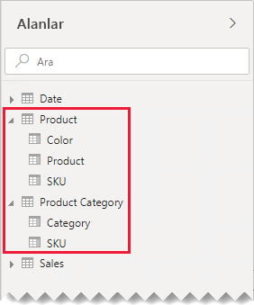
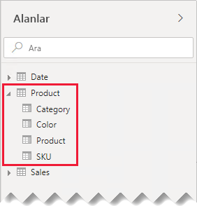
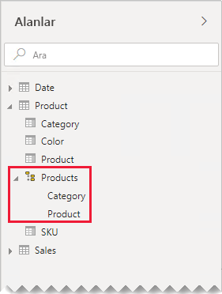
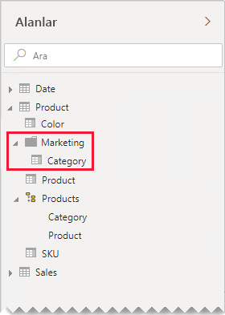

# Birebir ilişki kılavuzu

Bu makale, Power BI Desktop'la çalışan veri modelleyicilerine yöneliktir. Size birebir modeli ilişkileriyle çalışma konusunda yol gösterir. Birebir ilişki, her iki tabloda da bir ortak ve benzersiz değerler sütunu bulunduğunda oluşturulabilir.

[!INCLUDE [relationships-prerequisite-reading](includes/relationships-prerequisite-reading.md)]

Birebir ilişkiler içeren iki senaryo vardır:

- [Bozuk boyutlar](#degenerate-dimensions): Olgu türündeki bir tablodan [bozuk boyut](star-schema.md#degenerate-dimensions) türetebilirsiniz.
- [Tablolar arasına yayılan ham veriler](#row-data-spans-across-tables): Tek bir iş varlığı veya konusu iki (veya daha çok) model tablosu olarak yüklenir. Bunun nedeni büyük olasılıkla bunların veri kaynaklarının farklı veri depoları olmasıdır. Boyut türündeki tablolar için bu yaygın bir senaryo olabilir. Örneğin ana ürün ayrıntıları operasyonel satış sisteminde, tamamlayıcı ürün ayrıntıları ise farklı bir kaynakta depolanıyordur.

    Öte yandan olgu türünde iki tabloyu ilişkilendirmek için birebir ilişki kullanılması alışılmışın dışında bir durumdur. Bunun nedeni olgu türündeki her iki tablonun da aynı boyut ve ayrıntı düzeyine sahip olmasının gerekmesidir. Ayrıca model ilişkisinin oluşturulabilmesi için olgu türündeki her tablonun benzersiz sütunları olması gerekir.

## Bozuk boyutlar

Olgu türündeki bir tablodaki sütunlar filtrelemek veya gruplandırmak için kullanıldığında, bunları ayrı bir tabloda kullanıma sunmayı göz önünde bulundurabilirsiniz. Bu yolla, filtrelemek veya gruplandırmak için kullanılan sütunları olgu satırlarını özetlemek için kullanılan sütunlardan ayırırsınız. Bu ayrım şunları sağlayabilir:

- Depolama alanını azaltma
- Model hesaplamalarını basitleştirme
- Geliştirilmiş sorgu performansına katkıda bulunma
- Rapor yazarlarınıza daha sezgisel bir **Alanlar** bölmesi deneyimi sağlama

Satış siparişi ayrıntılarının iki sütunda depolandığı bir kaynak satış tablosu düşünün.

**OrderNumber** sütununda sipariş numarası ve **OrderLineNumber** sütununda siparişin içindeki satırların sırası depolanır.

Aşağıdaki model diyagramında sipariş numarası (OrderNumber) ve sipariş satırı numarası (OrderLineNumber) sütunlarının **Sales** tablosuna yüklenmediğine dikkat edin. Bunun yerine bu sütunların değerleri [SalesOrderLineID](star-schema.md#surrogate-keys) adlı bir **vekil anahtar** sütunu oluşturmak için kullanılmıştır. (Anahtar değeri, sipariş numarası 1000 ile çarpılıp ardından sipariş satırı numarası toplanarak hesaplanır.)

**Sales Order** tablosu üç sütunuyla rapor yazarlarına zengin bir deneyim sağlar: **Sales Order**, **Sales Order Line** ve **Line Number**. Ayrıca bir de hiyerarşi içerir. Bu rapor kaynakları siparişleri veya sipariş satırlarını filtrelemesi, gruplandırması veya bunlarda detaya gitmesi gereken rapor tasarımlarını destekler.

**Sales Order** tablosu satır verilerinden türetildiğinden, her tabloda tam olarak aynı sayıda satır bulunmalıdır. Dahası her **SalesOrderLineID** sütununda da eşleşen değerler yer almalıdır.

## Tablolar arasına yayılan ham veriler

Birebir ilişkili iki boyut türünde tablo içeren bir örnek düşünün: **Product** (Ürün) ve **Product Category** (Ürün Kategorisi). Each table represents imported data and has a **SKU** (Stock-Keeping Unit) column containing unique values.

Burada iki tablonun kısmi bir model diyagramı verilmiştir.

İlk tablo **Product** adlı tablodur ve üç sütunu vardır: **Color**, **Product** ve **SKU**. İkinci tablo **Product Category** adlı tablodur ve iki sütunu vardır: **Category** ve **SKU**. Birebir ilişki, **SKU** sütunlarını ilişkilendirir. İlişki her iyi yönde de filtreleme yapar ve bu durum birebir ilişkilerde her zaman geçerlidir.

İlişki filtresi yayma işleminin çalışmasını açıklamaya yardımcı olmak için, model diyagramı tablo satırlarını ortaya koymak için değiştirilmiştir. Bu makaledeki tüm örneklerde bu veriler temel alınmıştır.

> [!NOTE]
> Power BI Desktop model diyagramında tablo satırlarını görüntülemek mümkün değildir. Bu makalede açıklamayı net örneklerle desteklemek için yapılmıştır.

İki tablonun satır ayrıntıları aşağıdaki madde işaretli listede açıklanır:

- **Product** tablosunun üç satırı vardır:
  - **SKU** CL-01, **Product** T-shirt, **Color** Green
  - **SKU** CL-02, **Product** Jeans, **Color** Blue
  - **SKU** AC-01, **Product** Hat, **Color** Blue
- **Product Category** tablosunun iki satırı vardır:
  - **SKU** CL-01, **Category** Clothing
  - **SKU** AC-01, **Category** Accessories

**Product Category** tablosunda Product SKU CL-02 satırının olmadığına dikkat edin. Bu eksik satırın sonuçlarını bu makalenin devamında açıklayacağız.

**Alanlar** bölmesinde rapor yazarları iki tabloda yer alan ürünle ilgili alanları bulacaktır: **Product** ve **Product Category**.

Şimdi her iki tablodaki alanlar da bir tablo görseline eklendiğinde ne olduğuna bakalım. Bu örnekte **SKU** sütunun kaynağı **Product** tablosudur.

Product SKU CL-02 için **Category** değerinin BOŞ olduğuna dikkat edin. Bunun nedeni **Product Category** tablosunda bu ürün için satır bulunmamasıdır.

### Öneriler

Satır verileri model tabloları arasına yayıldığında birebir model ilişkileri oluşturmaktan mümkün olduğunca kaçınmanızı öneririz. Çünkü bu tasarım:

- Gereğinden fazla tablo listeleyerek **Alanlar** bölmesinde kalabalığı artırır
- İlgili alanlar birden çok tabloya dağılmış olduğundan rapor yazarlarının bunları bulmasını zorlaştırır
- Hiyerarşi düzeylerinin _aynı tablodaki_ sütunları temel alması gerektiğinden hiyerarşi oluşturma becerisini sınırlandırır
- Tablolar arasında tamamlanmış bir eşleşme olmadığından beklenmeyen sonuçlar doğurur

Belirli öneriler birebir ilişkinin _ada içi_ mi yoksa _adalar arası_ mı olduğuna göre değişiklik gösterir. İlişkinin değerlendirmesi hakkında daha fazla bilgi için bkz. [Power BI Desktop’ta model ilişkileri (İlişki değerlendirmesi)](../transform-model/desktop-relationships-understand.md#relationship-evaluation).

### Ada içi birebir ilişki

Tablolar arasında birebir _ada içi_ ilişki olduğunda verileri tek bir model tablosunda birleştirmenizi öneririz. Bu işlem Power Query sorguları birleştirilerek yapılır.

Aşağıdaki adımlarda birebir ilişkili verileri birleştirme ve modelleme yöntemi gösterilir:

1. **Sorguları birleştirme**: [İki sorguyu birleştirirken](../connect-data/desktop-shape-and-combine-data.md#combine-queries), her sorgudaki verilerin bütünlüğünü göz önünde bulundurun. Bir sorgu eksiksiz bir satır kümesi (ana liste gibi) içeriyorsa, diğer sorguyu onunla birleştirin. Varsayılan birleştirme türü olan _sol dış birleştirmeyi_ kullanmak için birleştirme dönüştürmesini yapılandırın. Bu birleştirme türü ilk sorgunun tüm satırlarının tutulmasını ve bunların ikinci sorgudaki eşleşen satırlarla tamamlanmasını güvence altına alır. İkinci sorgunun tüm gerekli sütunlarını ilk sorguya genişletin.
2. **Sorgu yüklemeyi devre dışı bırak**: İkinci sorgunun [yüklemesini devre dışı bıraktığınızdan](import-modeling-data-reduction.md#disable-power-query-query-load) emin olun. Bu şekilde ikinci sorgu sonucunu bir model tablosu olarak yüklemez. Bu yapılandırma veri modeli depolama boyutunu azaltır ve **Alanlar** bölmesinde kalabalığı önlemeye yardımcı olur.

    Bizim örneğimizde, rapor yazarları artık **Alanlar** bölmesinde **Product** adlı tek bir tablo bulurlar. Bu tablo ürünle ilişkili alanları içerir.

    
3. **Eksik değerleri değiştir**: İkinci sorguda eşleşmeyen satırlar varsa bu sorgudan eklenen sütunlarda NULL değerleri gösterilir. Uygun olduğunda NULL değerlerini bir belirteç değeriyle değiştirmeyi göz önünde bulundurun. Rapor yazarları sütun değerlerine göre filtreleme veya gruplandırma yaptığında eksik değerleri değiştirmek özellikle önemlidir çünkü rapor görsellerinde BOŞLUK görüntülenebilir.

    Aşağıdaki tablo görselinde SKU CL-02 ürününün kategorisinde _[Tanımsız]_ ifadesinin gösterildiğine dikkat edin. Sorguda null kategoriler bu belirteç metin değeriyle değiştirilmiştir.

    

4. **Hiyerarşileri oluştur**: Artık birleştirilmiş olan tablonun _sütunları arasında_ ilişkiler varsa hiyerarşi oluşturmayı göz önünde bulundurun. Bu şekilde rapor yazarları rapor görselinde detaya gitme fırsatlarını hızla belirleyebilir.

    Bizim örneğimizde rapor yazarları artık iki düzeyi olan bir hiyerarşi kullanabilir: **Category** ve **Product**.

    

Ayrı tabloların alanlarınızı düzenlemeye yardımcı olmasından memnun olsanız bile, yine de tek tabloda birleştirmenizi öneririz. Alanlarınızı yine düzenleyebilirsiniz ama bu kez _görüntü klasörlerini_ kullanırsınız.

Bizim örneğimizde rapor yazarları **Category** alanını **Marketing** görüntü klasöründe bulabilir.

Yine de modelinizde birebir ada içi ilişkiler tanımlamaya karar verirseniz, mümkünse ilişkili tablolarda eşleşen satırların bulunduğundan emin olun. Birebir ada içi ilişkisi [normal bir ilişki](../transform-model/desktop-relationships-understand.md#regular-relationships) olarak değerlendirildiğinden, rapor görsellerinizde veri bütünlüğü sorunları BOŞLUKLAR olarak kendini gösterebilir. (Bu makalede tanıtılan ilk tablo görselinde BOŞLUK gruplandırmasının bir örneğini görebilirsiniz.)

### Adalar arası birebir ilişki

Tablolar arasında birebir _adalar arası_ ilişki bulunduğunda, veri kaynaklarınızdaki verileri önceden birleştirmediğiniz sürece alternatif bir model tasarımı yoktur. Power BI birebir model ilişkisini [sınırlı bir ilişki](../transform-model/desktop-relationships-understand.md#limited-relationships) olarak değerlendirecektir. Bu nedenle ilişkili tablolarda eşleşen satırların bulunduğundan emin olun çünkü eşleşmeyen satırlar sorgu sonuçlarından çıkarılır.

Şimdi her iki tablodaki alanlar bir tablo görseline eklendiğinde ve tablolar arasında sınırlı ilişki olduğunda neler olduğuna bakalım.

Tablo yalnızca iki satır görüntüler. Product SKU CL-02 eksiktir çünkü **Product Category** tablosunda bununla eşleşen bir satır yoktur.

## Sonraki adımlar

Bu makaleyle ilgili daha fazla bilgi için aşağıdaki kaynaklara bakın:

- [Power BI Desktop’ta model ilişkileri](../transform-model/desktop-relationships-understand.md)
- [Yıldız şemasını ve Power BI açısından önemini anlama](star-schema.md)
- [İlişki sorunlarını giderme kılavuzu](relationships-troubleshoot.md)
- Sorularınız mı var? [Power BI Topluluğu'na sorun](https://community.powerbi.com/)
- Önerileriniz mi var? [Power BI'ı geliştirmek için fikirlerinizi paylaşın](https://ideas.powerbi.com/)
