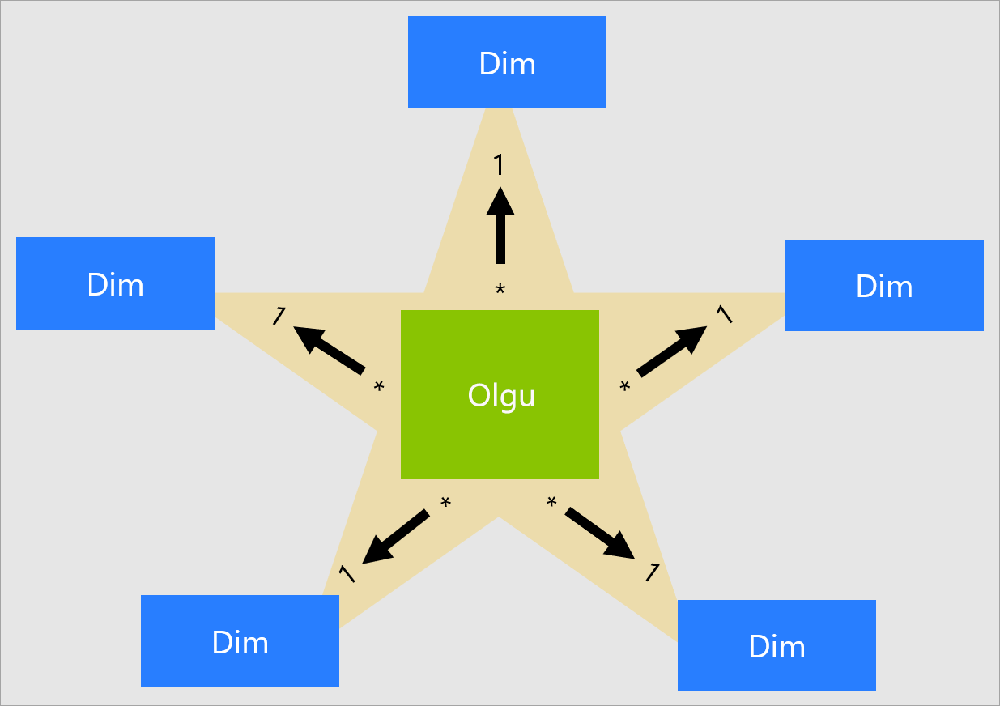
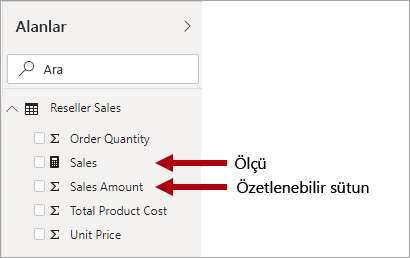
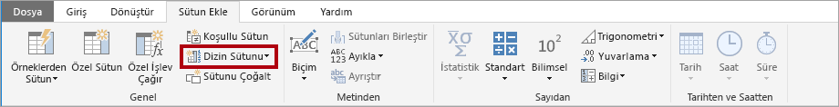
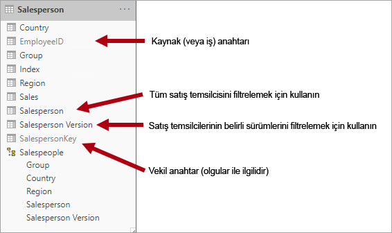
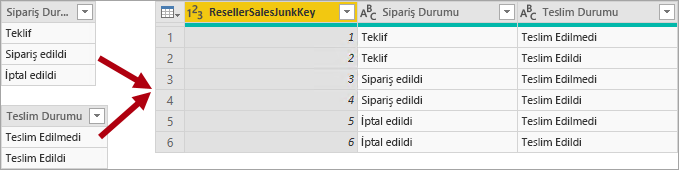
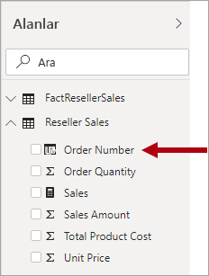

# Yıldız şemasını ve Power BI açısından önemini anlama

Bu makale Power BI Desktop veri modelleyicilerine yöneliktir. Yıldız şeması tasarımı ve bunun performans ve kullanılabilirlik için iyileştirilmiş Power BI veri modellerinin geliştirilmesine neden uygun olduğu açıklanır.

Bu makalede yıldız şeması tasarımıyla ilgili eksiksiz bir açıklama sağlamak amaçlanmamıştır. Diğer ayrıntılar için doğrudan Ralph Kimball'un **Data Warehouse Toolkit: The Definitive Guide to Dimensional Modeling** (3. Baskı, 2013) kitabı yayımlanmış içeriğe başvurun.

## Yıldız şemasına genel bakış

**Yıldız şeması** ilişkisel veri ambarları tarafından yaygın olarak benimsenmiş olgun bir modelleme yaklaşımıdır. Modelleyicilerin model tablolarını _boyut_ veya _olgu_ olarak sınıflandırmasını gerektirir.

**Boyut tabloları** iş varlıklarını, modellediğiniz _şeyleri_ açıklar. Varlıklar ürünlerden, kişilerden, yerlerden ve kavramlardan, ayrıca zamanın kendisinden oluşabilir. Yıldız şemasında bulabileceğiniz en tutarlı tablo tarih boyutu tablosudur. Boyut tablosu benzersiz tanımlayıcı işlevi gören bir anahtar sütunu (veya sütunları) ile açıklayıcı sütunlar içerir.

Gözlemleri ve olayları depolayan **olgu tabloları** satış siparişleri, envanter bakiyeleri, döviz kurları, sıcaklıklar vb. olabilir. Olgu tablosu boyut tablolarıyla ilgili boyut anahtar sütunları ve sayısal ölçü sütunları içerir. Boyut anahtar sütunları olgu tablosunun _boyut özelliklerini_ belirlerken boyut anahtar değerleri de olgu tablosunun _ayrıntı düzeyini_ belirler. Örneğin satış hedeflerinin depolandığı, iki boyut anahtar sütunu (**Date** ve **ProductKey**) olan bir olgu tablosu tasarlandığını düşünün. Tablonun iki boyutu olduğu kolayca anlaşılabilir. Öte yandan ayrıntı düzeyi boyut anahtar değerleri dikkate alınmadan belirlenemez. Bu örnekte **Date** sütununda depolanan değerlerin her ayın ilk günü olduğunu düşünün. Bu örnekte ayrıntı düzeyi aylık ürün düzeyidir.

Genel olarak boyut tabloları görece az sayıda satır içerir. Öte yandan olgu tabloları çok fazla sayıda satır içerebilir ve zamanla bu sayı büyümeye devam eder.

## Yıldız şemasının Power BI modellerine uygunluğu

Bu makalede tanıtılan yıldız şeması tasarımı ve bununla ilgili birçok kavram, performans ve kullanılabilirlik için iyileştirilmiş Power BI modelleri geliştirmeyle son derece ilgilidir.

Her Power BI raporu görselinin Power BI modeline gönderilen bir sorgu oluşturduğunu düşünün (Power BI hizmeti bir veri kümesi çağırır). Bu sorgular model verilerini filtrelemek, gruplandırmak ve özetlemek için kullanılır. İyi tasarlanmış bir model filtreleme ve gruplandırma için tablolar ve özetleme için tablolar sağlayan modeldir. Bu tasarım, yıldız şemasının ilkelerine çok iyi uyar:

- Boyut tabloları _filtrelemeyi_ ve _gruplandırmayı_ destekler
- Olgu tabloları _özetlemeyi_ destekler

Modelleriyicilerin tablo türünü boyut veya olgu olarak yapılandırmak için ayarlayabilecekleri bir tablo özelliği yoktur. Aslında bu, model ilişkileri tarafından belirlenir. Model ilişkisi iki tablo arasında bir filtre yayma yolu oluşturur ve tablo türü ilişkinin **Kardinalite** özelliğiyle belirlenir. Yaygın bir ilişki kardinalitesi _bire çok_ veya bunun tersi olan _çoka bir_ ilişkidir. İlişkinin "bir" tarafı her zaman boyut türündeki tabloyken "çok" tarafı da her zaman olgu türünde tablodur. İlişkiler hakkında daha fazla bilgi için bkz. [Power BI Desktop’ta model ilişkileri](../transform-model/desktop-relationships-understand.md).

İyi yapılandırılmış bir model tasarımı boyut türünde veya olgu türünde olan tablolar içermelidir. Aynı tabloda bu iki türü karıştırmaktan kaçının. Ayrıca doğru ilişkileri olan doğru sayıda tablo sağlamak için çaba harcamanızı da öneririz. Olgu türündeki tabloların her zaman tutarlı bir dilime sahip veriler yüklemesi de önemlidir.

Son olarak, en uygun model tasarımını yapmanın kısmen bilim kısmen de sanat olduğunu anlamalısınız. Bazen size mantıklı geldiğinde uygun yönergelerden uzaklaşabilirsiniz.

Yıldız şeması tasarımında Power BI modeline uygulanabilecek birçok başka kavram da vardır. Bu kavramlar şunlardır:

- [Ölçüler](#measures)
- [Vekil anahtarlar](#surrogate-keys)
- [Kar tanesi boyutları](#snowflake-dimensions)
- [Rol yapan boyutlar](#role-playing-dimensions)
- [Yavaş değişen boyutlar](#slowly-changing-dimensions)
- [Gereksiz boyutlar](#junk-dimensions)
- [Bozuk boyutlar](#degenerate-dimensions)
- [Olgu içermeyen olgu tabloları](#factless-fact-tables)

## Ölçüler

Yıldız şeması tasarımında **ölçü** özetlenecek değerlerin depolandığı bir olgu tablosu sütunudur.

Power BI modelinde **ölçünün** farklı ama benzer bir tanımı vardır. Özetleme yapabilen [Veri Çözümleme İfadeleri (DAX)](/dax/data-analysis-expressions-dax-reference) dilinde yazılmış bir formüldür. Ölçü ifadeleri çoğunlukla sorgu süresinde skaler bir değer sonucu üretmek için SUM, MIN, MAX ve AVERAGE gibi DAX toplama işlevlerinden yararlanır (değerler hiçbir zaman modelde depolanmaz). Ölçü ifadesi basit sütun toplamalarından filtre bağlamını ve/veya ilişki yayma işlemini geçersiz kılan daha gelişmiş formüllere kadar değişebilir. Daha fazla bilgi için [Power BI Desktop'ta DAX ile İlgili Temel Bilgiler](../transform-model/desktop-quickstart-learn-dax-basics.md) makalesini okuyun.

Power BI modellerinin özetlemeyi başarmak için ikinci bir yöntemi daha desteklediğini anlamanız önemlidir. Herhangi bir sütun ve genellikle de sayısal sütunlar rapor görseli veya Soru-Cevap kullanılarak özetlenebilir. Bu sütunlara _örtülü ölçüler_ denir. Birçok durumda ölçüler oluşturmanız gerekmediğinden bir model geliştiricisi olarak bu size kolaylık sağlar. Örneğin Adventure Works bayi satışlarının **Sales Amount** (Satış Tutarı) sütunu, olası her toplama türü için bir ölçü oluşturmaya gerek kalmadan çok sayıda yolla (sum, count, average, median, min, max vb.) özetlenebilir.

Öte yandan basit sütun düzeyi özetlemelerinde bile ölçüler oluşturmanız için üç cazip neden vardır:

- Rapor yazarlarınızın modeli [Çok Boyutlu İfadeler (MDX)](/sql/analysis-services/multidimensional-models/mdx/mdx-query-the-basic-query) kullanarak sorgulayacağını biliyorsanız, modelin _açık ölçüler_ içermesi gerekir. Açık ölçüler DAX kullanılarak tanımlanır. Power BI veri kümesi MDX kullanılarak sorgulandığında bu tasarım yaklaşımı son derece uygundur çünkü MDX sütun değerlerinin özetlemesini yapamaz. Özellikle, [Excel'de Analiz](../collaborate-share/service-analyze-in-excel.md) yapılırken MDX kullanılır çünkü PivotTable’lar MDX sorguları gönderir.
- Rapor yazarlarınızın MDX sorgu tasarımcısını kullanarak Power BI sayfalandırılmış raporları oluşturacağını biliyorsanız, modelin açık ölçüler içermesi gerekir. [Sunucu toplamalarını](/sql/reporting-services/report-design/report-builder-functions-aggregate-function) yalnızca MDX sorgu tasarımcısı destekler. Bu nedenle rapor yazarlarının ölçülerin Power BI tarafından değerlendirilmesine (sayfalandırılmış rapor altyapısı yerine) ihtiyaç duyması halinde MDX sorgu tasarımcısını kullanmaları gerekir.
- Rapor yazarlarınızın sütunları yalnızca belirli yollarla özetleyebildiğinden emin olmanız gerektiğinde. Örneğin bayi satışlarının **Unit Price** (Birim Fiyatı) sütunu (birim başına ücreti temsil eder) özetlenebilir ama bu yalnızca belirli toplama işlevleri kullanılarak yapılabilir. Hiçbir zaman toplanmamalıdır ama başka toplama işlevleriyle (min, max, average vb.) özetlemeye uygundur. Bu örnekte modelleyici **Unit Price** sütununu gizleyebilir ve tüm uygun toplama işlevleri için ölçüler oluşturabilir.

Bu tasarım yaklaşımı Power BI hizmetinde yazılan raporlarda ve Soru-Cevap için iyi sonuç verir. Öte yandan Power BI Desktop canlı bağlantıları rapor yazarlarının **Alanlar** bölmesinde gizli alanları göstermesine izin verir ve sonuç olarak bu tasarım yaklaşımı aşılabilir.

## Vekil anahtarlar

**Vekil anahtar** yıldız şeması modellemesini desteklemek için tabloya eklediğiniz benzersiz bir tanımlayıcıdır. Tanımı gereği kaynak verilerde tanımlanmaz veya depolanmaz. Yaygın olarak vekil anahtarlar ilişkisel veri ambarı boyut tablolarına eklenerek boyut tablosu satırlarının her biri için benzersiz tanımlayıcı sağlanır.

Power BI modeli ilişkilerinde bir tablodaki tek bir benzersiz sütun temel alınır ve bu sütun farklı bir tablodaki tek sütuna filtreleri yayar. Modelinizde boyut türündeki bir tablo tek bir benzersiz sütun içermiyorsa, ilişkinin "bir" tarafına dönüşmesi için benzersiz tanımlayıcı eklemelisiniz. Power BI Desktop'ta [Power Query dizin sütunu](/powerquery-m/table-addindexcolumn) oluşturarak bu gereksinimi kolayca karşılayabilirsiniz.

Bu sorguyu "çok" tarafı sorgusuyla birleştirmeniz gerekir çünkü bu sayede ona da dizin sütunu ekleyebilirsiniz. Bu sorguları modele yüklediğinizde, model tabloları arasında bire çok ilişkisi oluşturabilirsiniz.

## Kar tanesi boyutları

**Kar tanesi boyutu** tek bir iş varlığı için bir dizi normalleştirilmiş tablodur. Örneğin Adventure Works ürünleri kategoriye ve alt kategoriye göre sınıflandırır. Kategoriler alt kategorilere atanır ve ardından ürünler de alt kategorilere atanır. Adventure Works ilişkisel ve ambarında ürün boyutu normalleştirilir ve üç ilişkili tabloda depolanır: **DimProductCategory**, **DimProductSubcategory** ve **DimProduct**.

Hayal gücünüzü kullanırsanız normalleştirilmemiş tabloların olgu tablosundan dışarı doğru konumlandırıldığını ve bunun bir kar tanesi tasarımı oluşturduğunu gözünüzde canlandırabilirsiniz.

Power BI Desktop'ta kar tanesi boyut tasarımını taklit etmeyi (belge kaynak verileriniz taklit ettiği için) veya kaynak tabloları tek model tablosuna tümleştirmeyi (normalleştirilmişlikten çıkarma) seçebilirsiniz. Genel olarak tek modelli tablonun avantajları çok modelli tabloların avantajlarına ağır basar. En uygun karar veri hacimlerine ve modelin kullanılabilirlik gereksinimlerine bağlı olabilir.

Kar tanesi boyut tasarımını taklit etmeyi seçtiğinizde:

- Power BI daha fazla tablo yükler, bu da depolama ve performans açılarından daha az verimlidir. Bu tabloların model ilişkilerini destekleyen sütunlar içermesi gerekir ve bu da daha büyük model boyuta yol açabilir.
- Daha uzun ilişki yayma zincirlerinin geçirilmesi gerekir ve bu da büyük olasılıkla tek tabloya uygulanan filtrelerden daha az verimli olur.
- **Alanlar** bölmesi rapor yazarlarına daha fazla model tablosu sunar ve bu da özellikle kar tanesi boyut tabloları yalnızca bir veya iki sütun içerdiğinde daha az sezgisel bir deneyime yol açabilir.
- Tablolara yayılmış bir hiyerarşi oluşturmak mümkün değildir.

Tek modelli tabloya tümleştirmeyi seçtiğinizde boyutun en yüksek ve en düşük dilimini kapsayan bir hiyerarşi de tanımlayabilirsiniz. Bir olasılıkla yedekli normalleştirilmişlikten çıkarılmış verilerin depolanması, özellikle de çok büyük boyut tabloları için model depolama boyutunun artmasına yol açabilir.

## Yavaş değişen boyutlar

**Yavaş değişen boyut** (SCD) boyut üyelerinin zaman içindeki değişimini uygun bir şekilde yöneten boyuttur. İş varlığı değerlerinin zaman içinde ve geçici olarak değiştiği durumlarda geçerli olur. Müşteri boyutu, özellikle de bunun e-posta adresi ve telefon numarası gibi iletişim ayrıntıları sütunları _yavaş_ değişen boyuta iyi bir örnektir. Buna karşılık borsa fiyatı gibi boyut özniteliği sık sık değişen bazı boyutlar _hızlı_ değişen boyut olarak kabul edilir. Bu örneklerde yaygın tasarım yaklaşımı, hızlı değişen öznitelik değerlerini bir olgu tablosu ölçüsünde depolamaktır.

Yıldız şeması tasarım teorisi iki yaygın SCD türüne başvurur: Tür 1 ve Tür 2. Boyut türündeki tablo Tür 1 veya Tür 2 olabileceği gibi, farklı sütunlarda aynı anda her iki türü de destekleyebilir.

### Tür 1 SCD

**Tür 1** **SCD** her zaman en son değerleri yansıtır ve kaynak verilerde değişiklikler algılandığında boyut tablosu verilerinin üzerine yazılır. Bu tasarım yaklaşımı müşterinin e-posta adresi veya telefon numarası gibi tamamlayıcı değerlerin depolandığı sütunlarda yaygın olarak kullanılır. Müşterinin e-posta adresi veya telefon numarası değiştiğinde boyut tablosu müşteri satırını yeni değerlerle güncelleştirir. Müşterinin iletişim bilgileri hep böyleymiş gibi olur.

Tür 1 SCD'nin sonucu, Power BI modeli boyut türündeki tablonun artımlı olmayan yenilemesiyle elde edilir. En son verilerin yüklendiğinden emin olmak için tablo verilerini yeniler.

### Tür 2 SCD

**Tür 2** **SCD** boyut üyelerinin sürümlerini oluşturmayı destekler. Kaynak sistem sürümleri depolamıyorsa, değişiklikleri algılayan ve boyut tablosunda bu değişiklikleri uygun şekilde yöneten genellikle veri ambarı yükleme işlemi olur. Bu durumda boyut tablosunun, boyut üyesinin _sürümüne_ yönelik benzersiz bir başvuru sağlamak üzere vekil anahtar kullanması gerekir. Ayrıca geçerli boyut üyelerine göre kolayca filtreleme yapabilmek için sürümün tarih aralığı geçerliliğini tanımlayan sütunlar (örneğin **StartDate** ve **EndDate**) ve olasılıkla bir bayrak sütunu da (örneğin **IsCurrent**) içerir.

Örneğin Adventure Works satış bölgelerine satış elemanları atar. Bir satış elemanının bölgesi değiştiğinde, geçmiş olgularının eski bölgeyle ilişkili kalmasını sağlamak için satış elemanına yeni bir sürüm oluşturmak gerekir. Satış elemanına göre satışlarla ilgili doğru geçmiş analizini desteklemek için, boyut tablosu satış elemanlarının ve ilişkili bölgelerinin sürümlerini depolamalıdır. Tablo ayrıca zaman geçerliliğini tanımlamak üzere başlangıç ve bitiş tarihi değerlerini de içermelidir. Satırın geçerli sürüm olduğunu göstermek üzere geçerli sürümlerde Current boş bir bitiş tarihi (veya 31/12/9999) tanımlanabilir. Tablo aynı zamanda bir de vekil anahtar tanımlamalıdır çünkü iş anahtarı (bu örnekte çalışan kimliği) benzersiz olmayacaktır.

Kaynak verilerde sürüm depolanmadığında, değişiklikleri algılamak ve depolamak için bir ara sistem (veri ambarı gibi) kullanmanız gerektiğini anlamanız önemlidir. Tablo yükleme işlemi mevcut verileri korumalı ve değişiklikleri algılamalıdır. Değişiklik algılandığında tablo yükleme işleminin geçerli sürümün süresini sona erdirmesi gerekir. **EndDate** değerini güncelleştirerek ve **StartDate** değeri önceki **EndDate** değerinden başlayan yeni bir sürüm ekleyerek bu değişiklikleri kaydeder. Ayrıca, ilgili olgular olgu tarihine uygun boyut anahtarı değerini almak için zamana dayalı bir arama kullanmalıdır. Power Query kullanan bir Power BI modeli bu sonucu üretemez. Bununla birlikte önceden yüklenmiş bir SCD Type 2 boyut tablosundan verileri yükleyebilir.

Power BI modeli değişikliğe bakılmaksızın üyenin ve üye sürümünün (üyenin zaman içindeki belirli bir durumunu temsil eder) geçmiş verilerini sorgulamayı desteklemelidir. Adventure Works bağlamında baktığımızda bu tasarım, hangi satış bölgesine atanmış olursa olsun satış elemanını veya satış elemanının belirli bir sürümünü sorgulamanıza olanak tanır.

Bu gereksinimi karşılamak için Power BI modeli boyut türündeki tablosunda satış elemanını filtreleme sütunu ve bir de satış elemanının belirli bir sürümünü filtreleme sütunu bulunmalıdır. Sürüm sütununun "Michael Blythe (12/15/2008-06/26/2019)" veya "Michael Blythe (güncel)" gibi belirgin bir açıklama sağlaması önemlidir. Ayrıca rapor yazarlarıyla tüketicilerine SCD Tür 2 ile ilgili eğitim vermek ve doğru filtreleri uygulayarak uygun rapor tasarımları elde etmeyi öğretmek de önemlidir.

Görsellerin sürüm düzeyinde detaya gitmesine izin veren bir hiyerarşi eklemek de iyi bir yöntem olabilir.

## Rol yapan boyutlar

**Rol yapan boyut**, ilgili olguları farklı filtreleyebilen bir boyuttur. Örneğin Adventure Works'te tarih boyut tablosunun bayi satış olgularıyla üç ilişkisi vardır. Aynı boyut tablosu olguları sipariş tarihine, sevk tarihine veya teslim tarihine göre filtrelemek için kullanılabilir.

Veri ambarında kabul edilen tasarım yaklaşımı tek tarihli boyut tablosu tanımlamaktır. Sorgu zamanında tarih boyutunun "rolü", tabloları birleştirmek için kullandığınız olgu sütunu tarafından belirlenir. Örneğin sipariş tarihine göre satışları analiz ederken tablo birleştirmesi bayi satış siparişi tarihi sütunuyla ilgilidir.

Power BI modelinde bu tasarım iki tablo arasında birden çok ilişki oluşturularak taklit edilebilir. Adventure Works örneğinde tarih ile bayi satış tabloları arasında üç ilişki olabilir. Bu tasarım mümkün olsa da, iki Power BI modeli tablosu arasında tek bir etkin ilişki olabileceğini anlamanız önemlidir. Kalan tüm ilişkiler etkin değil olarak ayarlanmalıdır. Tek etkin ilişki olması tarihten bayi satışlarına varsayılan bir filtre yayılması olduğu anlamına gelir. Bu örnekte etkin ilişki raporlar tarafından kullanılan en yaygın filtreye, Adventure Works'te sipariş tarih ilişkisine ayarlanmıştır.

Etkin olmayan ilişki kullanmanın tek yolu [USERELATIONSHIP işlevini](/dax/userelationship-function-dax) kullanan bir DAX ifadesi tanımlamaktır. Bizim örneğimizde model geliştiricisinin sevk tarihine ve teslim tarihine göre bayi satışlarını analiz etmeye olanak tanımak için ölçüler oluşturması gerekir. Özellikle de bayi tablosunun çok sayıda ölçü tanımladığı durumlarda bu bıktırıcı bir çalışma olabilir. Ayrıca ölçülerin aşırı bolluğu nedeniyle **Alanlar** bölmesinde dağınıklığa da yol açar. Başka sınırlamaları da vardır:

- Rapor yazarları ölçüleri tanımlamak yerine sütunları özetlemeye dayandığında, rapor düzeyi bir ölçü yazmadan etkin olmayan ilişkileri özetlemeyi başaramaz. Rapor düzeyi ölçüleri ancak raporlar Power BI Desktop'ta yazılırken tanımlanabilir.
- Tarih ile bayi satışları arasında tek bir etkin ilişki yolu olduğunda bayi satışlarını farklı tarih türlerine göre eş zamanlı olarak filtrelemek mümkün olmaz. Örneğin sevk edilen satışlara göre sipariş tarihi satışlarının çizildiği bir görsel oluşturamazsınız.

Bu sınırlamaları aşmak için yaygın kullanılan bir Power BI modelleme tekniği her rol yapan örnek için boyut türünde bir tablo oluşturmaktır. Normalde DAX kullanarak ek boyut tablolarını [hesaplanan tablolar](/dax/calculatetable-function-dax) halinde oluşturursunuz. Hesaplanan tablolar kullanıldığında model bir **Date** (Tarih) tablosu, bir **Ship Date** (Sevk Tarihi) tablosu ve bir de **Delivery Date** (Teslim Tarihi) tablosu içerebilir. Her birinin kendi ilgili bayi satış tablosu sütunlarıyla tek ve etkin bir ilişkisi olur.

Bu tasarım yaklaşımında farklı tarih rolleri için birden çok ölçü tanımlamanız gerekmez ve aynı anda farklı tarih rollerine göre filtrelemeye olanak tanınır. Bu tasarım yaklaşımında ödenecek küçük bir bedel vardır: Tarih boyutu tablosunun çoğaltılması model depolama boyutunun artmasına yol açar. Boyut türündeki tablolar normalde olgu türündeki tablolara göre daha az satır depoladığından bu durum pek sorun yaratmaz.

Her rol için model boyut türünde tablolar oluştururken aşağıdaki iyi tasarım yöntemlerine dikkat edin:

- Sütun adlarının açıklayıcı olduğundan emin olun. Tüm tarih tablolarında bir **Year** (Yıl) sütunu olabilir (sütun adları kendi tabloları içinde benzersizdir) ama bu ad varsayılan olarak görsel başlıklarında pek açıklayıcı değildir. Boyut rol tablolarının her birinde sütunları yeniden adlandırmayı göz önünde bulundurun; böylelikle örneğin **Ship Date** (Sevk Tarihi) tablosunda **Ship Year** (Sevk Yılı) adlı bir yıl sütunu bulunabilir.
- Uygun olduğunda tablo açıklamalarının rapor yazarlarına (**Alanlar** bölmesi araç ipuçları yoluyla) filtre yayılımının nasıl yapılandırıldığına ilişkin geri bildirim sağladığından emin olun. Modelde olgu türünde birçok tabloyu filtrelemek için kullanılan **Date** (Tarih) gibi genel adlı bir tablo olduğunda, bu netliği sağlamak önemlidir. Örneğin bu tablonun bayi satış siparişi sütunuyla etkin bir ilişkisi olması gibi durumlarda "Bayi satışlarını sipariş tarihine göre filtreler" gibi bir tablo açıklaması sağlamayı dikkate alın.

Daha fazla bilgi için bkz. [Etkin ve etkin olmayan ilişki karşılaştırması kılavuzu](relationships-active-inactive.md).

## Gereksiz boyutlar

**Gereksiz boyutlar**, özellikle az sayıda (belki de bir) öznitelikten oluşan çok fazla boyut olduğunda ve bu özniteliklerin de çok az değeri olduğunda yararlıdır. İyi adaylar arasında sipariş durumu sütunları veya müşteri demografisi sütunları (cinsiyet, yaş grubu vb.) sayılabilir.

Gereksiz boyutun tasarım amacı, hem model depolama boyutunu küçültmek hem de daha az model tablosu ortaya koyarak **Alanlar** bölmesindeki dağınıklığı azaltmak için birçok "küçük" boyutu tek bir boyutta birleştirmektir.

Gereksiz boyut tablosu normalde tüm boyut öznitelik üyelerinin bir vekil anahtar sütunuyla Kartezyen çarpımıdır. Vekil anahtar tablodaki her satıra benzersiz bir başvuru sağlar. Boyutu bir veri ambarında oluşturabileceğiniz gibi, Power Query kullanıp [tam dış sorgu birleştirmeleri](/powerquery-m/table-join) gerçekleştiren bir sorgu oluşturarak ve ardından vekil anahtar (dizin sütunu) ekleyerek de oluşturabilirsiniz.

Bu sorguyu bir boyut türünde tablo olarak modele yüklersiniz. Ayrıca bu sorguyu olgu sorgusuyla birleştirmeniz gerekir, dolayısıyla dizin sütunu bir "bire çok" model ilişkisi oluşturmayı desteklemek için modele yüklenir.

## Bozuk boyutlar

**Bozuk boyutlar**, olgu tablosunun filtreleme için gereken bir özniteliğine karşılık gelir. Adventure Works'te bayi satışları sipariş numarası iyi bir örnektir. Bu örnekte, yalnızca bu tek sütundan oluşan bağımsız bir tablo oluşturmak anlamlı bir model tasarımı değildir çünkü modelin depolama boyutunu artırabilir ve **Alanlar** bölmesinde dağınıklığa yol açabilir.

Power BI modelinde satış sipariş numarası sütununu olgu türündeki tabloya ekleyip satış sipariş numarasına göre filtrelemeye olanak tanımak uygun olabilir. Bu daha önce belirtilen tablo türlerini karıştırmama kuralına (örneğin, model tabloları ya boyut türünde ya da olgu türünde olmalıdır) karşı özel bir durumudur.

Ancak Adventure Work kurumsal bayiler satış masasında sipariş numarası _ve_ sipariş sıra numarası sütunları varsa ve bunlara filtreleme için ihtiyaç duyuluyorsa bozuk boyut tablosu iyi bir tasarım olabilir. Daha fazla bilgi için bkz. [Birebir ilişki kılavuzu (Bozuk boyutlar)](relationships-one-to-one.md#degenerate-dimensions).

## Olgu içermeyen olgu tabloları

**Olgu içermeyen olgu** tablosu hiçbir ölçü sütunu içermez. Yalnızca boyut anahtarlarını içerir.

Olgu içermeyen olgu tablosu boyut anahtarları tarafından tanımlanan gözlemleri depolayabilir. Örneğin belirli bir tarih ve saatte belirli bir müşteri web sitenizde oturum açmıştır. Kaç müşterinin ne zaman oturum açtığıyla ilgili bir analiz yapmak için olgu içermeyen olgu tablosunun satırlarını sayan bir ölçü tanımlayabilirsiniz.

Olgu içermeyen olgu tablosunun daha cazip bir kullanımı, boyutlar arasındaki ilişkileri depolamaktır ve bu da çoklu boyut ilişkilerini tanımlamayı önerdiğimiz Power BI modeli tasarım yaklaşımıdır. [Çoklu boyut ilişkisi tasarımında](relationships-many-to-many.md#relate-many-to-many-dimensions) olgu içermeyen olgu tablosuna bir _köprü oluşturma tablosu_ denir.

Örneğin, satış elemanlarının bir _veya birden çok_ satış bölgesine atanabildiğini düşünün. Köprü oluşturma tablosu, iki sütundan oluşan bir olgu içermeyen olgu tablosu olarak tasarlanabilir: satış elemanı anahtarı ve bölge anahtarı. Yinelenen değerler her iki sütunda da depolanabilir.

Bu çoklu tasarım yaklaşımı iyi belgelenmiştir ve köprü oluşturma tablosu olmadan da başarılabilir. Öte yandan, iki boyut ilişkilendirilirken köprü oluşturma tablosunun en iyi yöntem olduğu düşünülür. Daha fazla bilgi için bkz. [Çoka çok ilişki kılavuzu (Boyut türündeki iki tabloyu ilişkilendirme)](relationships-many-to-many.md#relate-many-to-many-dimensions).

## Sonraki adımlar

Yıldız şeması tasarımı ve Power BI modeli tasarımı hakkında daha fazla bilgi için aşağıdaki makalelere bakın:

- [Boyut modellemesi Vikipedi makalesi](https://go.microsoft.com/fwlink/p/?linkid=246459)
- [Power BI Desktop'ta ilişki oluşturma ve ilişkileri yönetme](../transform-model/desktop-create-and-manage-relationships.md)
- [Birebir ilişki kılavuzu](relationships-one-to-one.md)
- [Çoka çok ilişkiler kılavuzu](relationships-many-to-many.md)
- [Çift yönlü ilişki kılavuzu](relationships-bidirectional-filtering.md)
- [Etkin ve etkin olmayan ilişki karşılaştırması kılavuzu](relationships-active-inactive.md)
- Sorularınız mı var? [Power BI Topluluğu'na sorun](https://community.powerbi.com/)
- Önerileriniz mi var? [Power BI'ı geliştirmek için fikirlerinizi paylaşın](https://ideas.powerbi.com/)
