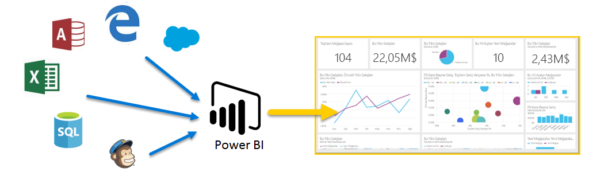
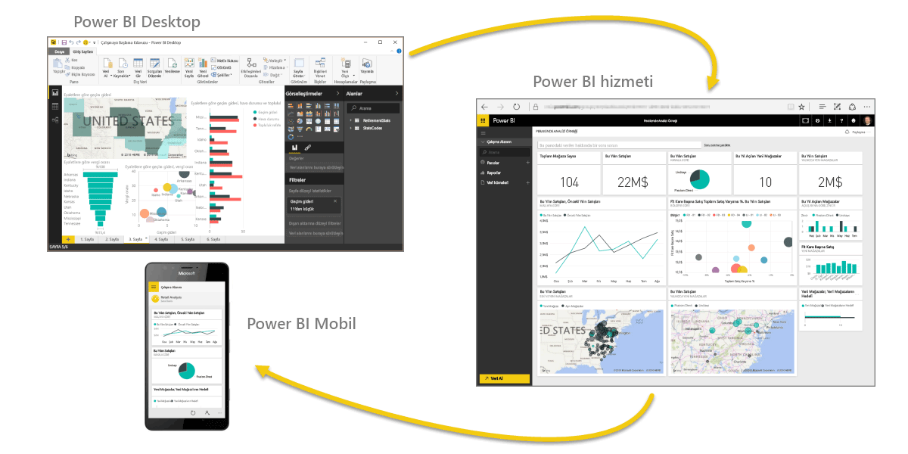

Power BI'a ilişkin **Destekli Öğrenme** kursuna hoş geldiniz. Kendi temponuzda ilerleyebileceğiniz bu çevrimiçi kursta Power BI'ı adım adım açıklayacağız. Bu sayede Power BI'ı her yönüyle öğrenebileceksiniz.

Bu kurs; kavramları, ayrıntıları ve örnekleri kavramanıza yardımcı olacak bir mantıksal akış izlenerek anlaşılır parçalar halinde rehberlik sunmak için hazırlanmıştır. Ayrıca kursta, öğrenme sürecinizde size yardımcı olacak çok sayıda görsel ve video da mevcuttur.

Bu **Destekli Öğrenme** kursu birçok **bölümden** oluşur ve her bölümde birçok **konu başlığı** ele alınır. Bu **Başlangıç** bölümündeki ilk birkaç konu başlığından sonraki neredeyse her konu başlığında, öğreneceklerinizin açıklandığı bir video bulunur. Videonun alt kısmındaki içerikte, ilgili kavram daha ayrıntılı biçimde açıklanır. Bu sayede gözden geçirme ve öğrenme süreciniz kendi temponuzda ilerler.

Power BI kullanmaya **yeni başladıysanız**, ihtiyacınız olan tüm bilgileri bu kursta edinirsiniz. Power BI konusunda **deneyimliyseniz** de bu kursta kavramları pekiştirip bilgi eksiklerinizi giderebilirsiniz. Bu kurstan keyif alacağınızı umuyor ve ileride daha fazla içerik eklemek için sabırsızlanıyoruz.

## Power BI nedir?
**Power BI**, birbirinden bağımsız veri kaynaklarınızı tutarlı, görsel olarak sürükleyici ve etkileşimli öngörülere dönüştürmenizi sağlamak için birlikte çalışan yazılım hizmetlerinden, uygulamalardan ve bağlayıcılardan oluşan bir koleksiyondur. Verilerinizin basit bir Excel elektronik tablosu veya bulut tabanlı ve şirket içi hibrit veri ambarlarından oluşan bir koleksiyon olması fark etmeksizin **Power BI**, veri kaynaklarınıza kolayca bağlanmanıza, önemli verileri görselleştirmenize (veya araştırmanıza) ve bunları istediğiniz herkesle paylaşmanıza olanak sağlar.

**Power BI**, Excel elektronik tablolarından veya yerel veritabanlarından hızlı öngörüler oluşturma özelliği ile işlemlerinizi basit ve hızlı şekilde gerçekleştirebilir. Ayrıca, **Power BI** özel geliştirmenin yanı sıra kapsamlı modelleme ve gerçek zamanlı analiz işlemlerinizi gerçekleştirmeye hazır, sağlam ve kurumsal sınıf bir hizmettir. Bu nedenle Power BI, kişisel rapor ve görselleştirme aracınız olabileceği gibi grup projeleri, departmanlar veya tüm şirket için analiz ve karar mekanizması olarak da kullanılabilir.

## Power BI'ın bileşenleri
Power BI; **Power BI Desktop** adlı bir Windows masaüstü uygulamasını, **Power BI hizmeti** adlı bir çevrimiçi SaaS (*Hizmet olarak Yazılım*) hizmetini ve Windows işletim sistemi yüklü telefon ve tabletlerin yanı sıra iOS cihazlarında ve Android cihazlarda kullanılabilen Power BI mobil **uygulamalarını** içerir.

Bu üç bileşen (**Desktop**, **hizmet** ve **Mobil**) kullanıcıların ihtiyaçlarına veya sahip oldukları role uygun iş öngörüleri oluşturmasına, paylaşmasına ve kullanmasına olanak sağlamak için tasarlanmıştır.

## Power BI, rolünüzle nasıl eşleşir?
Power BI'ı nasıl kullandığınız bir projedeki veya ekipteki rolünüze bağlıdır. Başka rollerdeki kullanıcılar Power BI'ı farklı şekillerde kullanabilir ve bu oldukça normaldir.

Örneğin, siz en çok **Power BI hizmetini** kullanırken, sürekli hesaplama yapan ve rapor oluşturan (ardından, Desktop raporlarını sizin de daha sonra görüntüleyebileceğiniz Power BI hizmetinde yayımlayan) iş arkadaşınız **Power BI Desktop**'ı çok daha fazla kullanabilir. Satış departmanındaki başka bir iş arkadaşınız ise satış kotalarındaki ilerlemeyi izlemek ve yeni satış fırsatları hakkında ayrıntılı bilgi edinmek için Power BI telefon uygulamasını daha çok kullanabilir.

Bununla birlikte, ne elde etmek istediğinize veya belirli bir proje için sahip olduğunuz role bağlı olarak farklı dönemlerde **Power BI**'ın her bir bileşenini kullanabilirsiniz.

Bir yandan Power BI hizmetindeki gerçek zamanlı bir panoda envanter ve üretim sürecini izlerken diğer yandan kendi ekibiniz için müşteri ilişkilerine yönelik istatistiklerle ilgili raporlar oluşturmak üzere **Power BI Desktop**'ı kullanabilirsiniz. Power BI'ı nasıl kullandığınız, Power BI'ın hangi özelliğinin veya hizmetinin durumunuz için en uygun araç olduğuna göre değişiklik gösterebilir. Ancak, Power BI'ın her bir bileşenini kullanabilirsiniz; onu bu kadar esnek ve etkileyici yapan da budur.

**Destekli Öğrenme** kursunun ilerleyen bölümlerinde, bu üç bileşeni (**Desktop**, **hizmet** ve **Mobil** uygulamalar) biraz daha ayrıntılı olarak ele alacağız. Ayrıca sonraki makalelerde Power BI Desktop'ta raporlar oluşturacak, bunları hizmette paylaşacak ve Mobil cihazımızda ayrıntılı olarak inceleyeceğiz.

## Power BI'daki iş akışı
Power BI'daki iş akışı genellikle, raporların oluşturulduğu **Power BI Desktop**'ta başlar. Bu raporlar daha sonra Power BI **hizmetinde** yayımlanır ve paylaşılır. Böylece kullanıcılar **Power BI Mobil** uygulamalarında bu bilgileri kullanabilir.

Akış her zaman söz konusu şekilde gerçekleşmez ve bu çok normaldir. Ancak, Power BI'ın çeşitli kısımlarını ve bunların birbirini nasıl tamamladığını öğrenmenize yardımcı olmak için biz bu akışı kullanacağız.

Bu kursa, Power BI'ın ne olduğuna ve üç ana bileşenine yönelik genel bir bakış edindiğimize göre artık **Power BI** kullanma konusuna göz atabiliriz.

