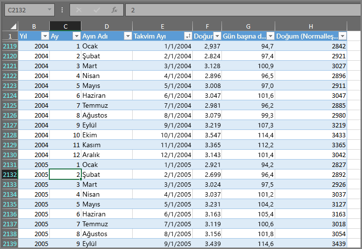

Power BI'da yaptığınız her şey birkaç temel **yapı taşına** ayrılabilir. Bu yapı taşlarını anladıktan sonra her birini genişletip ayrıntılı ve karmaşık raporlar oluşturmaya başlayabilirsiniz. Sonuç olarak, karmaşık görünen şeyler bile temel yapı taşlarından (ahşap, çelik, beton ve cam ile oluşturulan binalar gibi) oluşturulmaktadır. Arabalar metal, kumaş ve kauçuktan üretilir. Elbette, temel yapı taşlarının nasıl düzenlendiğine bağlı olarak binalar ve araçlar da basit şekilde veya ince ayrıntılar gözetilerek hazırlanmış olabilir.

Şimdi bu temel yapı taşlarına bir göz atıp bunlarla oluşturulabilecek basit öğelerden bahsedelim ve ardından karmaşık şeylerin nasıl oluşturulabileceğine ilişkin bir bakış sağlayalım.

Power BI'daki temel yapı taşları şunlardır:

* Görselleştirmeler
* Veri kümeleri
* Raporlar
* Panolar
* Kutucuklar

## Görselleştirmeler
**Görselleştirme** (zaman zaman **görsel** olarak da anılır) verilerin görsel bir gösterimidir. Grafik, graf, renk kodlu harita veya verilerinizi görsel olarak ifade etmek için oluşturabileceğiniz diğer ilgi çekici öğeler bunlara örnek olarak gösterilebilir. Power BI'da çok sayıda farklı görselleştirme türü mevcuttur ve sürekli olarak daha fazlası eklenmektedir. Aşağıda, Power BI hizmetinde oluşturulan bir dizi farklı görselleştirme gösterilmektedir.

Görselleştirmeler basit (önemli bir şeyi ifade eden tek bir sayı gibi) veya görsel açıdan karmaşık (belirli bir toplumsal konuya veya soruna yönelik seçmen duyarlılığını gösteren gradyan renkli bir harita gibi) olabilir. Bir görselin amacı; verileri, ham bir sayı veya metin tablosundan elde edilmesi güç olan bağlamı ve öngörüleri sağlayacak şekilde sunmaktır.

## Veri kümeleri
**Veri kümesi** Power BI'ın görselleştirmeler oluşturmak için kullandığı verileri içeren bir koleksiyondur.

Aşağıdaki resimde gösterilene benzer şekilde, Excel çalışma kitabındaki tek bir tabloya bağlı basit bir veri kümesine sahip olabilirsiniz.

**Veri kümeleri**, Power BI'da kullanıma yönelik benzersiz bir veri koleksiyonu (veri kümesi) sağlamak için filtreleyip birleştirebileceğiniz birçok farklı kaynağın birleşimi olabilir.

Örneğin, biri web sitesi tablosu, biri Excel tablosu, biri de bir e-posta pazarlama kampanyasının İnternet'teki sonuçları olmak üzere üç farklı veritabanı alanından bir veri kümesi oluşturabilirsiniz. Bu benzersiz birleşim farklı kaynaklardan alınıp bir araya getirilmiş olsa da tek bir **veri kümesi** olarak değerlendirilir.

Verileri Power BI'a aktarmadan önce filtrelemeniz, önem verdiğiniz verilere odaklanabilmenizi sağlar. Örneğin, veri kümesine yalnızca pazarlama kampanyasından e-posta almış olan müşterilerin dahil edilmesi için kişi veritabanınızı filtreleyebilirsiniz. Ardından, kampanyaya dahil edilen bu müşteri alt kümesine (filtrelenen koleksiyona) dayalı olarak görseller oluşturabilirsiniz. Filtreleme, verilerinize ve çalışmalarınıza odaklanmanıza yardımcı olur.

Power BI'ın kolaylık sağlayan önemli bir diğer özelliği de çok sayıda veri **bağlayıcısı** içermesidir. İstediğiniz veriler ister Excel'de veya bir SQL veritabanında ister Azure'da ya da Oracle'da isterse Facebook, Salesforce veya MailChimp gibi bir hizmette olsun, Power BI bu verilere kolayca bağlanmanıza, bunları gerektiğinde filtrelemenize ve veri kümenize aktarmanıza olanak tanıyacak yerleşik veri bağlayıcılarına sahiptir.

Bir veri kümesine sahip olduğunuzda bu veri kümesinin farklı kısımlarını farklı şekillerde görüntüleyen görselleştirmeler oluşturamaya başlayabilir ve gördüklerinizle öngörü elde edebilirsiniz. Bu noktada devreye raporlar giriyor.

## Raporlar
Power BI'da **rapor**, bir veya birden fazla sayfada birlikte görünen görselleştirmelerin bir koleksiyonudur. Tıpkı satış sunumunuz için oluşturduğunuz başka bir rapor veya okul ödeviniz için yazdığınız bir rapor gibi, Power BI'daki **raporlar** da birbirleriyle bağlantılı öğelerden oluşan bir koleksiyondur. Aşağıdaki resimde Power BI Desktop'taki bir **rapor** gösterilmektedir; bu örnek, altı sayfalık bir raporun beşinci sayfasıdır. Power BI hizmetinde rapor da oluşturabilirsiniz.

Raporlar, gerektiğinde birden fazla farklı sayfa üzerinde çeşitli görselleştirmeler oluşturmanıza ve bunları senaryonuzu en iyi ifade edecek şekilde düzenlemenize olanak tanır.

Üç aylık döneme ilişkin satışlarla ilgili bir raporunuz veya belirli bir segmentteki ürün artışına yönelik bir raporunuz olabilir ya da kutup ayılarının göç biçimleri hakkında bir rapor oluşturabilirsiniz. Konunuz ne olursa olsun raporlar, görselleştirmelerinizi bir (veya birden fazla) sayfada bir araya getirip düzenleyebilmenizi sağlar.

## Panolar
Bir görselleştirme koleksiyonunu veya bir rapora ait tek bir sayfayı paylaşmaya hazır olduğunuzda **pano** oluşturursunuz. Bir arabadaki gösterge paneli gibi Power BI **panoları** da tek bir sayfadan diğerleriyle paylaşabileceğiniz görseller içeren bir koleksiyondur. Genel olarak, sunmak istediğiniz verilere veya senaryoya ilişkin hızlı öngörüler sunan seçilmiş bir görseller grubudur.

Bir panonun genellikle tuval adı verilen tek bir sayfaya sığması gerekir. (Tuval, Power BI Desktop'ta veya hizmette görselleştirmeleri yerleştirdiğiniz boş perde arkasıdır.) Bunu bir ressamın kullandığı tuval gibi düşünün: İlgi çekici görseller oluşturup birleştirdiğiniz ve düzenlediğiniz bir çalışma alanı.
Panoları başka kullanıcılarla veya gruplarla paylaşabilirsiniz ve bu kişiler Power BI hizmetini veya mobil cihazlarını kullanarak panonuzla etkileşime geçebilir.

## Kutucuklar
Power BI'da **kutucuk** bir raporda veya panoda bulunan tek bir görselleştirmedir. Her bir ayrı görseli içeren dikdörtgen şeklindeki kutudur. Aşağıda, başka kutucuklarla çevrili bir kutucuk (parlak bir kutuyla vurgulanmış) görüyorsunuz.

Power BI'da rapor veya pano *oluştururken* kutucuklarınızı bilgilerinizi sunmak istediğiniz şekilde taşıyabilir veya düzenleyebilirsiniz. Kutucukları büyütebilir, enlerini veya boylarını değiştirebilir ve dilediğiniz şekilde diğer kutucuklara sarınmalarını sağlayabilirsiniz.

Bir panoyu veya raporu *görüntülerken* veya *kullanırken* (oluşturucusu ya da sahibi olmadığınız ancak sizinle paylaşıldığı anlamına gelir) bu panoyla veya raporla etkileşime geçebilir ancak kutucukların boyutunu veya düzenlenme biçimlerini değiştiremezsiniz.

## Özet
Bunlar Power BI'a ve onun yapı taşlarına ilişkin temel bilgilerdir. Tümünü gözden geçirmek için bir dakikamızı ayıralım.

Power BI, herhangi bir yerdeki verilerinize bağlanmanıza, gerekiyorsa bu verileri filtrelemenize ve ardından başkalarıyla paylaşmak için ilgi çekici görselleştirmeler oluşturabileceğiniz Power BI hizmetine aktarmanıza olanak tanıyan hizmetlerin, uygulamaların ve bağlayıcıların bir koleksiyonudur.  

Power BI'ın çeşitli yapı taşlarını kavradığınıza göre artık *sizin için* anlam ifade eden veri kümeleri ve hikayenizi anlatan görsel açıdan ilgi çekici raporlar oluşturabilirsiniz. Power BI ile anlatılan hikayelerin ilgi çekici olabilmesi için karmaşık olması gerekmez.

Bazı kişiler için bir veri kümesinde tek bir Excel tablosunu kullanmak ve ardından ekibiyle bir pano paylaşmak Power BI'ı kullanmanın son derece etkili bir yolu olabilir.

Başkaları için de Power BI'da diğer veritabanları ve gerçek zamanlı kaynaklarla birleşen, ardından da anlık üretim ilerleyişini izleyen bir veri kümesi oluşturulması amacıyla gerçek zamanlı olarak filtrelenen gerçek zamanlı Azure SQL Veri Ambarı tablolarını kullanabilmek aranan işlevsellik olabilir.

Her ikisi için de süreç aynıdır: veri kümesi oluşturma, ilgi çekici görseller hazırlama ve başkalarıyla paylaşma. Benzer şekilde her ikisinin de sonucu (her biri için) aynıdır: gün geçtikçe genişleyen veri dünyanızdan yararlanma ve verileri eyleme dönüştürülebilir öngörüler haline getirme.

Veri öngörüleriniz için ister basit ister karmaşık veri kümeleri gerekiyor olsun Power BI hızlı bir başlangıç yapmanıza yardımcı olur ve veri dünyanızın gerektirdiği kadar karmaşık olacak şekilde gereksinimlerinize göre genişleyebilir. Ayrıca Power BI bir Microsoft ürünü olduğundan sağlam, genişletilebilir, Office ile kullanılabilir ve kurumsal kullanıma hazır olması konusunda da ona güvenebilirsiniz.

Şimdi nasıl çalıştığını görelim. Power BI hizmetine hızlı bir bakış ile başlayacağız.

