Bu konu başlığı altında, Power BI'ın ilk iki kısmının birbiriyle uyum içinde nasıl çalıştığına daha yakından bakacağız:

* **Power BI Desktop**'ta rapor oluşturma
* Raporu **Power BI hizmetinde** yayımlama

Power BI Desktop'ta çalışmaya başlayacak ve **Veri Al** seçeneğini belirleyeceğiz. Veri kaynağı seçmenize olanak sağlayan veri kaynakları koleksiyonu görünür. Aşağıdaki görüntüde, veri kaynağı olarak bir Web sayfası seçilmiş, yukarıdaki videoda ise Will, bir **Excel** çalışma kitabını tercih etmiştir.

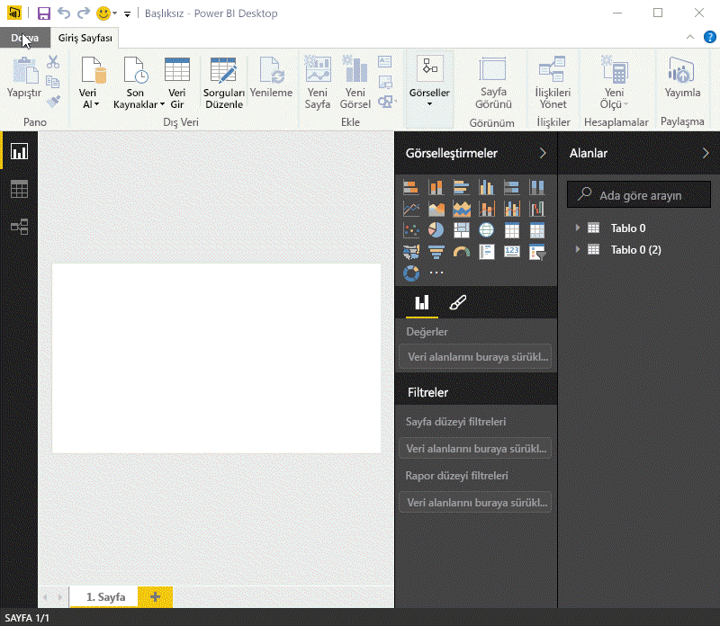

Power BI, seçtiğiniz veri kaynağına bağlanır ve bu kaynakta mevcut olan verileri size gösterir. Başka bir örneğe ilişkin aşağıdaki görüntü, farklı eyaletleri ve bazı ilgi çekici emeklilik istatistiklerini gösteren bir Web sayfasından alınmıştır.

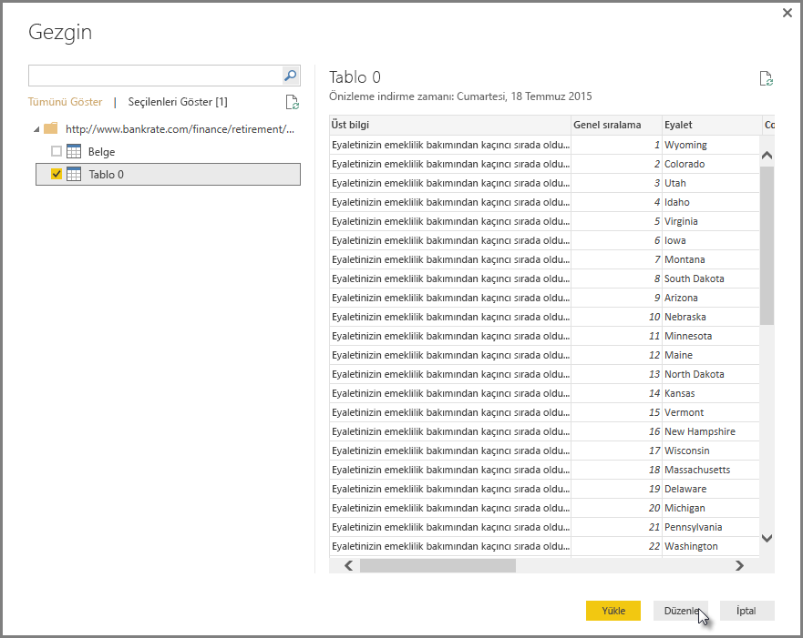

Power BI Desktop **Rapor** görünümünde rapor oluşturmaya başlayabilirsiniz.

**Rapor** görünümünde beş ana alan bulunur:

1. Raporlar ve görselleştirmeler ile ilişkili ortak görevleri görüntüleyen şerit
2. Görselleştirmelerin oluşturulduğu ve düzenlendiği **Rapor** görünümü veya tuval
3. Rapor sayfası seçmenize veya eklemenize olanak sağlayan, alt taraftaki **Sayfalar** sekmesi
4. Görselleştirmeleri değiştirebileceğiniz, renkleri veya eksenleri özelleştirebileceğiniz, filtreler uygulayabileceğiniz, alanları sürükleyebileceğiniz ve daha fazlasını yapabileceğiniz **Görsel Öğeler** bölmesi
5. Sorgu öğelerinin ve filtrelerin, **Rapor** görünümüne veya **Görsel Öğeler** bölmesinin **Filtreler** alanına sürüklenebildiği **Alanlar** bölmesi

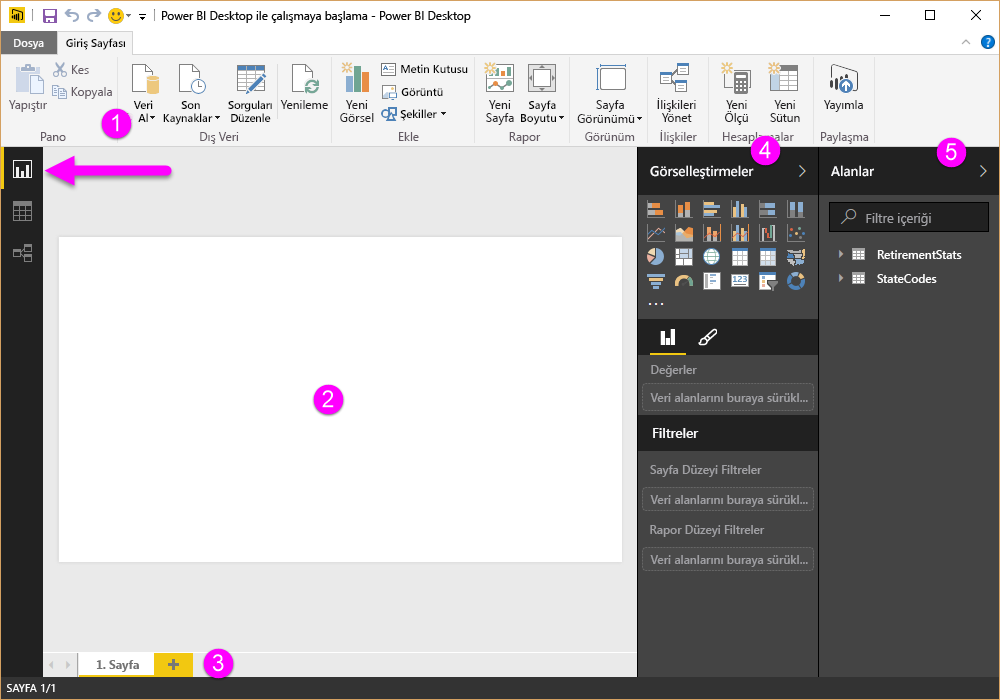

**Görsel Öğeler** ve **Alanlar** bölmeleri, ilgi çekici görselleştirmeler oluşturmak için **Rapor** görünümünde daha fazla alan sağlamak üzere, kenarda bulunan küçük ok seçilerek daraltılabilir. Görselleştirmeleri değiştirirken bu okların yukarı veya aşağı baktığını görebilirsiniz. Bu, söz konusu bölümü uygun şekilde genişletip daraltabileceğinizi gösterir.

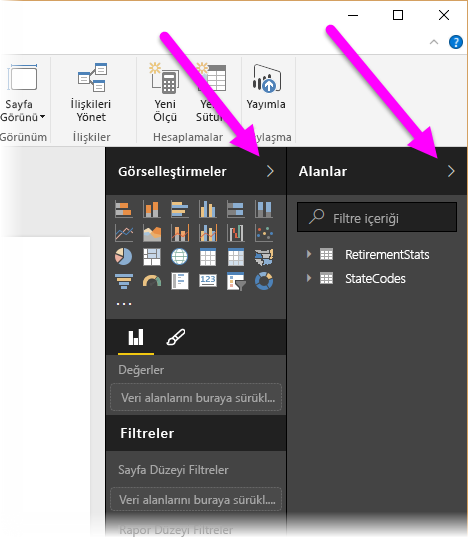

Görselleştirme oluşturmak için **Alanlar** bölmesindeki bir alanı **Rapor** görünümüme sürüklemeniz yeterlidir. Bu örnekte, *RetirementStats* bölümündeki State alanını sürükleyip ne olacağına bakalım.

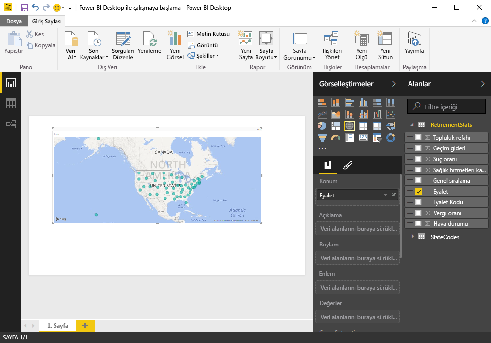

Şuna bir bakın: Power BI Desktop, State alanında coğrafi konum verilerinin bulunduğunu belirlediğinden otomatik olarak harita tabanlı bir görselleştirme oluşturdu.

Şimdi biraz ileri saralım. Birkaç görselleştirme içeren bir rapor oluşturduktan sonra bunu Power BI hizmetinde yayımlamak için hazırız. Power BI Desktop'taki **Giriş** şeridinde bulunan **Yayımla**'yı seçin.

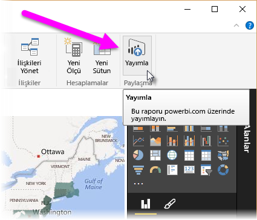

Power BI'da oturum açmanız istenir.

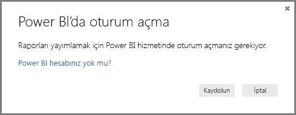

Oturum açtıktan ve yayımlama işlemi tamamlandıktan sonra aşağıdaki iletişim kutusuyla karşılaşırsınız. Yayımlamış olduğunuz raporu görebileceğiniz Power BI hizmetine gitmek için bağlantıyı (**Başarılı!** ifadesinin altındaki) seçebilirsiniz.

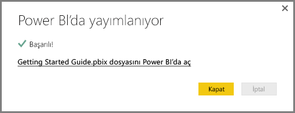

Power BI'da oturum açtığınızda, hizmette yeni yayımladığınız Power BI Desktop dosyasını görürsünüz. Aşağıdaki görüntüde, Power BI Desktop'ta oluşturulan rapor, **Raporlar** bölümünde gösterilmektedir.

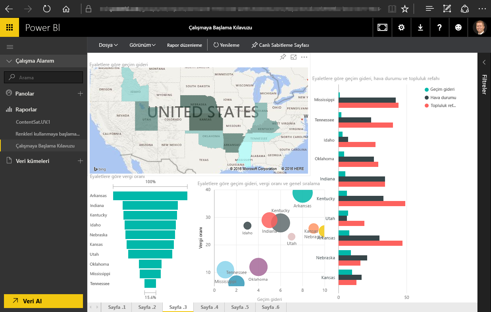

Bu raporda, söz konusu görseli bir panoya sabitlemek üzere **Raptiye** simgesini seçebilirim. Aşağıdaki görüntüde, parlak bir kutu ve ok ile vurgulanmış şekilde raptiye simgesi gösterilmektedir.

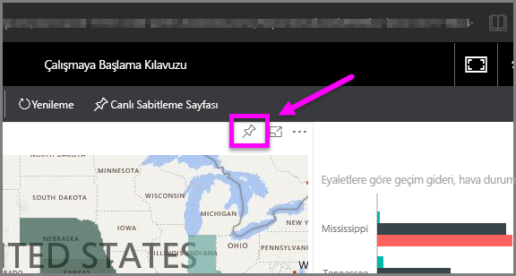

Bu simgeyi seçtiğimde, görseli mevcut bir panoya sabitlememe veya yeni bir pano oluşturmama olanak sağlayan aşağıdaki iletişim kutusu görünür.

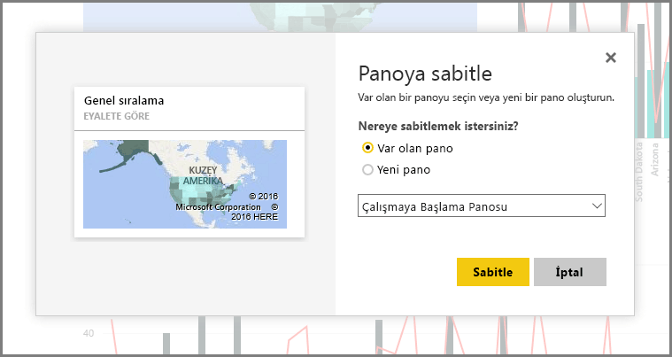

Raporumuzdaki birkaç görseli sabitlediğimizde bunları panoda görüntüleyebiliriz.

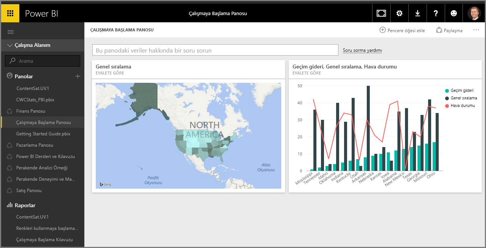

Elbette Power BI'ı kullanarak, daha pek çok işlem (oluşturduğunuz panoları paylaşmak gibi) gerçekleştirebilirsiniz. Paylaşma konusunu bu kursun sonraki bölümlerinde ele alacağız.

Sonraki konu başlığında ise yalnızca Facebook ve Salesforce gibi çok sayıda bulut hizmetinden birine bağlanarak sizin için otomatik olarak pano oluşturabilecek bir özelliğe göz atacağız.

