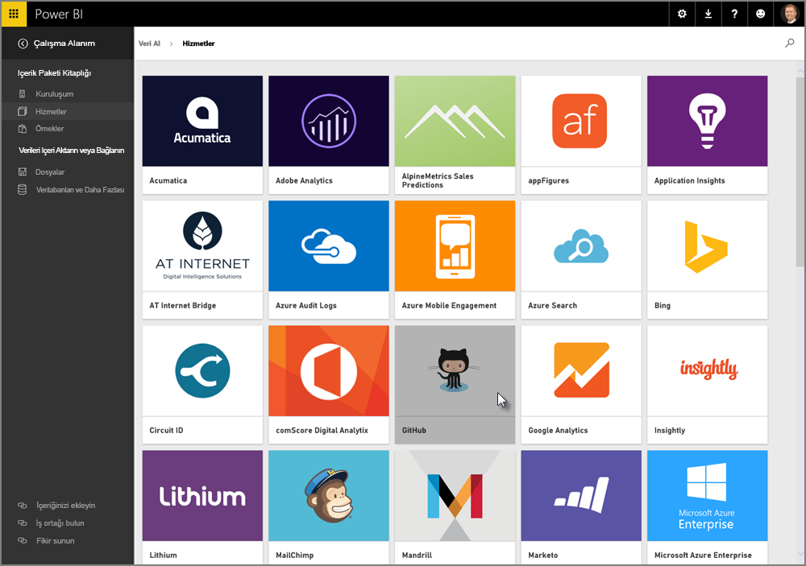
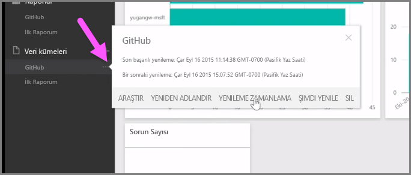

Öğrendiğimiz üzere, Power BI'daki genel iş akışı şöyledir: Power BI Desktop'ta bir rapor oluşturursunuz, bu raporu Power BI hizmetinde yayımlar ve başka kullanıcılarla paylaşırsınız. Böylece kullanıcılar raporu hizmette veya bir mobil uygulamada görüntüleyebilir.

Ancak, bazı kullanıcılar iş akışına Power BI hizmeti ile başlar. Şimdi bu hizmete hızlıca göz atıp Power BI'da hızlıca görsel oluşturmanın kolay ve popüler yolu hakkında bilgi edineceğiz: *içerik paketleri*.

**İçerik paketi**, Salesforce gibi belirli veri kaynaklarına dayalı önceden yapılandırılmış, hazır görsellerden ve raporlardan oluşan bir koleksiyondur. İçerik paketlerini kullanmak, TV karşısında yiyeceğiniz bir yemeği mikrodalga fırında ısıtmaya veya fast food yemek siparişi vermeye benzer. Yalnızca birkaç tıklama ve açıklamanın ardından, birlikte uyum sağlayacak şekilde tasarlanmış girişlerden oluşan bir koleksiyon hızlı bir şekilde servis edilir.

Şimdi içerik paketlerine, hizmete ve bunların nasıl çalıştığına hızlıca göz atalım. Sonraki bölümlerde içerik paketleri (ve hizmet) ile ilgili daha ayrıntılı bilgi vereceğiz. Bunu ana yemekten önce gelen bir aperitif olarak düşünebilirsiniz.

## Bulut hizmetleriyle kullanıma hazır panolar oluşturma
Power BI ile verilere kolayca bağlanabilirsiniz. Power BI hizmetinde, giriş ekranının sol alt köşesindeki **Veri Al** düğmesini seçmeniz yeterlidir.

*Tuvalde* (Power BI hizmetinin ortasındaki alan) Power BI hizmetindeki kullanılabilir veri kaynakları gösterilir. Power BI; Excel dosyaları, veritabanları veya Azure verileri gibi yaygın olarak kullanılan veri kaynaklarının yanı sıra Salesforce, Facebook, Google Analytics ve diğer tüm SaaS hizmet çeşitleri gibi **yazılım hizmetlerine** (SaaS sağlayıcıları veya bulut hizmetleri olarak da bilinir) kolayca bağlanabilir.

**Power BI hizmeti** bu yazılım hizmetleri için panolarda ve raporlarda önceden ayarlanmış, kullanıma hazır görsellerden oluşan bir koleksiyon (**İçerik Paketleri**) sunar. İçerik paketleri sayesinde, seçtiğiniz hizmetten edindiğiniz verilerle Power BI'da hızlıca çalışmaya başlarsınız. Örneğin, Salesforce içerik paketini kullandığınızda Power BI, Salesforce hesabınıza bağlanır (kimlik bilgilerinizi sağladığınızda) ve ardından Power BI'a, görsellerden ve panolardan oluşan önceden tanımlı bir koleksiyon ekler.

Power BI tüm hizmet türleri için içerik paketleri sunar. Aşağıdaki görüntüde, **Hizmetler** kutusundaki (önceki görüntüde gösterilmiştir) **Al** seçeneğini belirlediğinizde görüntülenen, hizmetlerin alfabetik olarak sıralandığı ilk ekran gösterilmektedir. Aşağıdaki görüntüde de görebileceğiniz üzere birçok seçeneğiniz vardır.

Biz, amaçlarımız doğrultusunda **GitHub**'ı seçeceğiz. GitHub çevrimiçi kaynak denetimine ilişkin bir uygulamadır. GitHub içerik paketine ilişkin bilgileri ve kimlik bilgilerini girdiğimde paket, verilerimi içeri aktarmaya başlar.

Veriler yüklendiğinde, önceden tanımlı GitHub içerik paketi panosu görünür.

**Panonun** yanı sıra, panoyu oluşturmak için (GitHub içerik paketinin parçası olarak) oluşturulan **Rapor** ile birlikte verilerin içeri aktarıldığı sırada oluşturulan ve GitHub Raporunun oluşturulması için kullanılan **Veri Kümesini** de (GitHub'dan çekilen veri koleksiyonu) görürsünüz.

Panoda herhangi bir görsele tıklayıp söz konusu görselin oluşturulduğu **Rapor** sayfasına otomatik olarak yönlendirilebilirsiniz. **Top 5 users by pull requests** görseline tıkladığınızda Power BI, Rapordaki **Pull Requests** sayfasını (görselin oluşturulduğu Rapor sayfası) açar.

## Verileriniz hakkında soru sorma
Ayrıca verileriniz hakkında soru da sorabilirsiniz. Power BI hizmeti, sorunuza göre gerçek zamanlı olarak birtakım görseller oluşturur. Aşağıdaki görüntüde, **Doğal Dil Sorgusu** çubuğunda yazılı olanlara göre Power BI'ın, giderilen Sorun Sayısını (Count of Issues) gösterdiği bir dizi görseli görebilirsiniz.

Bir görseli beğendiğinizde Doğal Dil Sorgusu çubuğunun sağ tarafında bulunan **Raptiye** simgesini seçerek söz konusu görseli panoya sabitleyebilirsiniz. Bu örnekte, görsel GitHub panosuna (seçili pano bu olduğundan) sabitlenmiş durumdadır.

## Power BI hizmetinde verileri yenileme
Bir içerik paketine ilişkin veri kümesini veya Power BI'da kullandığınız diğer verileri **yenilemeyi** seçebilirsiniz. Yenileme ayarlarını yapmak için bir veri kümesinin yanındaki üç nokta seçeneğini belirlediğinizde bir menü görünür.

Bu menünün alt kısmında bulunan **Yenilemeyi Zamanla** seçeneğini belirleyin. Tuvalde, Ayarlar iletişim kutusunu görünür. Burada, yenileme ayarlarını ihtiyaçlarınıza uygun şekilde belirleyebilirsiniz.

Power BI hizmetine hızlı bakış konusunu burada noktalayabiliriz. Bu hizmet ile yapabileceğiniz daha pek çok şey var ancak bunlara bu kursun ilerleyen kısımlarında değineceğiz. Ayrıca, bağlanabileceğiniz birçok veri türünün olduğunu ve tüm içerik paketi türlerini kullanabileceğinizi aklınızdan çıkarmayın. Üstelik her geçen gün bunlara yenileri de eklenmektedir.

Şimdi bu **Başlangıç** bölümünü özetleyip sonraki adımlar için hazırlanacağınız sıradaki konumuza geçelim.

