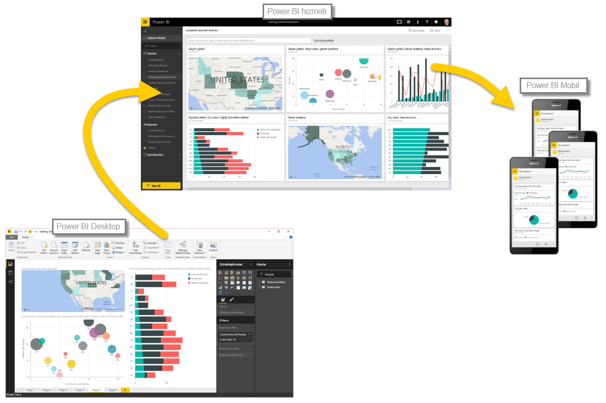

İlk bölümde öğrendiklerinizi hızlı bir şekilde gözden geçirelim.

**Power BI** verilerinizden etkileşimli öngörüler elde etmenizi sağlamak için birlikte çalışan yazılım hizmetlerinden, uygulamalardan ve bağlayıcılardan oluşan bir koleksiyondur. Excel çalışma kitapları gibi tek, basit kaynaklardaki verileri kullanabileceğiniz gibi birden fazla veritabanı ve bulut kaynağından veri çekip karmaşık veri kümeleri ve raporlar oluşturabilirsiniz. Power BI, istediğiniz ölçüde basit olabileceği gibi karmaşık küresel iş ihtiyaçlarınız doğrultusunda kurumsal kullanıma da hazırdır.

Power BI uygulaması şu üç temel bileşenden oluşur: **Power BI Desktop**, **Power BI hizmeti** ve **Power BI Mobil**. Üçü de birlikte çalışarak verileri dilediğiniz gibi oluşturmanıza, paylaşmanıza, kullanmanıza ve onlarla etkileşim kurmanıza olanak sağlar.

Power BI uygulamasının temel yapı taşlarından da bahsetmiştik. Bunları aşağıda görebilirsiniz:

* **Görselleştirmeler**: bazen yalnızca görsel olarak da adlandırılan, verilerin görsel bir temsili
* **Veri kümeleri**: Power BI uygulamasının görselleştirme oluşturmak için kullandığı verileri içeren bir koleksiyon
* **Raporlar**: bir veri kümesindeki, bir veya daha fazla sayfaya yayılmış görselleri içeren bir koleksiyon
* **Panolar**: bir rapordan oluşturulan, görseller içeren tek sayfalık bir koleksiyon
* **Kutucuklar**: bir raporda veya panoda bulunan tek bir görselleştirme

Daha sonra, Tur Rehberimiz **Will Thompson** eşliğinde Power BI'a göz attık. Will, size verileri Power BI ile nasıl çözümleyeceğinize ve görselleştireceğinize ilişkin hızlı bir genel bakış sundu.

<!---
In **Power BI Desktop**, we connected to a basic Excel file, created visualizations, then published those visualizations to the service. Even if you use Power BI only with your Excel workbooks, you can gain amazing visual insights with those Excel workbooks, and both interact and share it in ways never before possible.
-->
**Power BI hizmeti** bölümünde yalnızca birkaç tıklama ile bir pano oluşturduk. Power BI hizmetine göz atmaya devam ederek bir **İçerik Paketi** (görsellerden ve raporlardan oluşan kullanıma hazır bir koleksiyon) kullanıp bu içerik paketini doldurmak ve verileri hayata geçirmek için bir **yazılım hizmetine** bağlandık.

Ayrıca, verilerimizle ilgili sorular sormak için doğal dil sorguları (**Soru-Cevap** olarak adlandırılır) kullandık ve Power BI uygulaması da bu sorulara göre birtakım görseller oluşturdu. Son olarak, verilerimiz için bir **yenileme zamanlaması** ayarladık ve Power BI hizmetine geri döndüğümüzde söz konusu verilerin yenileneceğini öğrendik.

## Sonraki adımlar
**Tebrikler!** Power BI **Destekli Öğrenme** kursunun ilk bölümünü tamamladınız. Artık, Power BI'daki mantıksal iş akışının bir sonraki adımı olan **Veri Alma** konusunun ele alındığı sıradaki bölüme geçmek için sağlam bir bilgi temeline sahipsiniz.

Daha önce belirtmiş olsak da bu kursta edindiğiniz bilgilerin Power BI'daki genel iş akışı ile aynı doğrultuda ilerlediğini yeniden belirtmekte fayda görüyoruz:

* Verileri **Power BI Desktop**'a aktarma ve rapor oluşturma.
* Power BI hizmetinde **yayımlama** ve burada yeni görselleştirmeler veya panolar oluşturma
* Panolarınızı başkalarıyla (özellikle de hareket halinde olan kişilerle) **paylaşma**
* **Power BI Mobil** uygulamalarında, paylaşılan panoları görüntüleme ve bu panolarla etkileşim kurma

Bunların tümünü sizin yapmanız gerekmez. Bazı kullanıcılar hizmette yalnızca başkaları tarafından oluşturulan panoları da görüntüleyebilir. Bunda herhangi bir sorun yok ancak, bu kurstaki tüm bölümleri *tamamlayıp* söz konusu panoların nasıl oluşturulduğunu ve verilere nasıl bağlandığını *anlayacağınız* için kendi panonuzu oluşturmaya bile karar verebilirsiniz.

Bir sonraki bölümde görüşmek üzere!

