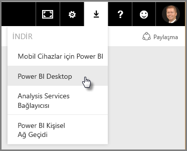
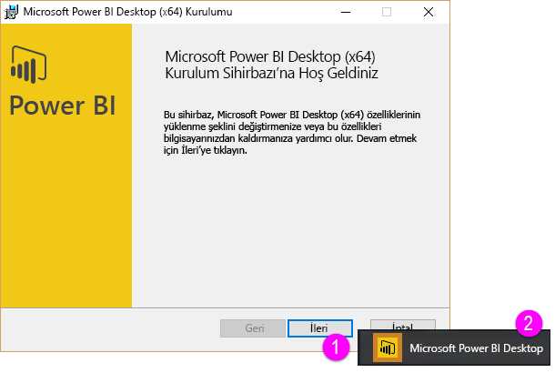
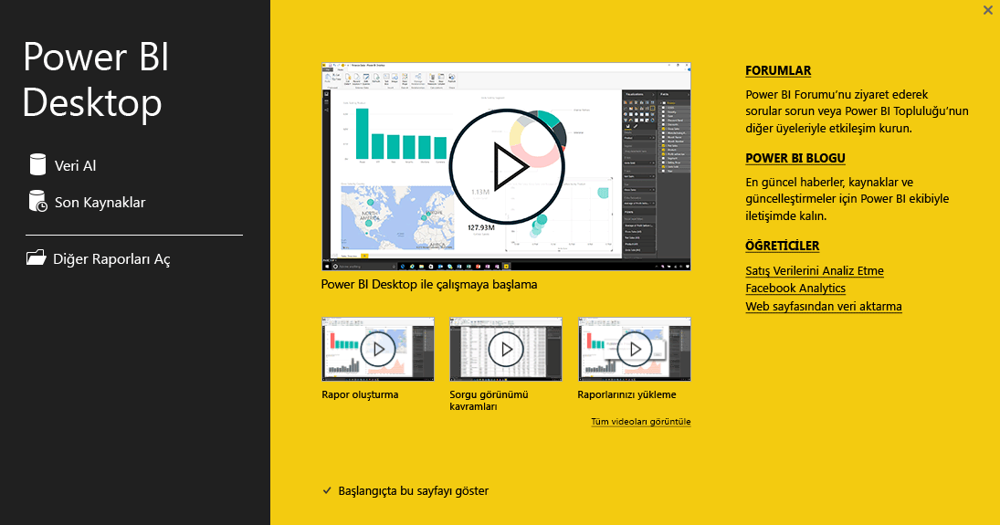

Power BI **Destekli Öğrenme** kursunun **Veri Alma** başlıklı ikinci bölümüne hoş geldiniz. Bu bölümde Power BI Desktop'a odaklanarak Power BI uygulamasının veri merkezli özelliklerinden ve araçlarından birçoğunu ele alacağız. Bu araçların birçoğunu Power BI hizmeti ile de kullanabileceğinizden bu bölümde öğrendikleriniz her ikisi için de geçerli.

Aldığınız veriler bazen istediğiniz düzeyde iyi biçimlendirilmiş veya *temiz* olmayabilir. Bu bölümde, veri alma ve temizlemenin yanı sıra (veri *temizliği* veya veri *dönüştürme* olarak da adlandırılır), veri alma işlemlerinizi kolaylaştıracak bazı gelişmiş ipuçları hakkında bilgi edineceksiniz.

Bu kursun tüm bölümlerinde olacağı gibi, öğrenme süreciniz, Power BI'daki iş akışı ile aynı doğrultuda ilerleyecektir. Bu nedenle, öncelikle **Power BI Desktop** uygulamasına göz atalım. Çalışmalar genelde burada başlar.

## Power BI Desktop'a genel bakış
Power BI Desktop, verilerinize bağlanmak, verilerinizi temizlemek ve görselleştirmek için kullandığınız bir araçtır. Power BI Desktop ile verilerinize bağlanıp onları farklı şekillerde modelleyebilir ve görselleştirebilirsiniz. İş Zekası projelerinde çalışan kullanıcıların çoğu, zamanının büyük kısmını Power BI Desktop uygulamasını kullanarak geçirir.

Power BI Desktop’ı [web’den](http://go.microsoft.com/fwlink/?LinkID=521662) indirebilirsiniz, **Power BI Desktop**’ı [**Windows Store**](http://aka.ms/pbidesktopstore)’dan uygulama olarak yükleyebilirsiniz veya dilerseniz doğrudan Power BI hizmetinden indirebilirsiniz. Hizmette **Power BI Desktop**’ı almak için Power BI uygulamasının sağ üst kenarındaki aşağı ok düğmesini seçtikten sonra Power BI Desktop seçeneğini belirlemeniz yeterlidir.

Power BI Desktop, Windows bilgisayarınıza bir uygulama olarak yüklenir.

Power BI Desktop uygulamasını indirdikten sonra Windows'daki diğer uygulamalar gibi yükleyip çalıştırabilirsiniz. Aşağıdaki görüntüde Power BI Desktop uygulamasının Başlangıç Ekranı gösterilmektedir. Uygulamayı başlattığınızda bu ekranla karşılaşırsınız.

Power BI Desktop yerel şirket içi veritabanlarından Excel çalışma sayfalarına ve bulut hizmetlerine kadar çok çeşitli veri kaynaklarına bağlanır. Verilerinizi daha kullanışlı hale getirmek için temizlemenize ve biçimlendirmenize (sütunları bölme ve yeniden adlandırma, veri türlerini değiştirme ve tarihlerle çalışma gibi işlemler de dahil) yardımcı olur. Ayrıca, sütunlar arasında ilişkiler oluşturarak verilerinizi daha kolay şekilde modelleyebilir ve çözümleyebilirsiniz.

