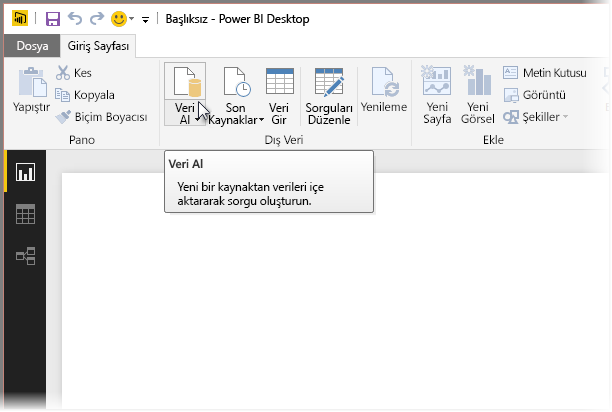
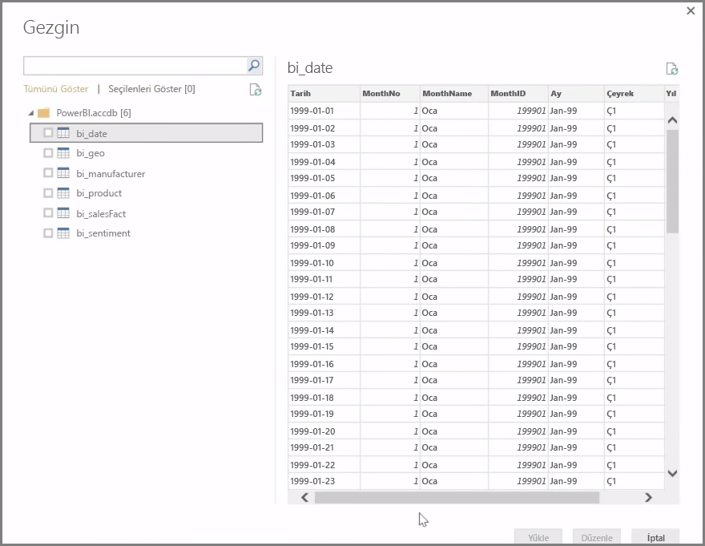

**Power BI Desktop**; şirket içi veritabanları, Excel çalışma kitapları ve bulut hizmetleri de dahil olmak üzere çok çeşitli sayıda veri kaynağına bağlanabilir. Şu anda, GitHub ve Marketo gibi 59'un üzerinde farklı bulut hizmeti özel bağlayıcılara sahiptir. Ayrıca XML, CSV, metin ve ODBC aracılığıyla genel kaynaklara da bağlanabilirsiniz. Üstelik Power BI ile doğrudan bir web sitesi URL'sinden tablo verisi bile kopyalayabilirsiniz! En başa dönelim ve Power BI Desktop'ı açıp verilere bağlanarak başlayalım.

**Power BI Desktop**'ı başlatıp Başlangıç Ekranı'nı geçtikten sonra, **Giriş** sekmesindeki şeritte Veri Al seçeneğini belirleyebilirsiniz.

Power BI Desktop için aylık güncelleştirmeler sunulur ve her bir güncelleştirmeyle birlikte, **Power BI Desktop What's New** (Power BI Desktop'taki Yenilikler) sayfası da güncelleştirmelere ilişkin bilgilerle, bloga yönelik bağlantılarla ve bir indirme bağlantısıyla güncelleştirilir.

Power BI Desktop'ta kullanılabilecek farklı bir çok veri kaynağı bulunur. Bağlantı oluşturmak üzere bir kaynak seçin. Seçiminize bağlı olarak kaynağı bilgisayarınızda veya ağ üzerinde bulmanız ya da isteğiniz için kimlik doğrulamak üzere hizmette oturum açmanız istenebilir.

Bağlantı kurulduktan sonra karşınıza ilk olarak **Gezgin** penceresi çıkar. Gezgin, veri kaynağınızın tablolarını ve varlıklarını görüntüler; bunlardan birine tıkladığınızda ise içeriklerin bir önizlemesi sunulur. Ardından, seçtiğiniz tabloları veya varlıkları anında içeri aktarabilir ya da **Düzenle** seçeneğini belirleyerek, içeri aktarma işleminden önce verilerinizi dönüştürebilir ve temizleyebilirsiniz.

Power BI Desktop'a aktarmak istediğiniz tabloları seçtikten sonra, **Gezgin** penceresinin sağ alt köşesindeki **Yükle** düğmesini seçerek söz konusu tabloları Power BI Desktop'a yükleyebilirsiniz. Ancak bazı durumlarda, söz konusu tabloları Power BI Desktop'a yüklemeden önce bu tablolarda değişiklikler yapmak isteyebilirsiniz. Müşterilerin yalnızca bir alt kümesini görüntülemek veya belirli bir ülkede gerçekleşen satışlara ilişkin verileri filtrelemek isteyebilirsiniz. Böyle durumlarda, Düzenle düğmesini seçebilir ve söz konusu verilerin tümünü Power BI Desktop'a aktarmadan önce bunları filtreleyebilir veya dönüştürebilirsiniz.

Sonraki bölümde bu kısımdan devam ederek verilerimizi düzenleyeceğiz.

