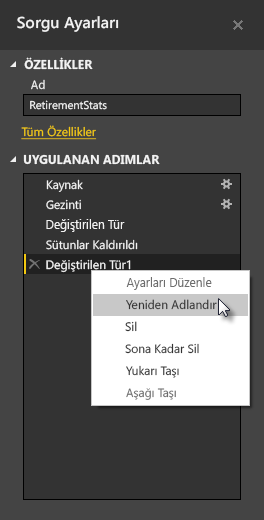

**Power BI Desktop**, verilerinizin modelleriniz ve görselleştirmeleriniz için hazır hale gelmesi amacıyla şekillendirilmesine ve dönüştürülmesine yönelik etkili bir araç olan **Sorgu Düzenleyicisi**'ni içerir. Gezgin'den Düzenle seçeneğini belirlediğinizde Sorgu Düzenleyicisi başlatılır ve veri kaynağınızdan seçtiğiniz tablolar veya diğer varlıklarla doldurulur.

Ayrıca **Sorgu Düzenleyicisi**'ni **Giriş** şeridindeki **Sorguları Düzenle** düğmesini kullanarak doğrudan **Power BI Desktop**'tan da başlatabilirsiniz.

Sorgu Düzenleyicisi'ne şekillendirmeniz için hazır veriler yüklendikten sonra çeşitli bölümler görürsünüz:

1. Sorgudaki verilerle etkileşime geçmek üzere şeritteki birçok düğme artık etkindir
2. Sol bölmede sorgular (her tablo veya varlık için bir adet) listelenir. Bunlar seçim, görüntüleme ve şekillendirme için kullanılabilir
3. Ortadaki bölmede seçilen sorgudaki veriler görüntülenir ve şekillendirme için kullanılabilir
4. Sorgunun özelliklerini ve uygulanan adımları listeleyen Sorgu Ayarları penceresi görünür

Orta bölmede; bir sütuna sağ tıklandığında, sütunu tablodan kaldırma, sütunu yeni bir adla yineleme ve değerleri değiştirme gibi, kullanılabilecek çeşitli dönüştürmeler görüntülenir. Bu menüde, sık kullanılan sınırlayıcılarla metin sütunlarını katlara da ayırabilirsiniz.

**Sorgu Düzenleyicisi** şeridi, sütunların veri türünü değiştirme, bilimsel gösterim ekleme veya tarihlerden haftanın günü gibi öğeleri ayıklama da dahil olmak üzere çeşitli işlemleri gerçekleştirmenizi sağlayan ek araçlar içerir.

Siz dönüştürme uyguladıkça her bir adım, **Sorgu Düzenleyicisi**'nin **Sorgu Ayarları** bölmesinde yer alan **Uygulanan Adımlar** listesinde görünür. Bu listeyi kullanarak belirli değişiklikleri geri alabilir veya gözden geçirebilir, hatta adımların adlarını değiştirebilirsiniz. Dönüştürmelerinizi kaydetmek için **Giriş** sekmesindeki **Kapat & Uygula** seçeneğini belirleyin.

**Kapat & Uygula** seçeneğini belirlemenizin ardından Sorgu Düzenleyicisi, yaptığınız sorgu değişikliklerini uygulayarak Power BI Desktop için geçerli hale getirir.

**Sorgu Düzenleyicisi**'nde gelişmiş dönüştürmeler de dahil olmak üzere verileri dönüştürürken gerçekleştirebileceğiniz her türlü işlem mevcuttur. Bir sonraki bölümde, **Sorgu Düzenleyicisi** ile verilerinizi dönüştürmek için kullanabileceğiniz hemen hemen hiç ölçülebilir olmayan yöntemlere ilişkin bilgi vermek amacıyla bu gelişmiş dönüştürmelerden birkaçına göz atacağız.

