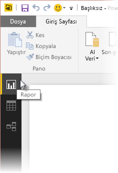
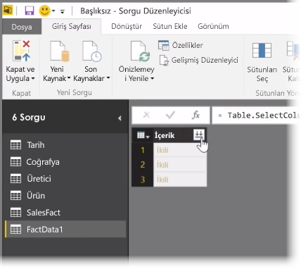
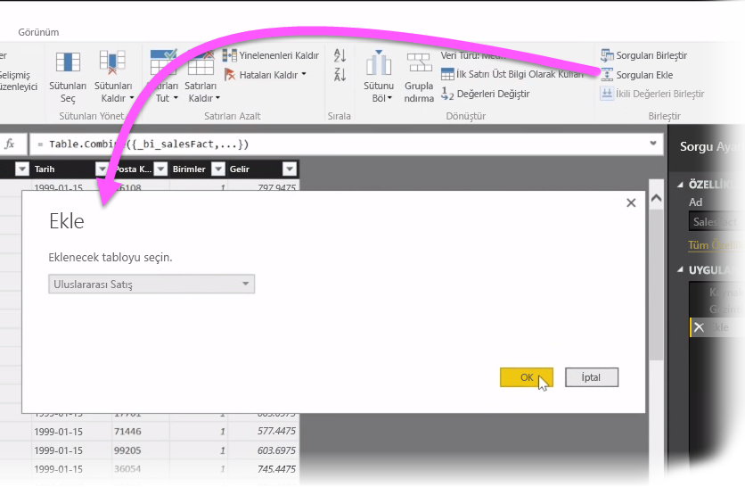
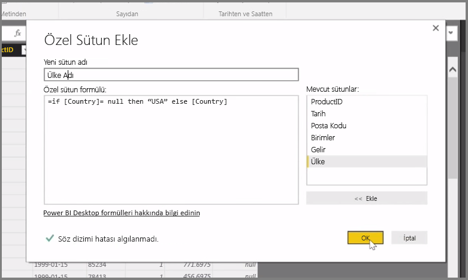

Bu makalede, **Power BI Desktop**'a yönelik bazı gelişmiş veri içeri aktarma ve temizleme tekniklerini ele alacağız. Verilerinizi **Sorgu Düzenleyicisi**'nde şekillendirip **Power BI Desktop**'a aktardıktan sonra bunları birkaç farklı yöntemle inceleyebilirsiniz. Power BI Desktop'ta üç görünüm vardır: **Rapor** görünümü, **Veri** görünümü ve **İlişkiler** görünümü. Tuvalin sol üst tarafında her bir görünüme ilişkin simgeyi seçerek söz konusu görünümü elde edebilirsiniz. Aşağıdaki resimde **Rapor** görünümü seçilmiştir. Simgenin yanındaki sarı çubuk, hangi görünümün etkin olduğunu belirtir.

Görünümü değiştirmek için diğer iki simgeden birini seçmeniz yeterlidir. Simgenin yanındaki sarı çubuk, hangi görünümün etkin olduğunu belirtir.

Power BI Desktop, modelleme işleminin herhangi bir noktasında, birden fazla kaynakta yer alan verileri tek bir raporda birleştirebilir. Mevcut bir rapora ek kaynaklar eklemek için **Giriş** şeridinde **Sorguları Düzenle** seçeneğini belirleyin ve ardından **Sorgu Düzenleyicisi**'nde **Yeni Kaynak**'ı seçin.

Klasörler de dahil olmak üzere, **Power BI Desktop**'ta kullanabileceğiniz çok sayıda farklı veri kaynağı bulunur. Bir klasöre bağlanarak bir dizi Excel dosyası veya CSV dosyası gibi birden fazla dosyadaki verileri aynı anda içeri aktarabilirsiniz. Seçtiğiniz klasörde yer alan dosyalar **Sorgu Düzenleyicisi**'nde ikili içerik olarak görünür ve **İçerik** sütununun üst tarafındaki çift ok simgesine tıkladığınızda içeriklerin değerleri yüklenir.

Power BI'ın en kullanışlı araçlarından biri de *Filtreleridir*. Örneğin, bir sütunun yanındaki açılan liste okunu seçtiğinizde modelinizden değerleri kaldırmak için kullanabileceğiniz metin filtrelerinin bir denetim listesi açılır.

Ayrıca sorguları birleştirebilir, birbirine ekleyebilir ve birden fazla tabloyu (veya klasörlerdeki çeşitli dosyalarda yer alan verileri) yalnızca istediğiniz verileri içeren tek bir tabloya dönüştürebilirsiniz. **Sorguları Ekle** aracını kullanarak yeni bir tablodaki verileri mevcut bir sorguya ekleyebilirsiniz. Power BI Desktop, sorgularınızdaki sütunları eşleştirmeye çalışır; bunları daha sonra **Sorgu Düzenleyicisi**'nde gerektiği şekilde ayarlayabilirsiniz.

Son olarak, **Özel Sütun Ekle** aracı ileri düzey kullanıcılara güçlü M dilini kullanarak sıfırdan sorgu ifadeleri yazma seçeneği sunar. M sorgu dili ifadeleri temelinde özel bir sütun ekleyebilir ve verilerinizi tam olarak istediğiniz hale getirebilirsiniz.

