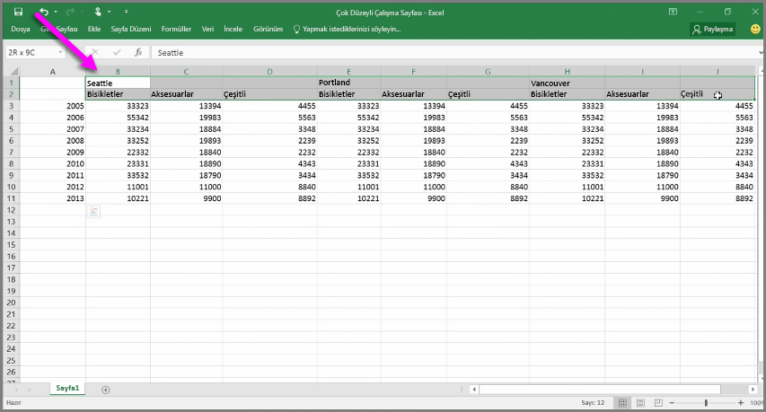
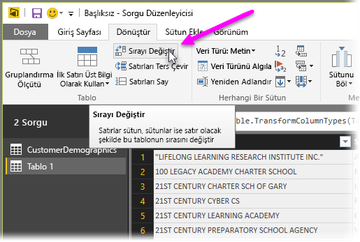
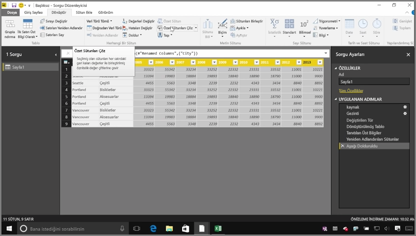
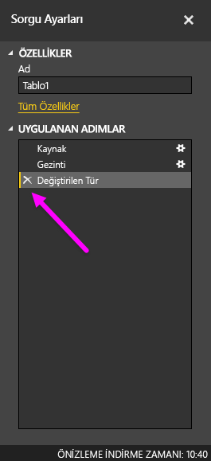
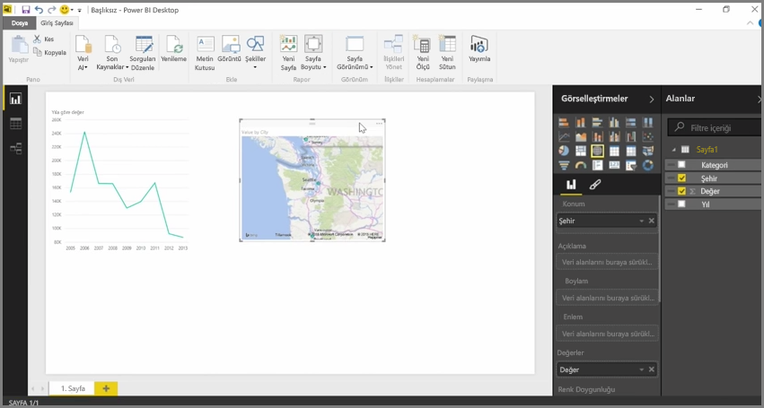

Hemen hemen her kaynaktaki verilerinizi içeri aktarabilen Power BI'ın görselleştirme ve modelleme araçlarıyla en iyi sonuçları sütun verilerinden alırsınız. Bazen verileriniz basit sütunlar halinde biçimlendirilmez; bu, genellikle Excel elektronik tablolarında söz konusudur ve bu elektronik tablolarda insan gözüyle uygun görünen bir tablo düzeni, otomatik sorgular için en iyi sonucu vermeyebilir. Örneğin, aşağıdaki elektronik tabloda birden fazla sütuna yayılmış üstbilgiler vardır.

Neyse ki Power BI; çok sütunlu tabloları, kullanabileceğiniz veri kümelerine hızlıca dönüştürebilecek araçlara sahiptir.

## Verilerin sırasını değiştirme
Örneğin, **Sorgu Düzenleyicisi**'nde **Sırayı Değiştir** seçeneğini kullanarak verileri çevirebilir (sütunları satırlara, satırları sütunlara), böylece verileri işleyebileceğiniz biçimlere ayırabilirsiniz.

Bunu videoda açıklandığı şekilde birkaç kez yapmanızın ardından tablonuz Power BI'ın daha kolay bir şekilde çalışabileceği biçimde şekillenmeye başlar.

## Verileri biçimlendirme
Veriler içeri aktarıldıktan sonra Power BI'ın bunları düzgün bir şekilde kategorilere ayırıp tanımlayabilmesi için verileri biçimlendirmeniz de gerekebilir.

Üstbilgileri bölmek için *satırları üstbilgilere yükseltme*, belirli bir sütunda *null* değerlerini yukarıda veya aşağıda bulunan değerlere dönüştürmek için **Doldur**'u kullanma ve **Özet Sütunları Çöz** seçeneğini belirleme de dahil olmak üzere çeşitli dönüştürmelerle söz konusu verileri Power BI'da kullanabileceğiniz bir veri kümesi haline getirmek üzere temizleyebilirsiniz.

Power BI ile bu dönüştürmeleri verilerinizin üzerinde deneyebilir ve verilerinizi Power BI'ın bu verilerle çalışmasına olanak sağlayan sütun biçimine dönüştürecek türleri belirleyebilirsiniz. Ayrıca gerçekleştirdiğiniz tüm işlemlerin Sorgu Düzenleyicisi'nin Uygulanan Adımlar bölümüne kaydedildiğini; bu nedenle, bir dönüştürmenin istediğiniz şekilde çalışmaması durumunda adımın yanındaki **x** işaretini tıklamanızın yeterli olacağını unutmayın.

## Görsel oluşturma
Verilerinizi dönüştürerek ve temizleyerek Power BI'ın kullanabileceği şekilde biçimlendirdikten sonra görsel oluşturmaya başlayabilirsiniz.

## Sonraki adımlar
**Tebrikler!** Power BI **Destekli Öğrenme** kursunun bu bölümünü tamamladınız. Power BI Desktop'ta **veri almayı** ve *şekillendirmeyi* veya *dönüştürmeyi* öğrendiğinize göre artık etkileyici görseller oluşturabilirsiniz.

Power BI'ın nasıl çalıştığını ve *işinize yaramasını* nasıl sağlayacağınızı öğrenme sürecinde bir sonraki adım, **modellemenin** neleri içerdiğini anlamaktır. Bildiğiniz gibi, **veri kümesi**, Power BI'ın yapı taşıdır ancak bazı veri kümeleri karmaşık olabilir ve farklı veri kaynaklarını temel alabilir. Ayrıca, oluşturduğunuz veri kümesine zaman zaman kendi özel dokunuşunuzu (veya *alan*) eklemeniz de gerekir.

Bir sonraki bölümde **modelleme** ve diğer birçok konu hakkında bilgi edineceksiniz. Görüşmek üzere!

