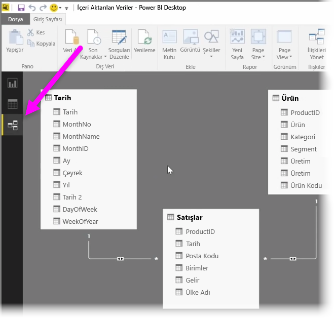
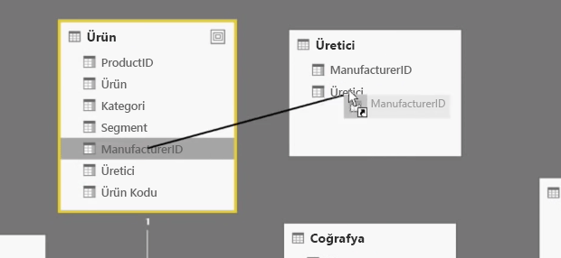
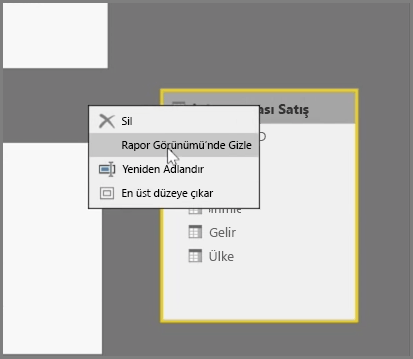
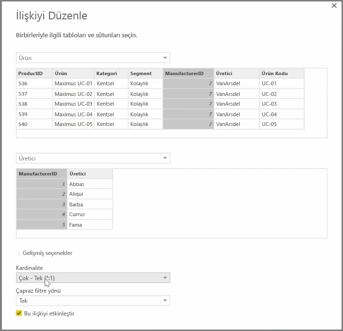

Power BI, tablolar veya öğeler arasındaki ilişkiyi görsel olarak ayarlamanıza olanak sağlar. Verilerinizin diyagram içeren bir görünümünü elde etmek için, Rapor tuvalinin yanındaki ekranın en sol tarafında bulunan **İlişkiler görünümünü** kullanın.

**İlişkiler** görünümünde, her bir tabloyu ve sütunlarını temsil eden blokları, bunların arasında ise ilişkileri gösteren çizgileri görebilirsiniz.

İlişkiler kolayca eklenebilir ve kaldırılabilir. Bir ilişkiyi kaldırmak için söz konusu ilişkiye sağ tıklayın ve **Sil**'i seçin. İlişki oluşturmak için, tablolar arasında bağlantılı hale getirmek istediğiniz alanları sürükleyip bırakın.

Bir tabloyu veya belirli bir sütunu raporunuzda gizlemek için İlişkiler görünümünde söz konusu öğeye sağ tıklayın ve **Rapor Görünümü'nde Gizle** seçeneğini belirleyin.

Veri ilişkilerinizin daha ayrıntılı bir görünümü için **Giriş** sekmesindeki **İlişkileri Yönet**'i seçin. Böylece, ilişkilerinizi görsel bir diyagram yerine liste olarak görüntüleyen **İlişkileri Yönet** iletişim kutusu açılır. Burada, yeni veya güncelleştirilmiş verilerdeki ilişkileri bulmak için **Otomatik algıla** seçeneğini belirleyebilirsiniz. İlişkilerinizi elle düzenlemek için **İlişkileri Yönet** iletişim kutusundaki **Düzenle**'yi seçin. Burada, ilişkilerinizin *Kardinalite* ve *Çapraz filtreleme* yönü gibi özelliklerini ayarlamaya yönelik ileri düzey seçeneklere de ulaşabilirsiniz.

Kardinalite için *Çok - Tek* ve *Tek - Tek* olmak üzere iki seçeneğiniz bulunur. *Çok - Tek*, ürün başına birden çok satır içeren bir satış tablosunun ürünleri benzersiz satırlarda listeleyen bir tablo ile eşleştirilmesi gibi, olgular ve boyutlar arası ilişkilerdir. *Tek - Tek* ise sıklıkla başvuru tablolarındaki tekli girişleri bağlamak için kullanılır.

Varsayılan olarak, ilişkiler her iki yönde de çapraz filtreleme yapılacak şekilde ayarlanır. Yalnızca tek bir yönde çapraz filtreleme yapmak bir ilişkideki modelleme özelliklerinin bazılarını sınırlayabilir.

Verileriniz arasında tutarlı ilişkiler ayarlamak, birden fazla veri öğesi için karmaşık hesaplamalar oluşturmanıza olanak sağlar.

