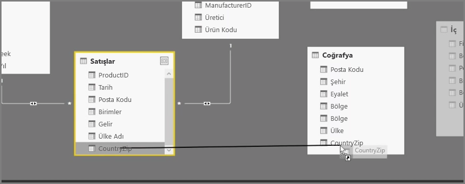

Hesaplanmış sütunlar oluşturmak, verilerinizi zenginleştirmenin ve geliştirmenin basit bir yoludur. **Hesaplanmış sütunlar**, mevcut verilere ilişkin iki veya daha fazla öğeyi dönüştüren ya da birleştiren bir hesaplama tanımlayarak oluşturduğunuz yeni sütunlardır. Örneğin, iki sütunu bir sütunda birleştirerek yeni bir sütun oluşturabilirsiniz.

İlişki oluşturmak için kullanılabilecek benzersiz alanlar bulunmadığında tablolar arasında ilişki oluşturma ihtiyacı, hesaplanmış sütun oluşturmaya yönelik geçerli bir sebep olarak sunulabilir. Bir ilişkinin eksikliği, Power BI Desktop'ta basit bir tablo görseli oluşturduktan sonra, temel alınan verilerin farklı olduğunu bilmenize rağmen tüm girişler için aynı değeri elde ettiğinizde kendini gösterir.

Örneğin, verilerdeki benzersiz alanlarla ilişki oluşturmak için, "Area Code" ve "Local Number" sütunlarındaki değerleri (bu değerler verilerinizde mevcut olduğunda) birleştirerek "Full Phone Number" adlı yeni bir hesaplanmış sütun oluşturabilirsiniz. Hesaplanmış sütunlar, hızlıca model ve görselleştirme oluşturma konusunda kullanışlıdır.

Hesaplanmış tablo oluşturmak için, Power BI Desktop'taki rapor tuvalinin sol tarafındaki **Veri görünümü**'ne gidin.

Modelleme sekmesinde **Yeni Sütun** seçeneğini belirleyin. Bu, DAX (Veri Çözümleme İfadeleri) dilini kullanarak hesaplamalar girebileceğiniz formül çubuğunu etkinleştirir. Excel'de de karşınıza çıkan DAX, güçlü bir formül dilidir ve güvenilir hesaplamalar oluşturmanıza olanak sağlar. Siz formülü yazarken Power BI Desktop, formülünüzün oluşturulmasına yardımcı olmak ve süreci hızlandırmak için, eşleşen formülleri ve veri öğelerini görüntüler.

Power BI formül çubuğu, siz ifadenizi girdiğiniz sırada belirli DAX işlevlerini ve ilgili veri sütunlarını önerir.

Her bir tabloda oluşturulan hesaplanmış sütunlar, bu tablolar arasında ilişki oluşturmak için benzersiz bir anahtar olarak kullanılabilir. **İlişkiler** görünümüne gidip alanı bir tablodan diğerine sürükleyerek ilişkiyi oluşturabilirsiniz.

**Rapor** görünümüne döndüğünüzde ise artık her bir bölge için farklı bir değer görürsünüz.

Hesaplanmış sütunlar oluşturarak gerçekleştirebilecekleriniz bunlarla sınırlı değildir.

