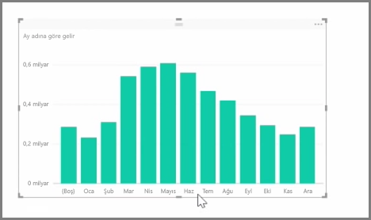

İçeri aktarılan veriler sıklıkla raporlama ve görselleştirme görevleri için ihtiyacınız olmayan alanlar da içerir. Bunlar ya fazladan sunulan bilgilerdir ya da söz konusu veriler başka bir sütunda zaten mevcuttur. Power BI Desktop'ta, verilerinizi en iyi duruma getirmeye, raporlar ve görseller oluşturmaya ve paylaşılan raporlarınızı görüntülemeye yönelik araçlar bulunur. Bu araçlar, Power BI Dektop'ı söz konusu işlemler için daha kullanışlı hale getirir.

## Alanları gizleme
Power BI Desktop'ın **Alanlar** bölmesinde bir sütunu gizlemek için sütuna sağ tıklayın ve **Gizle**'yi seçin. Gizi sütunlarınızın silinmediğini unutmayın. Söz konusu alanı mevcut görselleştirmelerde kullandıysanız veriler hâlâ bu görselde bulunur ve ilgili verileri diğer görselleştirmelerde de kullanmaya devam edebilirsiniz ancak gizli alan **Alanlar** bölmesinde görüntülenmez.

Tabloları **İlişkiler** görünümünde görüntülerseniz gizli alanlar gri renkle gösterilir. Tekrar belirtmek gerekirse, bu alanlardaki veriler hâlâ kullanılabilir ve modelin bir parçasıdır ancak görünümde gizlenir. Alana sağ tıklayıp **göster** seçeneğini belirleyerek herhangi bir alanı istediğiniz zaman gösterebilirsiniz.

## Görselleştirme verilerini başka bir alana göre sıralama
**Modelleme** sekmesinde bulunan **Sütuna Göre Sırala** aracı, verilerinizin istediğiniz sırada görüntülenmesini sağlamaya yönelik oldukça kullanışlı bir araçtır.

Yaygın olarak kullanılan bir örnek vermek gerekirse, ay isimleri içeren veriler varsayılan olarak alfabetik sıralanır. Örneğin; "Ağustos", "Şubat"tan önce görünür.

Böyle bir durumda, Alanlar listesinden alanı ve ardından **Modelleme** sekmesinden **Sütuna Göre Sırala**'yı seçip sıralanacak bir alan belirlemek sorunu çözebilir. Bu örnekte sıralama seçeneği olarak "MonthNo" kategorisinin belirlenmesi ayların istenen şekilde sıralanmasını sağlar.

Bir alanın veri türünü ayarlayarak da bilgilerinizi düzgün bir şekilde işlenecek şekilde en iyi duruma getirebilirsiniz. Rapor tuvalinde bir veri türünü değiştirmek için **Alanlar** bölmesinde söz konusu sütunu seçin ve ardından biçimlendirme seçeneklerinden birini belirlemek üzere **Biçim** açılan menüsünü kullanın. Sizin tarafınızdan oluşturulan ve söz konusu alanı görüntüleyen tüm görseller otomatik olarak güncelleştirilir.

