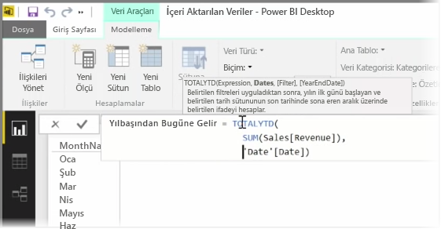

*Ölçü*, Power BI veri modelinizde bulunan bir hesaplamadır. Ölçü oluşturmak için **Rapor** görünümünde, **Modelleme** sekmesinden **Yeni Ölçü**'yü seçin.

Power BI'daki Veri Çözümleme İfadeleri dili olan DAX'ın en iyi özelliklerinden biri de özellikle *Yılbaşından Bugüne* veya *Yıldan Yıla* gibi zaman tabanlı hesaplamalar konusunda çok sayıda kullanışlı işleve sahip olmasıdır. DAX ile önce bir zaman ölçüsü tanımlayabilir, ardından da bunu veri modelinizdeki dilediğiniz sayıda farklı alana göre dilimleyebilirsiniz.

Power BI'da tanımlanmış bir hesaplamaya *ölçü* adı verilir. *Ölçü* oluşturmak için **Giriş** sekmesindeki **Yeni Ölçü** seçeneğini belirleyin. Böylece, ölçünüzü tanımlayan DAX ifadesini girebileceğiniz Formül çubuğu açılır. Siz yazarken Power BI, ilgili DAX işlevlerini, hesaplamanızı girerken de veri alanlarını önerir, ayrıca söz diziminin bir kısmını ve işlev parametrelerini açıklayan bir araç ipucuyla da karşılarsınız.

Hesaplamanız uzunsa **ALT-Enter** yazarak İfade Düzenleyicisi'nde satır sonu ekleyebilirsiniz.

Oluşturduğunuz yeni ölçü, ekranın sağ tarafında bulunan **Alanlar** bölmesindeki tablolardan birinde görünür. Power BI yeni ölçüyü o sırada seçili olan tabloya ekler ve verilerinizin tam olarak hangi noktasında olduğuna bakılmaksızın söz konusu ölçüyü seçip **Ana Tablo** açılan menüsünü kullanarak kolayca taşıyabilirsiniz.

Bir ölçüyü diğer herhangi bir tablo sütununu kullandığınız gibi kullanabilirsiniz: Rapor tuvaline veya görselleştirme alanlarına sürükleyip bırakmanız yeterlidir. Ölçüler aynı zamanda dilimleyicilerle sorunsuz bir şekilde tümleşerek, çalışma sırasında verilerinizi segmentlere ayırır; bu da bir ölçüyü tanımlayıp birçok farklı görselleştirmede kullanabileceğiniz anlamına gelir.

Özellikle finansal raporlamada ve görsellerde kullanılabilen **Calculate** DAX işlevi her türlü kullanışlı hesaplamaya olanak tanıyan güçlü bir işlevdir.

