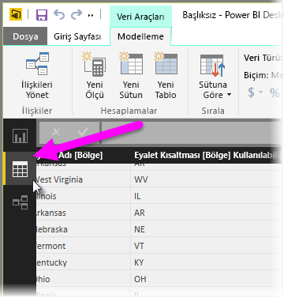
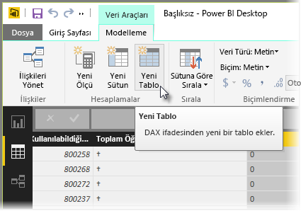
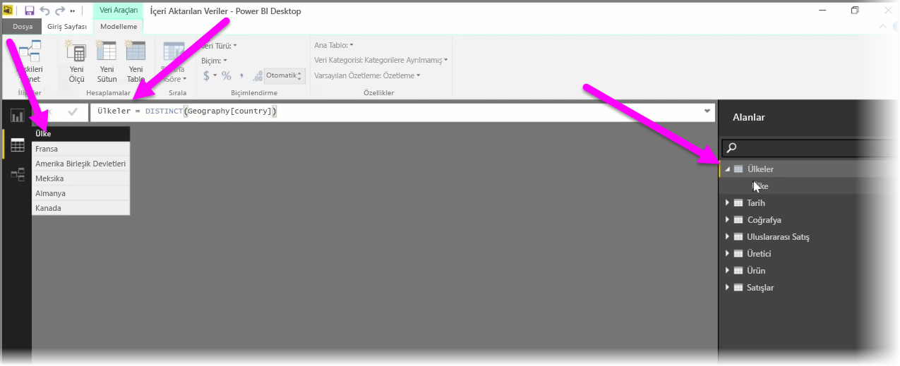

Hesaplanmış tablolar, DAX'ta bulunan birçok yeni modelleme özelliğini ifade etmenize olanak sağlayan bir işlevdir. Örneğin, farklı türlerde birleştirme işlemleri yapmak veya çalışma sırasında işlev içeren bir formülün sonuçlarına dayalı yeni tablolar oluşturmak istiyorsanız hesaplanmış tabloları kullanarak bunları gerçekleştirebilirsiniz.

Hesaplanmış bir tablo oluşturmak için Power BI Desktop'ta bulunan ve rapor tuvalinin sol tarafından etkinleştirilebilen **Veri görünümü**'ne gidin.

Modelleme sekmesindeki **Yeni Tablo** seçeneğini belirleyerek formül çubuğunu açın.

Eşittir işaretinin sol tarafına yeni tablonuzun adını, sağ tarafına ise söz konusu tabloyu oluşturmak için kullanmak istediğiniz hesaplamayı yazın. Hesaplamanızı bitirdiğinizde, modelinizdeki Alanlar bölmesinde yeni bir tablo görünür.

Oluşturma işlemi bittikten sonra, hesaplanmış tablonuzu tıpkı ilişkilerdeki, formüllerdeki ve raporlardaki diğer tablolar gibi kullanabilirsiniz.

