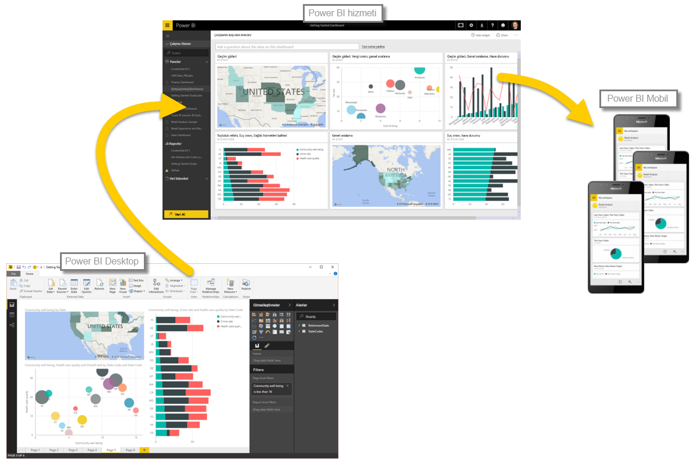

Power BI ile zamana dayalı veri çözümlemek kolaydır. Power BI Desktop'taki modelleme araçları, oluşturulan alanları otomatik olarak ekler ve böylece tek bir tıklamayla yıl, çeyrek yıl, ay ve gün temelinde detaya gidebilirsiniz.  

Raporunuzda tarih alanı kullanarak bir tablo görselleştirmesi oluşturduğunuzda Power BI Desktop, zaman aralığına göre kırılımları otomatik olarak ekler. Örneğin, aşağıda gösterildiği gibi, **Date** tablosundaki tek bir tarih alanı Power BI tarafından otomatik olarak Year, Quarter, Month ve Day şeklinde ayrılmıştır.

Görselleştirmeler, verileri varsayılan olarak *yıl* düzeyinde görüntüler ancak, görselin sağ üst köşesindeki **Detaya Git** seçeneğini etkinleştirerek bunu değiştirebilirsiniz.

Bu işlemin ardından grafiğinizdeki çubuklara veya çizgilere tıkladığınızda zaman hiyerarşisinin bir sonraki düzeyinde (*yıl* düzeyinden sonra *çeyrek yıl* gibi) detaya gidilir. Hiyerarşide en alttaki düzeye (bu örnekte *gün*) ulaşana kadar detaya gitmeye devam edebilirsiniz. Zaman hiyerarşisinde bir üstteki düzeye geri dönmek için görselin sol üst köşesindeki **Detaydan Çık**'a tıklayın.

Ayrıca, yine görselin sol üst köşesindeki **Bir sonraki düzeye kadar tüm öğelerin detayına git** çift ok simgesine dokunarak, seçili tek bir dönem yerine görselde gösterilen tüm verilerin detayına ulaşabilirsiniz.

Modelinizde bir tarih alanı olduğu sürece Power BI, farklı zaman hiyerarşileri için otomatik olarak farklı görünümler oluşturur.

Tarih hiyerarşisini kullanmak yerine tarihleri ayrı ayrı görüntülemek için **Alanlar** bölmesinde ilgili sütun adına sağ tıklamanız (aşağıdaki görüntüde ilgili sütunun adı *InvoiceDate*'tir) ve görünen menüde **Tarih Hiyerarşisi** seçeneği yerine sütun adını seçmeniz yeterlidir. Bu işlemin ardından görseliniz, tarih hiyerarşisini kullanmadan ilgili sütun verilerine dayalı olarak birtakım veriler görüntüler. Tarih hiyerarşisine mi dönmek istiyorsunuz? Hiç sorun değil. Tekrar sağ tıklayıp menüde **Tarih Hiyerarşisi** seçeneğini belirlemeniz yeterlidir.

## Sonraki adımlar
**Tebrikler!** Power BI **Destekli Öğrenme** kursunun bu bölümünü tamamladınız. Verilerinizi *modelleme* hakkında bilgi edindiğinize göre artık bir sonraki bölümde ele alacağımız eğlenceli kısma geçebiliriz: **Görselleştirmeler**.

Daha önce belirtmiş olsak da yeniden belirtmekte fayda görüyoruz. Bu kursta edindiğiniz bilgiler, Power BI'daki genel iş akışı ile aynı doğrultudadır:

* Verileri **Power BI Desktop**'a aktarma ve rapor oluşturma.
* Power BI hizmetinde yayımlama ve burada yeni **görselleştirmeler** ve panolar oluşturma
* Panolarınızı başkalarıyla (özellikle de hareket halinde olan kişilerle) **paylaşma**
* **Power BI Mobil** uygulamalarında, paylaşılan panoları görüntüleme ve bu panolarla etkileşim kurma

Tümünü kendiniz yapmasanız bile bu panoların nasıl oluşturulduğunu ve verilere nasıl bağlandığını *anlayacaksınız*. Bu kursu tamamladığınızda ise kendi panonuzu oluşturabileceksiniz.

Bir sonraki bölümde görüşmek üzere!

