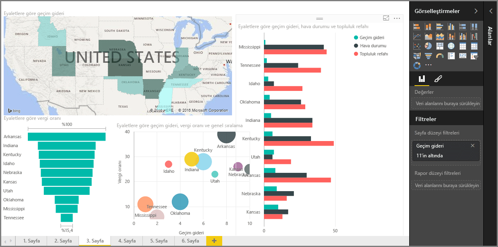

Power BI **Destekli Öğrenme** kursunun **Görselleştirmeler** bölümüne hoş geldiniz. Power BI uygulamasının sunduğu pek çok görselleştirme ile tanışmak için eğlenceli, ilginç ve bir o kadar da öğretici bir tura hazır olun. Üstelik görselleştirmeler bunlarla da sınırlı değil, sürekli olarak yenileri kullanıma sunuluyor!

Elbette her iş zekası projesinde nihai sonuç olarak birtakım görseller elde ederiz. Verileri alıp etkileyici ve bilgilendirici bir şekilde sunmak ve ortaya çıkan sonucu *göstermek* isteriz. Power BI aklınıza gelebilecek her türden etkileyici görselin yanı sıra bu görselleri özelleştirmek için neredeyse sınırsız sayıda yöntem sunduğundan bu bölüm çok önemli!

Bölümde çok sayıda konu başlığı olduğunu düşünebilirsiniz ancak endişelenmeyin; her biri kısa, tahmin edeceğiniz üzere görsellerle dolu ve kolay anlaşılır. Bu bölümde gezindiğiniz sırada kendinizi, verilerinizi sunmak için bu görselleri nasıl oluşturacağınızı hayal ederken bulabilirsiniz.

Görselleştirmelerin temel noktası olan, hepimizin aşina olduğu basit görsellerle başlayacak ve bu konuyu her yönüyle kavramanızı sağlayacağız. Ardından, çıtayı biraz daha yukarı taşıyacak ve rapor oluşturabilmek için gerekli bilgileri öğreneceksiniz.

Burada öğreneceğiniz çok şey var, keyfini çıkarın!

## Power BI'daki görseller ile tanışın
Verileri görselleştirme, Power BI uygulamasının temel parçalarından (bu kursun önceki kısımlarında da değindiğimiz üzere yapı taşlarından) biridir. Görsel oluşturmak ise öngörüler elde etmenin ve bunları paylaşmanın en kolay yoludur.

Power BI, basit çubuk grafiklerden pasta grafiklerine, haritalara ve hatta şelaleler, huniler ve ölçerler gibi çok daha özel bir dizi görselleştirmeye varsayılan olarak sahiptir. Ayrıca Power BI Desktop, raporunuzu hayata geçirmenize yardımcı olacak geniş kapsamlı sayfa biçimlendirme araçları da (şekiller ve resimler gibi) sunar.

