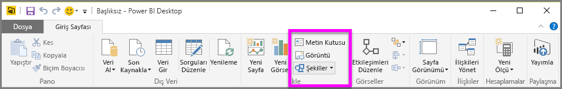
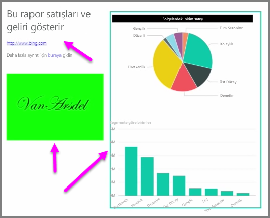

Raporlarınızın görsel tasarımını geliştirmek için verilere bağlı görsellerin yanı sıra metin kutuları, resimler ve şekiller gibi statik öğeler de ekleyebilirsiniz. Görsel öğe eklemek için **Giriş** sekmesinde **Metin kutusu**, **Resim** veya **Şekiller** seçeneğini belirleyin.

**Metin kutuları**; görselleştirmelerinizle birlikte büyük başlıklar, resim yazıları veya kısa paragraflar görüntülemenin ideal bir yoludur. URL'yi yazılı olarak girerek veya bir bağlayıcı ifadeyi vurgulayıp metin kutusu seçenekleri çubuğundaki bağlantı sembolünü seçerek metin kutularına bağlantılar ekleyebilirsiniz. Metin kutularına URL ekleyebilirsiniz. Böyle bir durumda Power BI bağlantıyı otomatik olarak algılar ve etkin hale getirir.

**Resim** seçeneği belirlendiğinde, bilgisayarınızdan veya bağlı başka bir kaynaktan görüntü seçebileceğiniz bir dosya tarayıcı açılır. Varsayılan olarak, raporunuzdaki bir görüntü yeniden boyutlandırıldığında en boy oranı korunur ancak bu, görsel biçimlendirme seçeneklerinde devre dışı bırakılabilir.

**Şekiller**'de dikdörtgenler ve oklar da dahil olmak üzere beş farklı biçim seçeneği bulunur. Şekiller donuk veya renkli bir kenarlıkla birlikte saydam olabilir. (İkinci seçenek, görselleştirme gruplarının çevresinde kenarlıklar oluşturmak için kullanışlıdır.)

