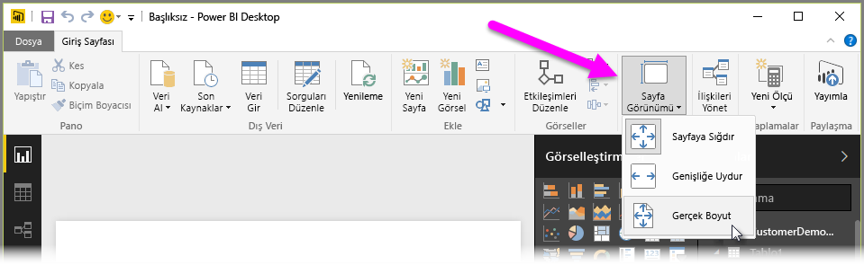

Power BI Desktop size rapor sayfalarınızın boyut ve yön gibi düzen ve biçimlendirme özelliklerini denetleme olanağı sunar.

Rapor sayfalarınızın ölçeklenme biçimini değiştirmek için Giriş sekmesindeki **Sayfa Görünümü** menüsünü kullanın. Kullanılabilir seçenekler şunlardır: **Sayfaya Sığdır** (varsayılan), **Genişliğe Uydur** ve **Gerçek Boyut**.

Sayfaların kendi boyutunu da değiştirebilirsiniz. Varsayılan olarak, rapor sayfalarının en boy oranı 16:9'dur. Sayfa boyutunu değiştirmek için, herhangi bir görselin seçilmediğinden emin olun, ardından Görsel Öğeler bölmesinde boya fırçası simgesini seçin ve **Sayfa Boyutu** seçeneğini belirleyerek söz konusu bölümü genişletin.

Sayfa boyutu seçenekleri arasında 4x3 (kareye daha yakın en boy oranı) ve Dinamik (sayfa kullanılabilir alanı dolduracak şekilde uzatılır) yer alır. Ayrıca raporlar için standart bir Letter boyutu da mevcuttur. Sayfa boyutunu değiştirdikten sonra görsellerinizin tamamen tuvalde olmasını sağlamak için görsellerinizi yeniden boyutlandırmanızın gerekebileceğini unutmayın.

Ayrıca boyutu inç veya piksel olarak ayarlayıp özel bir sayfa boyutu da belirtebilir ve tüm raporun arka plan rengini değiştirebilirsiniz.

Diğer bir seçenek de raporun Cortana kullanılarak yapılan aramalar için sonuç olarak kullanılabilecek şekilde boyutlandırılmasını sağlayan Cortana seçeneğini belirlemektir.

