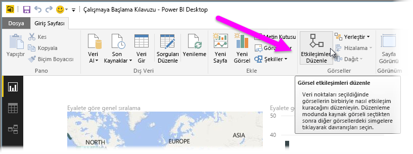
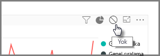
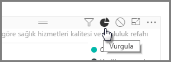
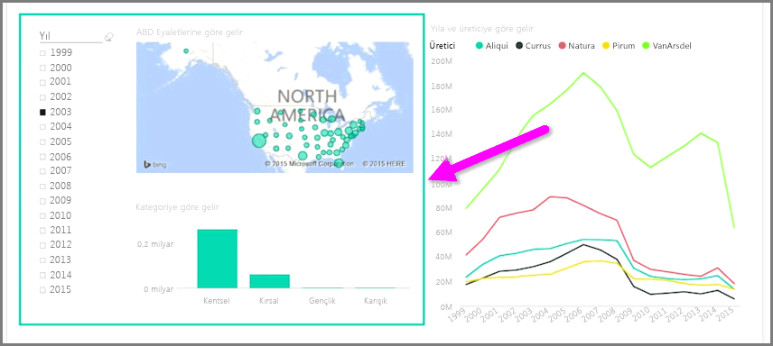

Aynı rapor sayfasında birden fazla görselleştirmeniz varsa tıklayarak veya dilimleyici kullanarak belirli bir segmenti seçtiğinizde ilgili sayfadaki tüm görseller etkilenir. Ancak, bazı durumlarda yalnızca belirli görselleri dilimlemek isteyebilirsiniz. Bu, özellikle de dağılımlar gibi, verilerin belirli bir segment ile sınırlandırılması halinde asıl anlamın kaybedildiği öğeler kullanıldığında geçerlidir. Neyse ki Power BI Desktop, görseller arasındaki etkileşimleri denetlemenize olanak sağlıyor.

Görselleştirmeleriniz arasındaki etkileşimi değiştirmek için **Giriş** şeridindeki Görseller bölümünde **Düzenle**'yi seçin ve **Düzenleme Modu**'nu açın.

>[!NOTE]
>Videonun kayda alındığı zamandan bu yana, Power BI Desktop'taki **Etkileşimleri Düzenle** simgesi değişmiştir.
> 
> 

Artık, rapor tuvalinde bir görseli seçtiğinizde, etkilenecek her bir görselin sağ üst köşesinde küçük ve donuk bir *filtre* simgesi görürsünüz. Bir görseli etkileşimin dışında bırakmak için, sağ üst köşede bulunan *filtre* simgesinin yanındaki *Hiçbiri* sembolüne tıklayın.

Bazı örneklerde, görseller arasında kurulan filtre etkileşiminin türünü ayarlayabilirsiniz. **Düzenleme Modu** açıkken, filtrelemek için kullandığınız görseli seçin. Etkileşimin türünü başka bir görselde değiştirebileceğiniz durumlarda sağ üst köşede bulunan filtre simgesinin yanında bir *pasta grafiği* simgesi görünür.

Segmentlere ayrılan verileri vurgulamak için *pasta grafiği* simgesine tıklayın. Aksi halde veriler filtrelenir. Daha önce yaptığınız gibi, tüm etkileşimleri kaldırmak için *Hiçbiri* simgesine tıklayabilirsiniz.

Faydalı bir tasarım ipucu: Birbirleriyle etkileşim içinde olan görsellerin etrafına saydam bir şekil çizerek kullanıcıların, etkileşimli bir ilişkiye sahip olduklarını kolayca anlamalarını sağlayabilirsiniz.

