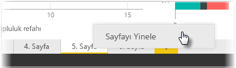

Bir raporun her bir sayfası, belirli şekillerde etkileşim kuran ve hassas bir biçimlendirmeye sahip olan birden fazla görselleştirmeyle birlikte oldukça karmaşık olabilir. Bazen rapor oluştururken iki farklı sayfa konusu için aynı görselleri ve düzenleri kullanmak isteyebilirsiniz. Örneğin, brüt gelir için bir rapor sayfası oluşturmuş ve net gelir için de benzer bir sayfa istiyor olabilirsiniz.

Tüm çalışmalarınızı yeniden oluşturmak zor olacaktır ancak Power BI Desktop ile rapor sayfasını yinelemeniz yeterlidir.

Kopyalamak istediğiniz sekmeye sağ tıklayın ve **Sayfayı Yinele** seçeneğini belirleyin.

Böylece yeni sayfa sekmesini uygun şekilde yeniden adlandırabilir, metin başlığınız varsa bu başlığı güncelleştirebilir ve ardından görsellerinizi, izlemek istediğiniz yeni alanla güncelleştirebilirsiniz.

