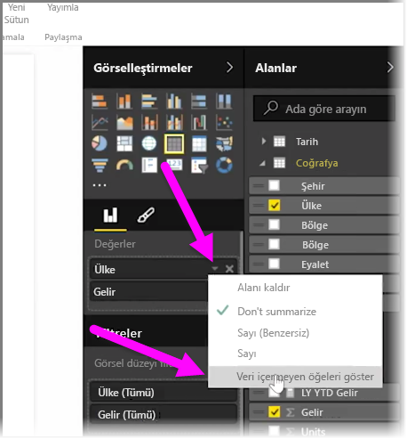
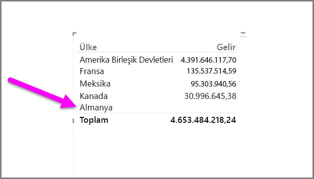
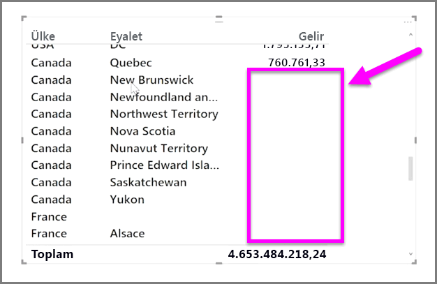

Varsayılan olarak, raporlarınızda, yalnızca veri içeren sütun başlıkları görüntülenir. Örneğin, ülkeye göre gelir bilgilerini görüntülüyorsanız ve Norveç'te hiç satış yoksa Norveç, görselleştirmenizin herhangi bir yerinde görünmez.

Boş kategorileri görüntülemek için, **Görsel Öğeler** bölmesinde, değiştirmek istediğiniz alandaki aşağı oka tıklayın ve **Veri içermeyen öğeleri göster** seçeneğini belirleyin.

Tüm boş sütunlar artık boş değerlerle birlikte görselinizde görüntülenir.

**Görsel Öğeler** bölmesindeki herhangi bir alan için **Veri içermeyen öğeleri göster** seçeneğini belirlerseniz bu seçenek Görsel Öğeler bölmesinde görüntülenen tüm alanlar için geçerli olur. Böylece, bir alan daha eklemeniz halinde, açılan menüyü yeniden ziyaret etmenize gerek kalmadan, veri içermeyen tüm öğeler de gösterilir.

