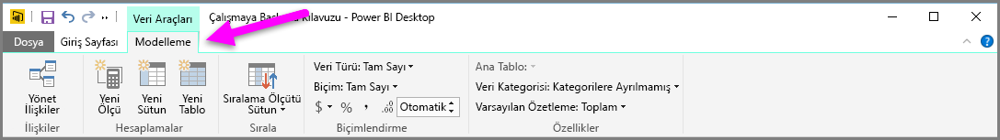
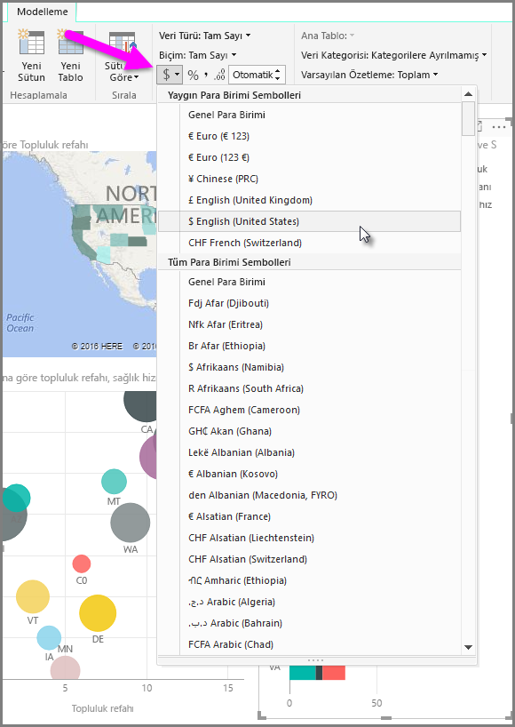
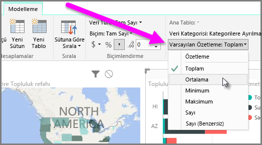
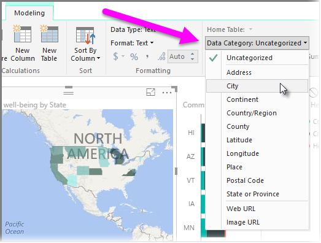

Power BI'da, modelinizdeki alanlar için atayabileceğiniz özellikler mevcuttur. Bunlar, verilerinizi daha net bir şekilde raporlarmanıza, görselleştirmenize ve sunmanıza yardımcı olur. Örneğin, bazen sayılardan oluşan bir listenin ortalamasını almak istersiniz ancak Power BI listedeki sayıları otomatik olarak toplar. Power BI ile söz konusu sayıların bulunduğu listelerin nasıl özetleneceğini ayarlayabilirsiniz.

## Özetleme için sayısal denetim
Bir örneğe göz atalım ve Power BI'ın sayısal veri alanlarını özetleme biçimini nasıl değiştirebileceğinizi gösterelim.

Rapor tuvalindeki bir görseli ve ardından **Alanlar** bölmesindeki bir alanı seçin. Şeritte **Modelleme** sekmesi görünür. Bu sekmede, veri biçimlendirme seçenekleri ve veri özellikleri görüntülenir.

Para birimi simgesi açılan menüsünü (aşağıdaki görüntüde gösterilmiştir) seçerek, kullanılan para birimi simgesinin türünü belirleyebilirsiniz.

Biçimlendirme alanları için birçok farklı seçenek mevcuttur. Örneğin, biçimi para birimi iken yüzde olarak değiştirebilirsiniz.

Power BI'ın verileri özetleme biçimini de değiştirebilirsiniz. Bir alanın özetlenme biçimini değiştirmek (bir toplamı, sayıyı veya ortalamayı görüntüleme de dahil) için **Varsayılan Özetleme** simgesini seçin.

## Konum verilerinizi yönetme ve netleştirme
Haritalarda konum çizerken de benzer değişiklikler yapabilirsiniz. Haritanızı ve ardından, **Alanlar** bölmesinde *Konum* değeri için kullandığınız alanı seçin. **Modelleme** sekmesinde **Veri Kategorisi**'ni seçin ve ardından, açılan menüde konum verilerinizi temsil eden kategoriyi seçin. Örneğin, eyalet, ilçe veya şehir seçeneklerinden birini belirleyebilirsiniz.

