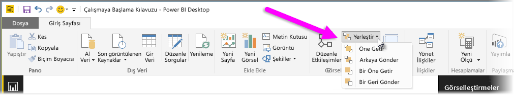
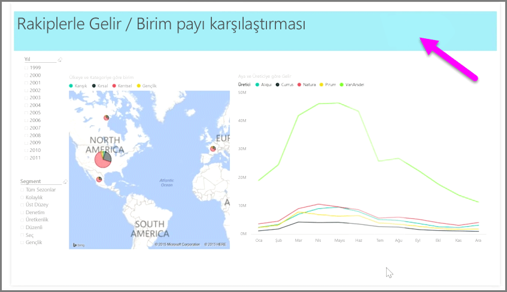

Bir raporda çok sayıda öğeniz varsa Power BI bunlara ilişkin çakışmaları yönetmenize olanak tanır. Öğelerin katmanlanma veya birbirleri üzerinde düzenlenme biçimine genellikle z düzeni adı verilir.

Bir rapordaki öğelerin z düzenini yönetmek için bir öğe seçin ve z düzenini değiştirmek üzere şeridin **Giriş** sekmesindeki **Düzenle** düğmesini kullanın.

**Düzenle** düğme menüsündeki seçenekleri kullanarak raporunuzdaki öğe sıralamasını dilediğiniz hale getirebilirsiniz. Bir görseli bir katman ileriye veya geriye taşıyabilir ya da sıranın en önüne veya en arkasına gönderebilirsiniz.

Düzenle düğmesinin kullanımı, şekilleri dekoratif arka plan veya kenarlık şeklinde kullanma ya da tek bir grafın veya diyagramın belirli bölümlerini vurgulama konusunda özellikle fayda sağlar. Ayrıca bunları, bir rapor başlığı arka planı için kullanılan açık mavi dikdörtgen gibi bir arka plan oluşturmak (aşağıdaki gibi) için de kullanabilirsiniz.

