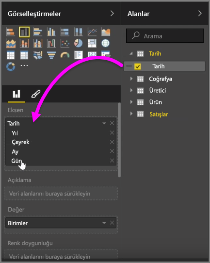
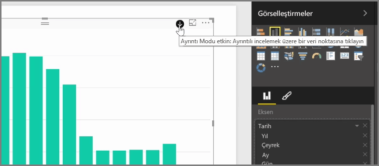
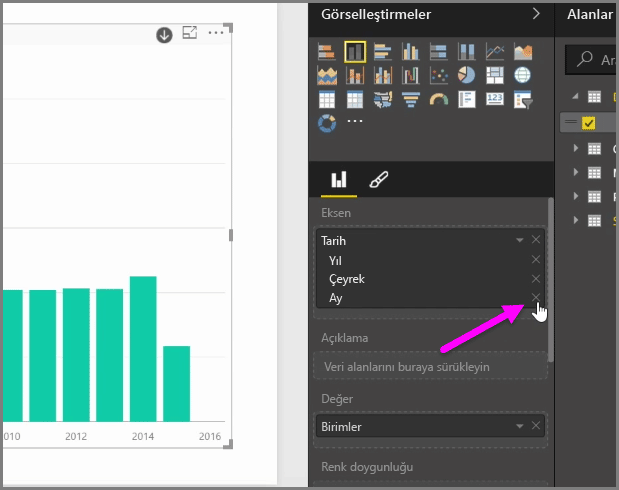
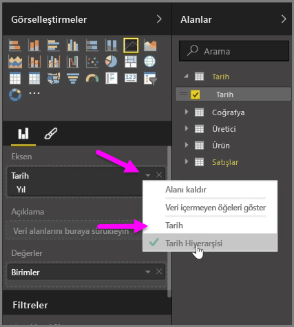
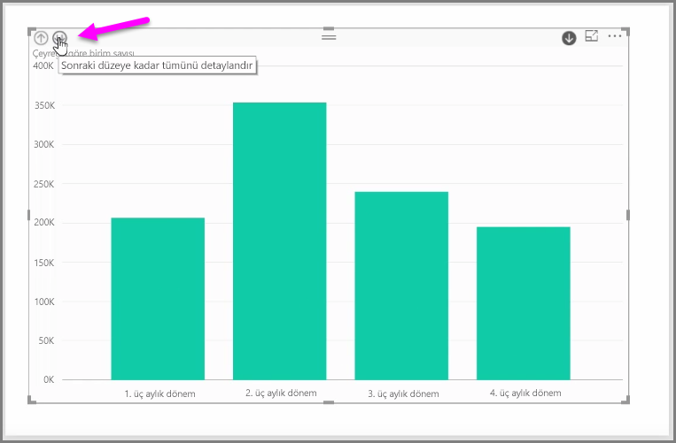

*Eksen* alanı demetindeki bir görsele *tarih* alanı eklediğinizde Power BI otomatik olarak; *Year*, *Quarter*, *Month* ve *Day* içeren bir zaman hiyerarşisi ekler. Power BI bunu yaparak görsellerinizle raporlarınızı görüntüleyen kullanıcıların zamana bağlı etkileşime geçmesine olanak tanır, böylece kullanıcılar bu farklı zaman düzeylerinde detaya gidebilir.

Hiyerarşi eklendiğinde, zaman hiyerarşisi aracılığıyla detaya gitmeye başlayabilirsiniz. Örneğin, grafikteki bir yıla tıklamak hiyerarşideki bir üst düzeye (bu durumda *Quarters*) kadar detaya gidilmesini sağlar ve bunlar daha sonra görselde görüntülenir.

Otomatik olarak oluşturulan bu hiyerarşide, paylaşılan raporunuzda kullanıcıların hangi düzeye kadar detaya gidebileceğini de yönetebilirsiniz. Bunu yapmak için Görsel Öğeler bölmesinde kaldırmak istediğiniz hiyerarşinin yanındaki X işaretine tıklamanız yeterlidir. Silinen düzey rapordan kaldırılır ve detaya gitme işlemiyle artık bu düzey görüntülenmez.

Bu hiyerarşi düzeyini geri almanız gerekiyorsa *tarih* alanını kaldırıp **Alanlar** bölmesinden tekrar eklemeniz yeterlidir, böylece hiyerarşi sizin için bir kez daha otomatik olarak oluşturulur.

Hiyerarşinin bir görselde kullanılmasını istemediğiniz zamanlar olabilir. *Date* alanının (görsele bu alanı eklemenizin ardından) yanındaki aşağı ok düğmesini seçerek bunu denetleyebilir ve **Date Hierarchy** yerine **Date**'i seçebilirsiniz. Bu, Power BI'dan görselde ham tarih değerlerini göstermesini ister.

Tek bir üç aylık dönem veya tek bir yıl seçmek yerine, o sırada görünür halde olan tüm veri öğelerini aynı anda da genişletebilirsiniz. Bunu yapmak için görselin sol üst tarafındaki, aşağı çift ok simgesi olan *Tüm öğelerin detayına git* simgesini seçin.

