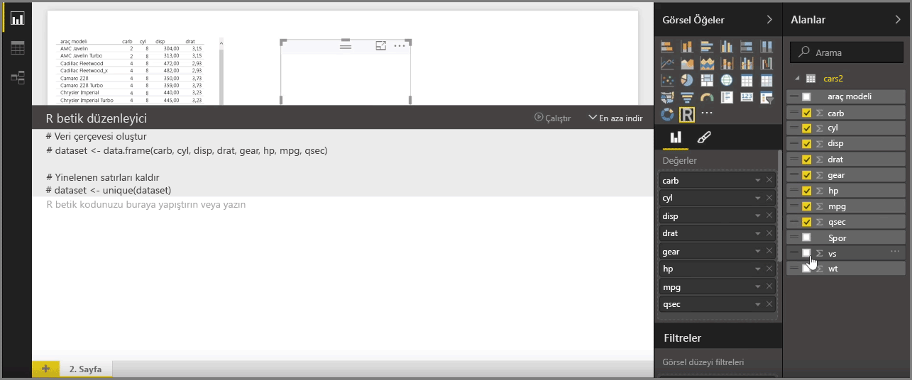
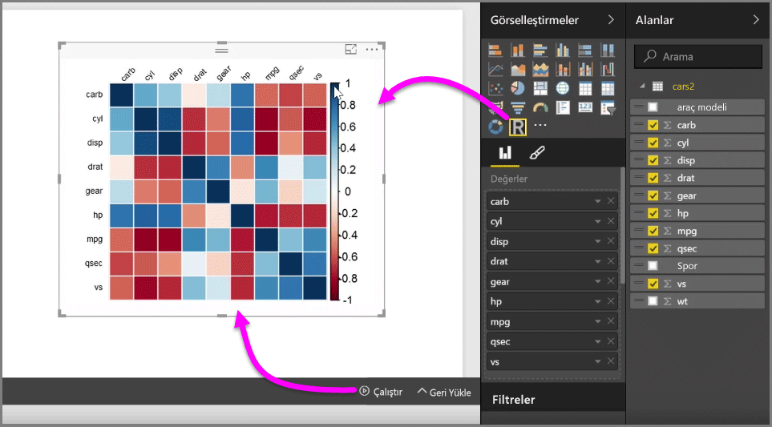
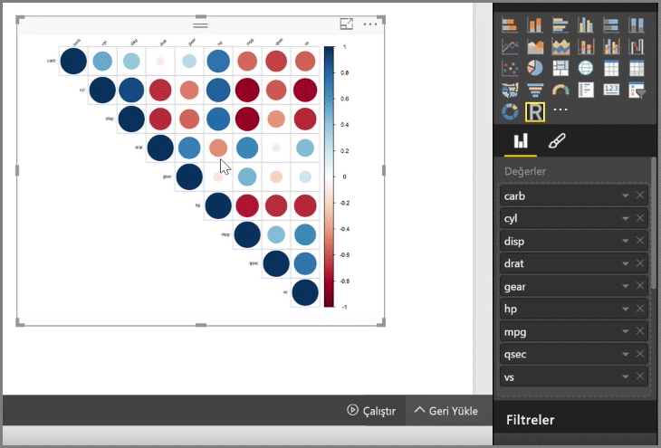
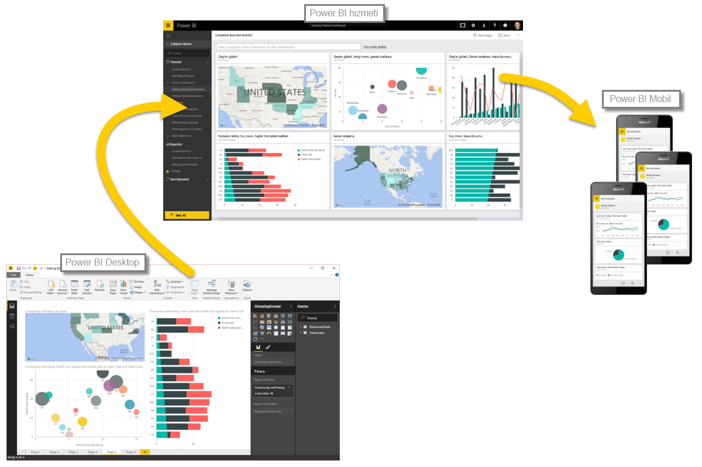

Power BI Desktop'ı R ile tümleştirerek analitik ve istatistiksel analizler gerçekleştirip ilgi çekici görseller oluşturabilirsiniz. Bu R görselleştirmelerini Power BI Desktop raporunda barındırabilirsiniz.

**Görsel Öğeler** bölmesinde **R görseli** simgesini seçtiğinizde Power BI, R görselinizi yerleştirmek için tuvalde bir yer tutucu oluşturur ve doğrudan tuvalde kullanabilmeniz için bir R betik düzenleyicisi sunar. Siz R görseline alan ekledikçe Power BI Desktop bunları R betik düzenleyicisi bölmesine ekler.

R betik düzenleyicisinde Power BI tarafından oluşturulan kısmın altında, görseli elde etmek için R betiğinizi oluşturmaya başlayabilirsiniz. Betiğiniz tamamlandıktan sonra **Çalıştır**'ı seçtiğinizde aşağıdaki işlemler gerçekleşir:

1. Görsele eklenen veriler (**Alanlar** bölmesinden) Power BI Desktop'tan yerel R yüklemesine gönderilir
2. Power BI Desktop R betik düzenleyicisinde oluşturulan betik bu yerel R yüklemesinde çalıştırılır
3. Ardından, Power BI Desktop, R yüklemesinden bir görsel alır ve bu görseli tuvalde görüntüler

Bunların tamamı çok hızlı bir şekilde gerçekleşir ve sonuç, tuvaldeki **R görseli** görselleştirmesinde görünür.

R betiğini ayarlayıp **Çalıştır**'ı tekrar seçerek R görselini değiştirebilirsiniz. Aşağıdaki görüntüde bulunan görseli, kareler yerine daireler görüntüleyecek şekilde değiştirdik.

R görselleri de Power BI Desktop'taki diğer görseller gibi olduğundan bunlarla etkileşime geçebilir ve tuvaldeki diğer görsellerle bağlantı kurabilirsiniz. Filtreleme veya vurgulama yoluyla tuvaldeki diğer görsellerle etkileşim kurduğunuzda R görseli, diğer tüm Power BI görselleri gibi otomatik olarak yanıt verir ve bunun için R betiğini ayarlamanıza gerek kalmaz.

Bu sayede doğrudan Power BI Desktop'ta R programlama dilinin gücünden harika bir şekilde faydalanabilirsiniz.

## Sonraki adımlar
**Tebrikler!** Power BI **Destekli Öğrenme** kursunun **Görselleştirmeler** bölümünü tamamladınız. Artık, Power BI'da sunulan birçok görselleştirmenin yanı sıra bunları nasıl kullanacağınız, değiştireceğiniz ve özelleştireceğiniz konusunda bilgi sahibisiniz. Güzel bir haberimiz var: Görselleştirmeler, Power BI Desktop'ta ve Power BI hizmetinde temel olarak aynıdır. Bu nedenle, öğrendikleriniz her ikisi için de geçerlidir.

Artık buluta doğru yol alıp **Veri Araştırma** işlemleri gerçekleştirebileceğiniz Power BI hizmetini keşfetmeye hazırsınız. Bildiğiniz üzere, burada iş akışı aşağıdaki gibi ilerler:

* Verileri **Power BI Desktop**'a aktarma ve rapor oluşturma.
* Power BI hizmetinde yayımlama ve burada yeni **görselleştirmeler** ve panolar oluşturma
* Panolarınızı başkalarıyla (özellikle de hareket halinde olan kişilerle) **paylaşma**
* **Power BI Mobil** uygulamalarında, paylaşılan panoları görüntüleme ve bu panolarla etkileşim kurma

Rapor oluşturmadan raporları yalnızca görüntülemeye veya bunlarla etkileşim kurmaya kadar uzanan tüm işlemler için bu harika görsellerin nasıl oluşturulduğunu ve verilere nasıl bağlandığını artık biliyorsunuz. Bir sonraki adımda bu görsellerin ve raporların nasıl kullanıldığına göz atacağız.

Bir sonraki bölümde görüşmek üzere!

