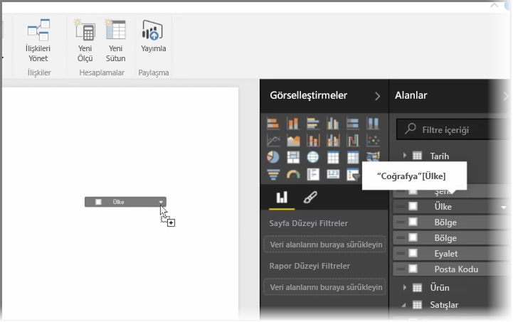
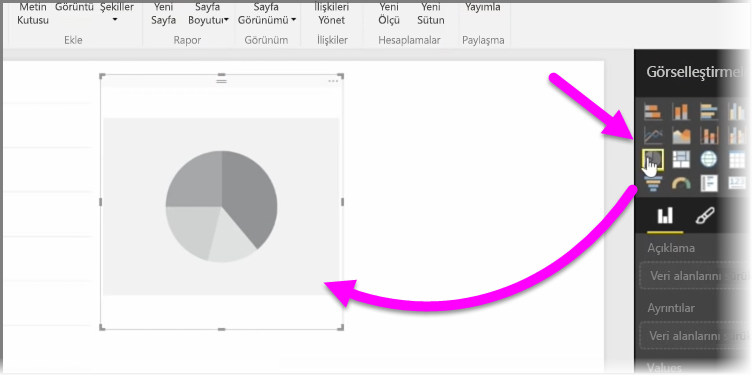
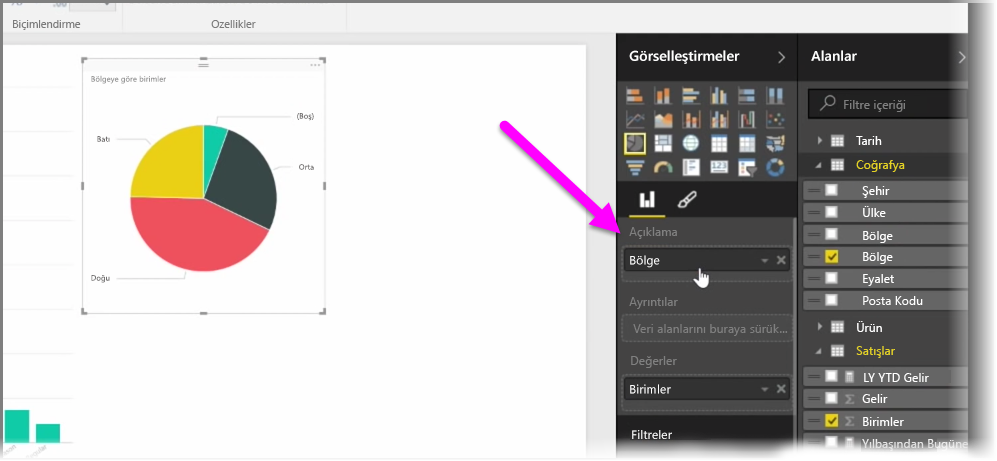
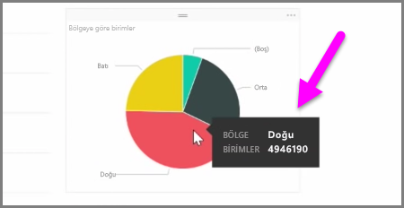
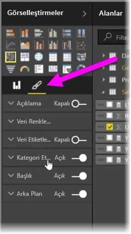

Bu makalede yeni çubuk grafikler, pasta grafikleri ve ağaç haritaları oluşturmanın yanı sıra bunları raporlarınıza uyacak şekilde özelleştirmeyi öğreneceksiniz.

Power BI Desktop'ta yeni bir görselleştirme oluşturmak için iki farklı yol izleyebilirsiniz:

* **Alanlar** bölmesindeki alan adlarını sürükleyip rapor tuvaline bırakabilirsiniz. Varsayılan olarak, görselleştirmeniz bir veri tablosu olarak görünür.
  
  
* **Görsel Öğeler** bölmesinde, oluşturmak istediğiniz görselleştirme türüne de tıklayabilirsiniz. Bu yöntem kullanıldığında varsayılan görsel, seçtiğiniz görselin türüne benzeyen boş bir yer tutucudur.
  
  

Grafınızı, haritanızı veya diyagramınızı oluşturduktan sonra görselinizi oluşturup düzenlemek için veri alanlarını **Görsel Öğeler** bölmesinin alt kısmına sürüklemeye başlayabilirsiniz. Kullanılabilir alanlar seçtiğiniz görselleştirmenin türüne göre değişir. Veri alanlarını sürükleyip bıraktığınız sırada görselleştirmeniz değişiklikleri yansıtacak şekilde otomatik olarak güncelleştirilir.

Görselleştirmenizi yeniden boyutlandırmak için öğeyi seçip tutamaçları içe ve dışa doğru sürükleyebilirsiniz. Ayrıca görselleştirmenize tıklayıp öğeyi sürükleyerek tuvalde istediğiniz yere taşıyabilirsiniz. Farklı görselleştirme türleri arasında dönüştürme yapmak istiyorsanız değiştirmek istediğiniz görselleştirmeyi seçin ve **Görsel Öğeler** bölmesindeki simgelerin arasından farklı bir görsel belirleyin. Power BI, seçtiğiniz alanları yeni görsel türüne mümkün olan en yakın şekilde dönüştürmeye çalışır.

Görselleştirmelerinizin bölümleri üzerine geldiğinizde söz konusu segmentle ilgili ayrıntılar (etiketler ve toplam değer gibi) içeren bir araç ipucuyla karşılaşırsınız.

Görselinizin dış görünüşünde arka plan hizalaması, başlık metni ve veri renkleri gibi özelliklere ilişkin değişiklikler yapmak için **Görsel Öğeler** bölmesinde **boya fırçası** simgesini seçin.

Görselinizin dış görünüşüyle ilgili değişikliklere yönelik olarak kullanılabilir seçenekler seçtiğiniz görselin türüne bağlı olarak değişiklik gösterir.

