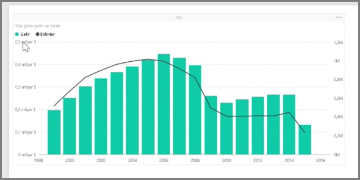
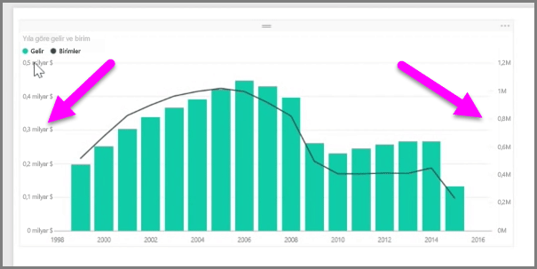
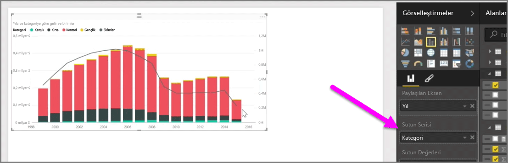

Gelir ve birimler gibi farklı ölçülere sahip iki ölçüyü görselleştirmek istemeniz halinde, farklı eksen ölçekleri içeren bir çizginin ve çubuğun gösterildiği bir **karma grafik** oldukça kullanışlı olacaktır. Power BI, popüler **Çizgi** ve **Yığılmış Sütun** grafikler de dahil olmak üzere varsayılan olarak birçok farklı karma grafik türünü destekler.

Karma grafik oluşturduğunuzda **Paylaşılan Eksen** (X ekseni) alanıyla ve iki alanınıza ilişkin değerlerle (bu örnekte bir sütun ve çizgi) karşılaşırsınız. Görselleştirmenin her iki tarafında da iki Y ekseni açıklaması görünür.

Ayrıca Görsel Öğeler bölmesindeki Sütun Serisi alanına bir kategoriyi sürükleyerek her bir sütunu kategoriye göre bölebilirsiniz. Bunu yaptığınızda tüm çubuklar her bir kategorideki değerlere bağlı olarak orantılı bir şekilde renklendirilir.

Karma grafikler, tek bir görselleştirmede oldukça farklı ölçeklere sahip birden çok ölçüyü görselleştirmenin etkili bir yoludur.

