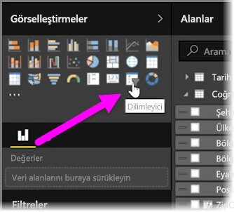
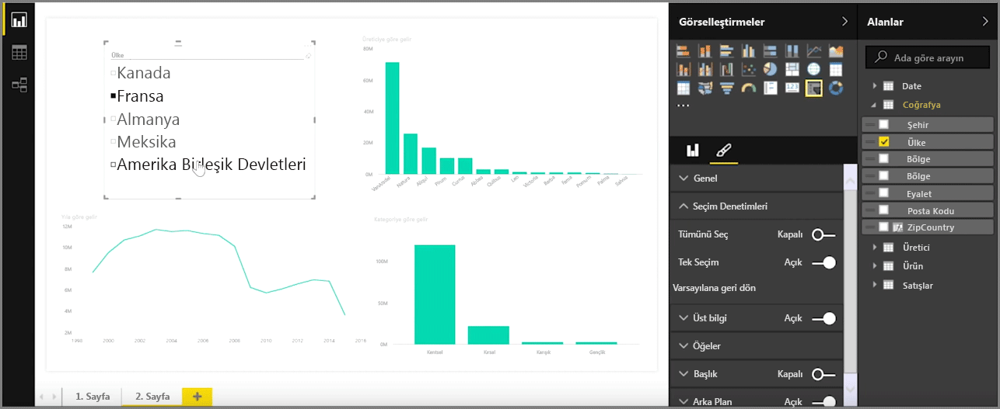

Dilimleyiciler, en güçlü görselleştirme türlerinden biridir ve özellikle de çok fazla veri içeren raporlarda kullanılır. **Dilimleyici**, **Power BI Desktop**'taki tuvalde bulunan ve kullanıcıların yıl veya coğrafi konum gibi belirli bir değere göre raporlara göz atmasına olanak sağlayan bir görsel filtredir.

Raporunuza dilimleyici eklemek için **Görsel Öğeler** bölmesinde **Dilimleyici**'yi seçin.

Dilimleme ölçütü olarak kullanacağınız alanı sürükleyin ve dilimleyici yer tutucusunun üzerine bırakın. Görselleştirme, onay kutuları içeren bir öğe listesine dönüştürülür. Bu öğeler filtrelerinizdir. Bir segmentin yanındaki kutuyu seçtiğinizde aynı rapor sayfasında bulunan diğer tüm görselleştirmeler seçiminize bağlı olarak filtrelenir veya *dilimlenir*.

Dilimleyicinizi biçimlendirmek için kullanabileceğiniz birkaç farklı seçenek bulunur. Dilimleyiciyi aynı anda birden çok girişi kabul edecek şekilde ayarlayabilir veya aynı anda tek giriş kullanılmasını sağlamak üzere **Tek Seçim** moduna geçebilirsiniz. Dilimleyici öğelerinize, özellikle uzun listelerle çalışırken kullanışlı olan bir **Tümünü Seç** seçeneği de ekleyebilirsiniz. Varsayılan olarak dikey yöndeki dilimleyicinizin yönünü yatay olarak değiştirdiğinizde dilimleyici, denetim listesi yerine bir seçim çubuğu olarak görünür.

