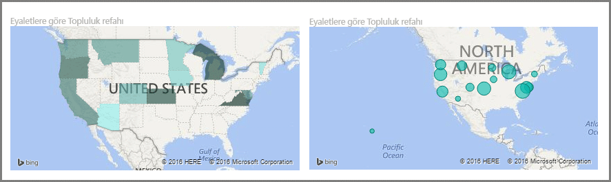
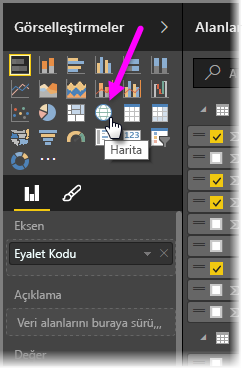
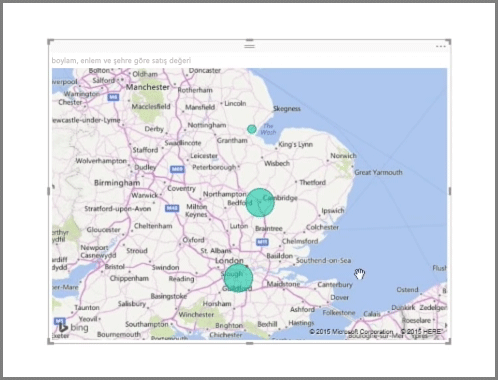
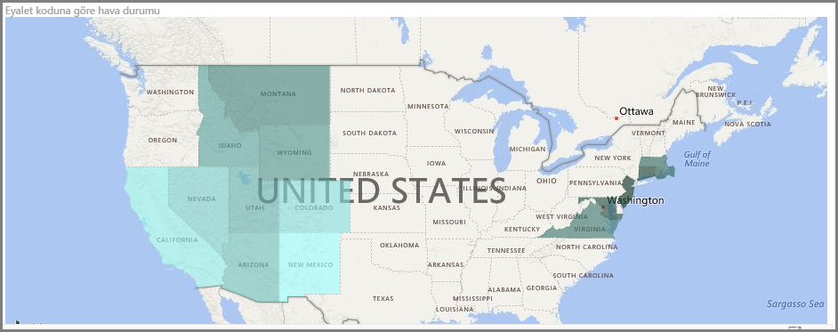
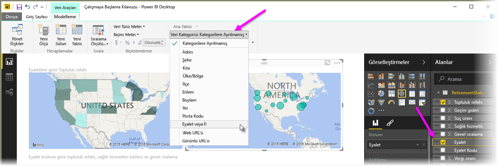

Power BI'da iki farklı türde harita görselleştirmesi mevcuttur: coğrafi noktalara balonların yerleştirildiği bir balonlu harita ve görselleştirmek istediğiniz alanın ana hatlarını gösteren bir şekil haritası.

> [!NOTE]
> Ülkelerle veya bölgelerle çalışırken harita görselleştirmelerinde coğrafi kodlamanın düzgün çalıştığından emin olmak için üç harfli kısaltmalar kullanın. Bazı ülkeler veya bölgeler düzgün şekilde tanınmayacağından iki harfli kısaltmalar *kullanmayın*.
> Yalnızca iki harfli kısaltmalara sahipseniz iki harfli ülke/bölge kısaltmalarınızı üç harfli ülke/bölge kısaltmalarıyla nasıl ilişkilendireceğiniz ile ilgili adımların açıklandığı [bu harici blog gönderisine](https://blog.ailon.org/how-to-display-2-letter-country-data-on-a-power-bi-map-85fc738497d6#.yudauacxp) göz atın.
> 
> 

## Balonlu harita oluşturma
Balonlu harita oluşturmak için **Görsel Öğeler** bölmesinde **Harita** seçeneğini belirleyin. Harita görseli kullanmak için **Görsel Öğeler**'in altındaki seçenekler bölümünde *Konum* demetine bir değer eklemeniz gerekir.

Power BI, şehir adı veya havaalanı kodu gibi daha genel bilgilerden belirli enlem ve boylam verilerine kadar kabul ettiği konum değeri türleri bakımından esnektir. Her harita konumu için balonun boyutunu uygun şekilde değiştirmek üzere **Boyut** demetine bir alan ekleyin.

## Şekil haritası oluşturma
Şekil haritası oluşturmak için Görsel Öğeler bölmesinde **Doldurulmuş Harita** seçeneğini belirleyin. Balonlu haritalarda olduğu gibi, bu görseli kullanmak için de Konum demetine bazı değerler eklemeniz gerekir. Dolgu renginin yoğunluğunu uygun şekilde değiştirmek için Boyut demetine bir alan ekleyin.

Görselinizin sol üst köşesinde bir uyarı simgesi görürseniz bu, haritanın, değerleri görselleştirmek için daha fazla konum verisine ihtiyaç duyduğu anlamına gelir. Bu, özellikle de konum alanınızdaki veriler belirsiz olduğunda (örneğin, *Washington* gibi hem eyalet hem de şehir belirtebilecek bir alan adı kullanıldığında) sık karşılaşılan bir sorundur. Sütununuzu daha belirli bir şekilde (*Eyalet* gibi) yeniden adlandırarak bu sorunu giderebilirsiniz. İkinci bir çözüm yolu ise Modelleme sekmesinde **Veri Kategorisi** seçeneğini belirleyip veri kategorisini elle yeniden belirlemektir. Burada, verilerinize "Eyalet" veya "Şehir" gibi bir kategori atayabilirsiniz.

