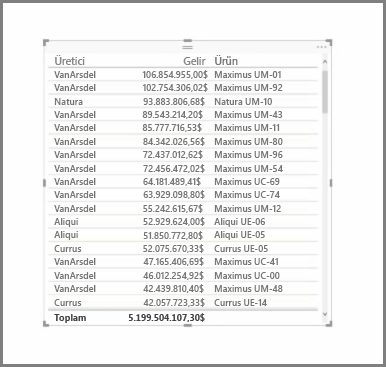
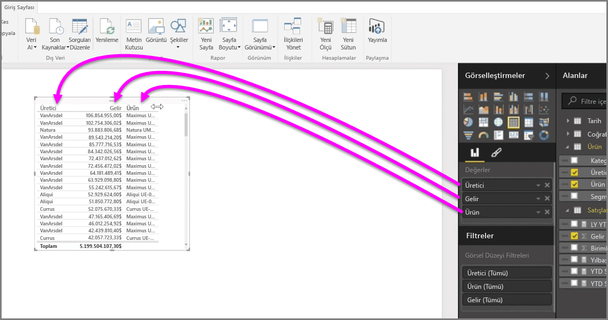
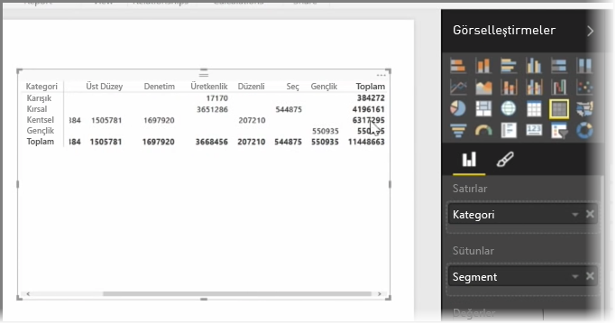

Power BI Desktop, kullanılabilen birçok grafiğe ek olarak daha tablo biçiminde olan görselleştirmeleri de destekler. Bir kategorik alanı veya metin alanını alıp rapor tuvaline sürüklediğinizde varsayılan olarak bir sonuç tablosu elde edersiniz. Başlangıçta alfabetik olarak sıralanan tabloda yukarı ve aşağı gezinebilirsiniz.

Bir tabloda gelir değerleri gibi sayısal değerlere sahipseniz alt kısımda tüm değerlerin toplamı görünür. Artan veya azalan düzen arasında geçiş yapmak üzere başlığına tıklayarak her bir sütunu elle sıralayabilirsiniz. Bir sütun tüm içeriğini görüntülemeye yetecek kadar geniş değilse başlıklara tıklayıp bunları yanlara doğru sürükleyerek sütunu genişletin.

**Görsel Öğeler** bölmesindeki *Değer* demetinde bulunan alanların sırası, bu alanların tablonuzda hangi sırayla görüntüleneceğini belirler.

**Matrisler** tablolarla benzerlik gösterir ancak sütunlarında ve satırlarında farklı kategoride başlıklar bulunur. Tablolarda olduğu gibi, sayısal bilgiler matrisin alt ve sağ tarafında otomatik olarak toplanır.

Matrisler için görünümü ayarlamak üzere kullanılabilen pek çok seçenek (sütunları otomatik boyutlandırma, satır ve sütun toplamları arasında geçiş yapma ve renkleri ayarlama gibi) bulunur. Matris oluştururken, yatay kaydırma çubuğunun göründüğünden ve kaydırma davranışının düzgün bir şekilde çalıştığından emin olmak için kategorik verilerinizin (sayı olmayan veriler) matrisin solunda, sayısal dosyalarınızın ise matrisin sağında bulunduğundan emin olun.

