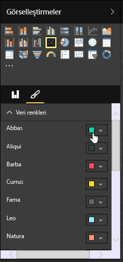

İki farklı ölçüyü (birim satışlar ve gelir gibi) karşılaştırmak istiyorsanız bu amaçla yaygın olarak kullanılan dağılım grafiği görselleştirmesini kullanabilirsiniz.

Boş bir grafik oluşturmak için **Görsel Öğeler** bölmesinden **Dağılım grafiği**'ni seçin. **Alanlar** bölmesinden, karşılaştırmak istediğiniz iki alanı *X Ekseni* ve *Y Ekseni* seçenek demetlerine sürükleyip bırakın. Bu noktada, dağılım grafiğinizdeki görselin ortasında küçük bir balon görüyor olabilirsiniz. Verilerinizi nasıl segmentlere ayırmak istediğinizi belirtmek için *Ayrıntılar* demetine bir ölçü eklemeniz gerekir. Örneğin, madde satışı ile geliri karşılaştırıyorsanız verileri kategoriye, üreticiye veya satış yapılan aya göre bölmek isteyebilirsiniz.

*Açıklama* demetine başka bir alan eklediğinizde balonlarınız, alanın değerine göre renklerle kodlanır. Ayrıca, alan değerine göre balon boyutunun da değişmesini istiyorsanız *Boyut* demetine bir alan ekleyebilirsiniz.

Dağılım grafikleri, renkli her balon için bir ana hat etkinleştirme ve her bir etiketi açıp kapatma gibi birçok görsel biçimlendirme seçeneğine de sahiptir. Diğer grafik türleri için de veri renklerini değiştirebilirsiniz.

*Yürütme Ekseni* demetine zaman tabanlı bir alan ekleyerek, zamanla kabarcık grafiğinizde meydana gelen değişikliklere ilişkin bir animasyon oluşturabilirsiniz. Animasyon sırasında bir balona tıklayarak nereye ait olduğuna ilişkin bir iz görebilirsiniz.

>[!NOTE]
>Dağılım grafiğinde yalnızca tek bir balon görüyorsanız bu, Power BI'ın verilerinizi bir araya getirdiği anlamına gelir ve varsayılan davranıştır. Daha fazla balon elde etmek için **Görsel Öğeler** bölmesindeki *Ayrıntılar* demetine bir kategori ekleyin.
> 
> 

