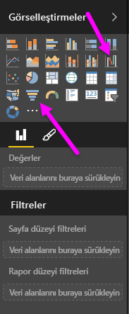
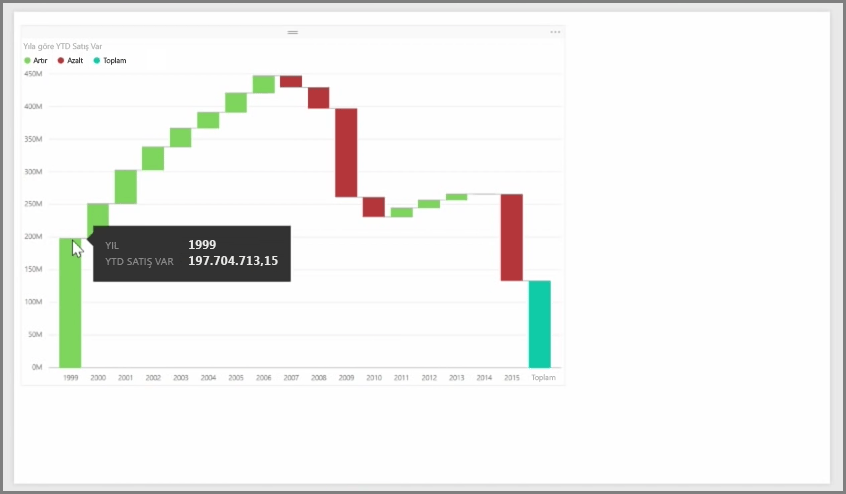
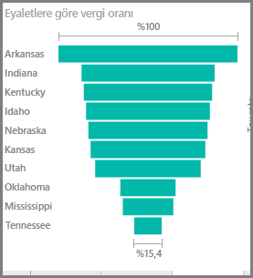

Şelale ve huni grafikleri Power BI'da yer alan ve nispeten daha ilgi çekici (ve belki de en sıra dışı) diğer iki standart görselleştirmedir. Bu iki türden birine sahip boş bir grafik oluşturmak için **Görsel Öğeler** bölmesinden türün simgesini seçin.

**Şelale grafikleri** genellikle zaman içinde belirli bir değerde gerçekleşen değişikliklerin gösterilmesinde kullanılır.

Şelale grafiklerinde yalnızca iki demet seçeneği vardır: *Kategori* ve *Y Ekseni*. *Yıl* gibi zamana bağlı bir alanı *Kategori* demetine, izlemek istediğiniz değeri ise *Y Ekseni* demetine sürükleyin. Değerde artış olan dönemler varsayılan olarak yeşil renkte görüntülenirken değerde düşüş olan dönemler kırmızı renkte görüntülenir.

**Huni grafikleri** genellikle bir satış kanalındaki müşterileri veya bir web sitesindeki ziyaretçileri elde tutma çalışmaları gibi belirli bir süreç dahilinde gerçekleşen değişikliklerin gösterilmesi için kullanılır.

Hem **Şelale** hem de **Huni** grafikleri dilimlenebilir ve görsel olarak özelleştirilebilir.

