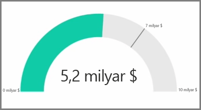

Genel olarak, görselleştirmeler iki veya daha fazla farklı değeri karşılaştırmak için kullanılır. Ancak, bazen rapor oluştururken yalnızca tek bir Ana Performans Göstergesinin (KPI) veya ölçümün zamana göre değişimini izlemek isteyebilirsiniz. Bunu Power BI Desktop'ta bir **Ölçek** veya **tek sayı içeren** kart görseli ile gerçekleştirebilirsiniz. Bu iki türden birinde boş bir grafik oluşturmak için **Görsel Öğeler** bölmesinde ilgili simgeyi seçin.

Ölçekler özellikle panolar oluşturup belirli bir hedefe yönelik ilerlemeyi göstermek istediğinizde yararlıdır. Ölçek oluşturmak için **Görsel Öğeler** bölmesinden ilgili simgeyi seçin ve izlemek istediğiniz alanı *Değer* demetine sürükleyin.

Ölçekler varsayılan olarak %50'ye veya *Değer*'in iki katına ayarlanmıştır ve bu ayarı değiştirmenin iki yolu vardır. Değerleri dinamik olarak ayarlamak için alanları *Minimum*, *Maksimum* ve *Hedef* Değer demetlerine sürükleyin. Alternatif olarak, ölçeğinizin aralığını elle özelleştirmek için görsel biçimlendirme seçeneklerini de kullanabilirsiniz.

Özetle, kart görselleştirmeleri bir alanın sayısal gösterimini sunar. Varsayılan olarak, kart görselleri sayıları kısa tutmak için görüntüleme birimleri (örneğin, "$5.000.000.000" yerine "$5 milyar") kullanır. Kullanılan birimi değiştirmek veya tamamen devre dışı bırakmak için, görsel biçimlendirme seçeneklerini kullanın.

Kartların metinle birleştirdiğiniz bir özel ölçüyü görüntülemesini sağlamak kartlara yönelik olarak ilginizi çekebilecek kullanım şekillerinden biridir. Önceki örnek düşünüldüğünde, kartınız bir özel ölçü ile ileri düzey DAX işlevleri içerebilir ve "Bu yılki toplam gelir: $5 milyar" gibi bir ifade görüntüleyebilir ya da "Bu yılki birim satışlarındaki ilerleme:" ifadesini gösterip ilerlemeyi gösteren sayıyı ekleyebilir.

