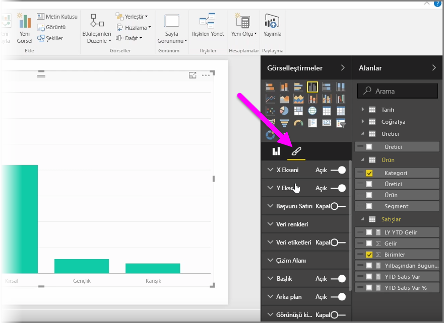
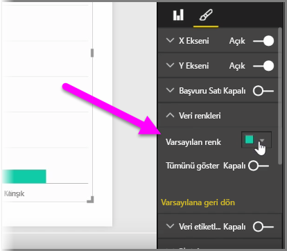
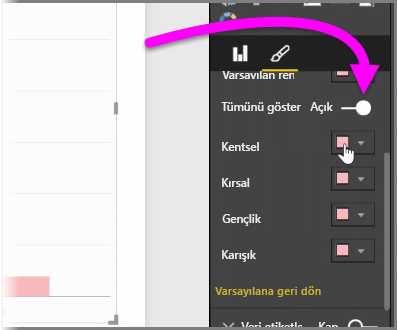
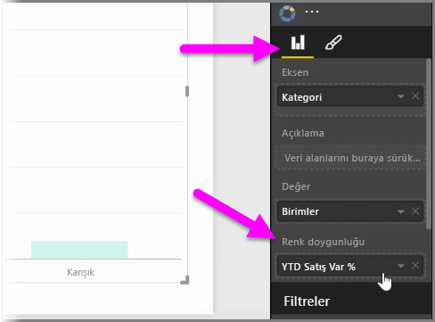
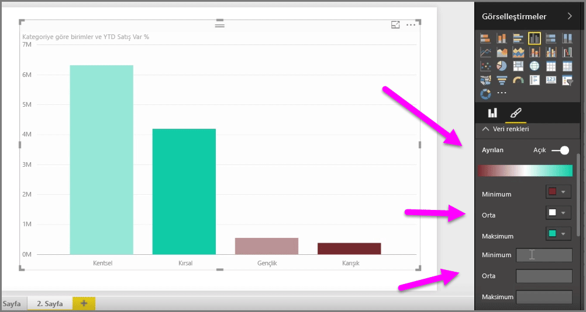
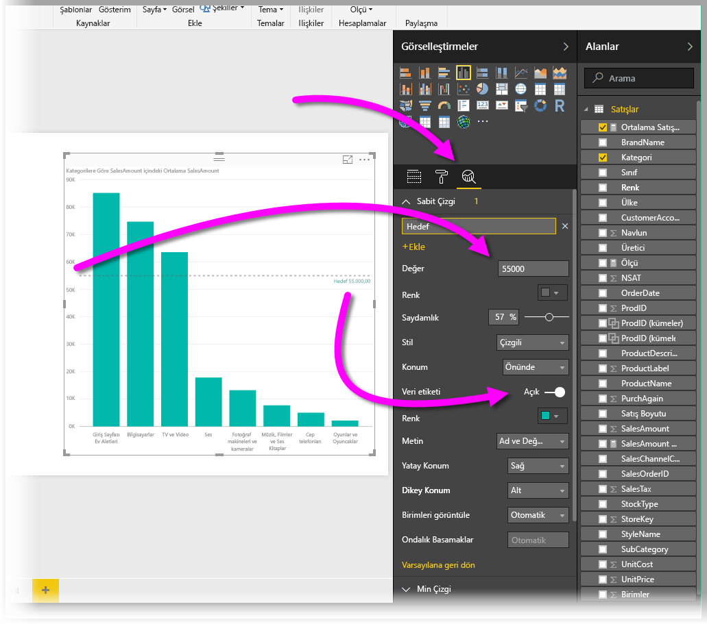
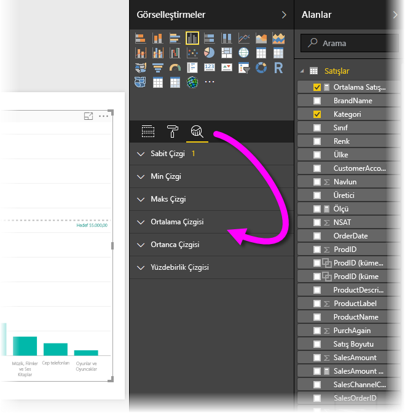

Grafiklerde veya görsellerde kullanılan renkleri değiştirmek isteyeceğiniz durumlarla sık sık karşılaşırsınız. Power BI renklerin nasıl görüntüleneceği konusunda yüksek düzeyde denetim elde etmenizi sağlar. Başlamak için **Görsel Öğeler** bölmesinden bir görsel seçin ve ardından **boya fırçası** simgesine tıklayın.

Renkleri değiştirmek veya görseli biçimlendirmek için kullanabileceğiniz birçok seçenek vardır. **Varsayılan renk**'in yanındaki renk seçiciyle istediğiniz rengi belirleyerek bir görseldeki tüm çubukların rengini değiştirebilirsiniz.

Ayrıca **Tümünü göster** kaydırıcısını açık duruma getirerek her bir çubuğun (veya seçtiğiniz görselin türüne bağlı olarak diğer bir öğenin) rengini de değiştirebilirsiniz. Bunu yaptığınızda her öğe için bir renk seçici görüntülenir.

Rengi aynı zamanda bir değere veya ölçüye göre de değiştirebilirsiniz. Bunu yapmak için bir alanı Görsel Öğeler bölmesindeki **Renk doygunluğu** (bunun **boya fırçası** bölümünde değil, **alan kutusu** bölümünde kullanılabildiğini unutmayın) demetine sürükleyin.

Ayrıca veri öğesi renklerinin doldurulması sırasında kullanılan ölçeği ve renkleri de değiştirebilirsiniz. Ayrıca Ayrılan kaydırıcısını açık duruma getirerek ayrılan bir ölçek de seçebilirsiniz; bu, rengin üç renk arasında ölçeklenmesine olanak tanır. Ayrıca grafiğinizde *Minimum*, *Orta* ve *Maksimum* değerlerinin görüntüleneceği şekilde ayarlama yapabilirsiniz.

Bu değerleri kural oluşturmak için de kullanabilirsiniz; örneğin, sıfırdan büyük değerleri belirli bir renge, sıfırdan küçük değerleri başka bir renge ayarlayabilirsiniz.

Renkleri kullanmaya yönelik diğer bir kullanışlı araç da bazen *başvuru çizgisi* olarak da adlandırılan *sabit çizgidir*. Sabit çizginin değerini belirleyebilir, rengini ayarlayabilir ve hatta başvuru çizgisinin etiket içermesini sağlayabilirsiniz. Sabit çizgi (ve diğer ilgi çekici çizgileri) oluşturmak için **Analiz bölmesini** (büyüteç gibi görünür) seçin ve ardından **Başvuru Çizgisi** bölümünü genişletin.

Bir görsel için oluşturabileceğiniz Min., Max., Ortalama, Ortanca ve Yüzdebirlik çizgileri gibi başka birçok çizgi vardır, bunlar aynı zamanda **Analiz bölmesinde** de bulunur.

Son olarak, tek bir görselleştirmenin çevresinde kenarlık oluşturabilir ve diğer denetimler gibi bu kenarlığın da rengini belirtebilirsiniz.

