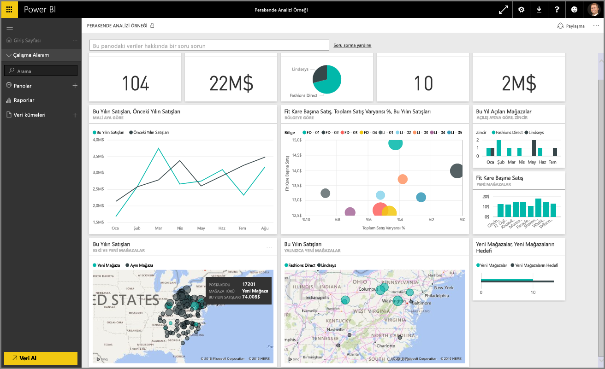
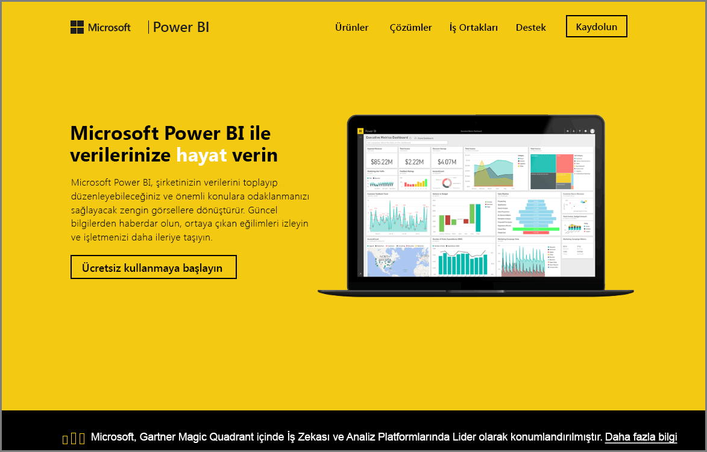

Power BI **Destekli Öğrenme** kursundaki **Verileri Araştırma** bölümüne hoş geldiniz. Artık Power BI Desktop, veri alma ve veri görselleştirme hakkında bilgi sahibi olduğunuza göre Power BI hizmetinde verileri araştırmaya hazırsınız.

Bu bölümde öğreneceğiniz çok şey var. Power BI'ın harika etkileşim ve paylaşım özellikleri ise bu bölümde kendisini tam anlamıyla gösterecek. Etkileşimli ve ilgi çekici bir bölüme hazırlıklı olun.

## Power BI hizmetine giriş
*Power BI hizmetinin kuruluşunuz için neler yapabileceğine göz atın*

Power BI hizmeti, **Power BI Desktop**'ın doğal bir uzantısıdır. Raporları karşıya yükleme, panolar oluşturma ve doğal dil kullanarak verileriniz hakkında soru sorma Power BI'ın özellikleri arasında yer almaktadır. Veri yenileme zamanları ayarlamak, kuruluşunuzla veri paylaşmak ve özelleştirilmiş hizmet paketleri oluşturmak için bu hizmeti kullanabilirsiniz.

Sıradaki konu başlıklarında, Power BI hizmetini inceleyip iş zekası verilerinizi veri öngörülerine ve işbirliğine dayalı olarak çalışan bir karar verme ortamına nasıl dönüştürdüğünü göstereceğiz.

