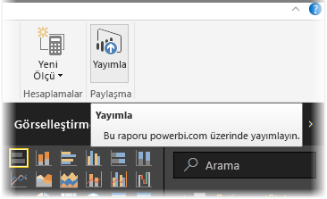
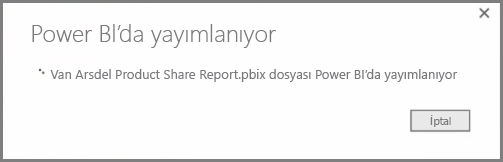
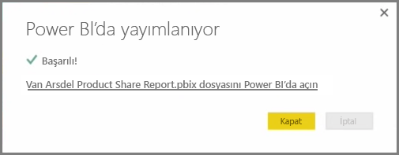
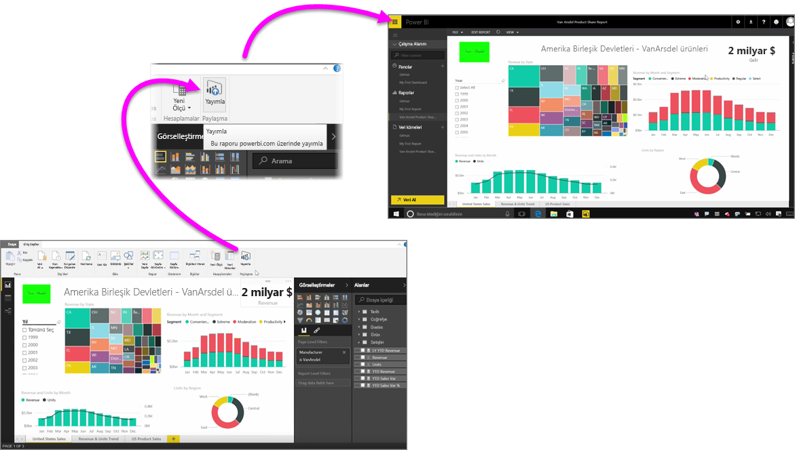

Raporlarınızı Power BI hizmetinde hızlı ve kolay bir şekilde yayımlayabilirsiniz.

**Power BI Desktop**'ta raporunuzu oluşturmayı tamamladıktan sonra Power BI Desktop'taki **Giriş** sekmesindeki **Yayımla** düğmesini seçmeniz yeterlidir, bunun ardından işlem başlar.

Raporunuz ve görselleştirmeler, sorgular ve özel ölçüler de dahil olmak üzere verileriniz bir araya getirilip Power BI hizmetine yüklenir.

> [!NOTE]
> Power BI Desktop raporları genellikle, bunlara Windows'da verilen uzantı olan **.pbix** dosyaları olarak anılır.
> 

Karşıya yükleme tamamlandıktan sonra bir iletişim kutusu, yayımlama işleminin başarılı olduğunu belirtir ve söz konusu iletişim kutusunda sizi bir web tarayıcısından Power BI hizmetinde doğrudan raporunuza yönlendirecek bir bağlantı sağlanır.

İşte bu kadar, Power BI Desktop'taki raporları Power BI hizmetinde yayımlamak çok kolay.

