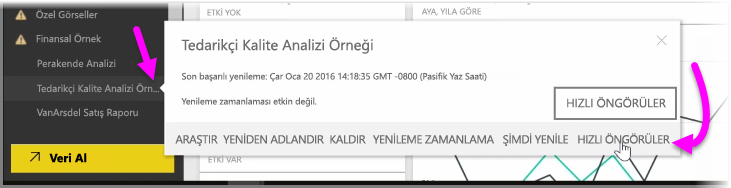
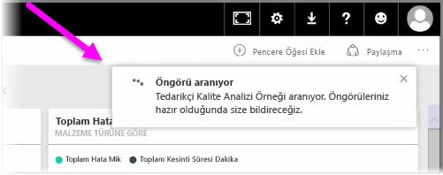
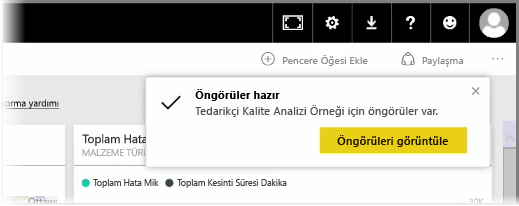
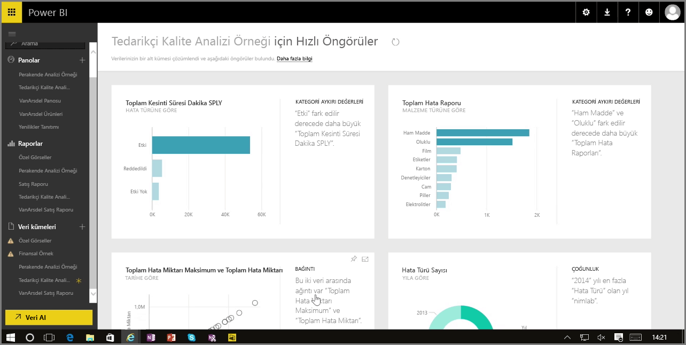

Power BI hizmetindeki bir pano, rapor veya veri kümesiyle çalışırken Power BI'ın verilere ilişkin hızlı öngörüler edinmesini sağlayabilirsiniz. Power BI'ın sol bölmesinde bulunan **Veri Kümeleri** bölümünde, çalışmak istediğiniz veri kümesinin yanındaki *üç noktayı* seçin. Görüntülenen seçenek menüsünün en sağında **Hızlı Öngörüler** adlı bir seçenek yer alır.

Power BI, Hızlı Öngörüler seçeneğini belirlediğinizde bazı makine öğrenimi işlemleri gerçekleştirir ve hızlı öngörüler edinmek üzere çözümleme yaparak verileri arar. Hizmetin sağ üst köşesinde, Power BI'ın öngörüler edinme üzerinde çalıştığını gösteren bir bildirim görürsünüz.

Bildirim, yaklaşık on beş saniye sonra, Power BI'ın bazı öngörüler edindiğini bildirecek şekilde değişir.

Bildirimdeki **Öngörüleri görüntüle** düğmesine tıkladığınızda, Power BI'ın bulduğu öngörülerin gösterildiği, aşağıdakine benzer bir görsel sayfasıyla karşılaşırsınız. Görüntülemek ve üzerinde düşünmek için sayfayı aşağı kaydırarak aralarında gezinebileceğiniz bir dizi öngörü bulunur.

Diğer tüm görsellerde olduğu gibi bu görsellerle de Hızlı Öngörüler sayfasında etkileşime geçebilir ve herhangi bir görseli sahip olduğunuz bir panoya sabitleyebilir ya da görsellerin birinde veya birkaçında (ya da istediğiniz kadar görsel üzerinde) filtreleme yaparak, keşfetmenizi bekleyen daha fazla öngörüye ulaşabilirsiniz.

**Hızlı Öngörüler** ile Power BI'ın verilerinizdeki aykırı değerleri ve eğilimleri bulmasına, ardından söz konusu bulguları panolarınızda kullanmasına veya sizin için en önemli olan öngörüleri edinmek üzere bunları daha fazla daraltmasına ve filtrelemesine olanak sağlayabilirsiniz.

